# WeBuild GitHub Policies and Guidelines

## Document Information

**Version:** 4.2<br/>
**Last Updated:** December 2025<br/>
**Status:** Active<br/>
**Owner:** Technical Coordinator  webuild-github-support@grnet.gr

---

## Table of Contents

1. [Introduction](#1-introduction)
2. [Purpose and Objectives](#2-purpose-and-objectives)
3. [Governance and Organizational Structure](#3-governance-and-organizational-structure)
4. [Access Management and Role Definitions](#4-access-management-and-role-definitions)
5. [Working Practices and Workflows](#5-working-practices-and-workflows)
6. [Repository Management](#6-repository-management)
7. [Licensing and Intellectual Property](#7-licensing-and-intellectual-property)
8. [Security and Compliance](#8-security-and-compliance)
9. [Contribution Guidelines](#9-contribution-guidelines)
10. [Onboarding and Offboarding Procedures](#10-onboarding-and-offboarding-procedures)
11. [Best Practices Summary](#11-best-practices-summary)
12. [Support and Resources](#12-support-and-resources)
13. [Appendices](#13-appendices)

---

## 1. Introduction

### 1.1 About WeBuild Consortium

The WeBuild Consortium is a collaborative European project focused on building digital wallet infrastructure and related technologies. The consortium brings together multiple partners across Europe to develop interoperable, secure, and standards-compliant solutions for the European Digital Identity ecosystem.

**GitHub Organization:** [https://github.com/webuild-consortium](https://github.com/webuild-consortium)

### 1.2 Role of GitHub

GitHub serves as the primary platform for technology collaboration across all Work Packages (WPs). It functions as the central hub where consortium partners collaborate on specifications, interface definitions, test environments, source code, and other technical deliverables.

**Primary Functions:**

- Source code management and version control
- Technical collaboration across partners
- Documentation and knowledge sharing
- Issue tracking and project management
- Continuous integration and deployment
- Community engagement and transparency

### 1.3 Document Purpose

This document establishes comprehensive policies and guidelines for using GitHub within the WeBuild consortium. It ensures consistent practices across all Work Packages, secure and compliant repository management, effective collaboration among partners, quality assurance and accountability, and alignment with EU project requirements.

By standardizing our approach to GitHub usage, we ensure that all partners can work together efficiently while maintaining the highest standards of transparency, security, and accountability.

---

## 2. Purpose and Objectives

### 2.1 Primary Objectives

This policy framework serves multiple critical purposes within the WeBuild Consortium:

**Establish a Common Framework**
Create a unified approach to using GitHub that all consortium partners can follow. This common framework reduces friction in cross-organizational collaboration and ensures that all partners understand the expected workflows and procedures.

**Support Collaborative Technical Work**
Enable seamless collaboration between partners on technical deliverables. GitHub's collaborative features—including pull requests, code reviews, and issue tracking—are leveraged to facilitate meaningful technical discussions and joint development efforts.

**Maintain Version Control Excellence**
Ensure that all technical artifacts are properly versioned, with clear histories of changes, contributors, and decision points. This version control discipline is essential for maintaining the integrity of technical work and understanding how solutions evolved over time.

**Enable Comprehensive Documentation**
Provide a structured environment where technical documentation lives alongside the artifacts it describes. This co-location of code and documentation ensures that information remains current and accessible to all partners.

**Ensure Traceability and Accountability**
Maintain clear records of who contributed what, when, and why. This traceability is essential for project governance, quality assurance, and demonstrating compliance with consortium agreements and funding requirements.

**Uphold Compliance Standards**
Ensure that all GitHub activities comply with project governance requirements, data protection regulations (including GDPR), and consortium-wide policies regarding intellectual property and information security.

### 2.2 Scope of Application

These policies apply to:

- All repositories under the `webuild-consortium` GitHub organization
- All consortium members with GitHub access
- All Work Packages and technical groups
- All types of content (code, documentation, specifications, tests)
- All development environments (DEV, TEST, PROD)

### 2.3 Relationship to Other Policies

These GitHub policies complement and must be read in conjunction with:

- WeBuild Consortium Agreement
- Data Management Plan
- Intellectual Property Rights Agreement
- Security and Privacy Policies
- EU Grant Agreement requirements

---

## 3. Governance and Organizational Structure

### 3.1 Consortium GitHub Organization

The WeBuild Consortium maintains a dedicated GitHub organization at [`https://github.com/webuild-consortium/`](https://github.com/webuild-consortium/). This organization serves as the authoritative location for all technical collaboration within the project.

**Benefits of Centralized Organization:**

- **Centralized Access Management:** Simplifies the process of granting and revoking access as partners join or leave the consortium
- **Unified Visibility:** Enables consortium leadership to maintain oversight of all technical activities
- **Consistent Branding:** Presents a cohesive identity for the consortium's technical work
- **Simplified Archival:** Facilitates long-term preservation of project outputs at the conclusion of the consortium

### 3.2 Organizational Hierarchy

The governance structure follows a clear hierarchy:

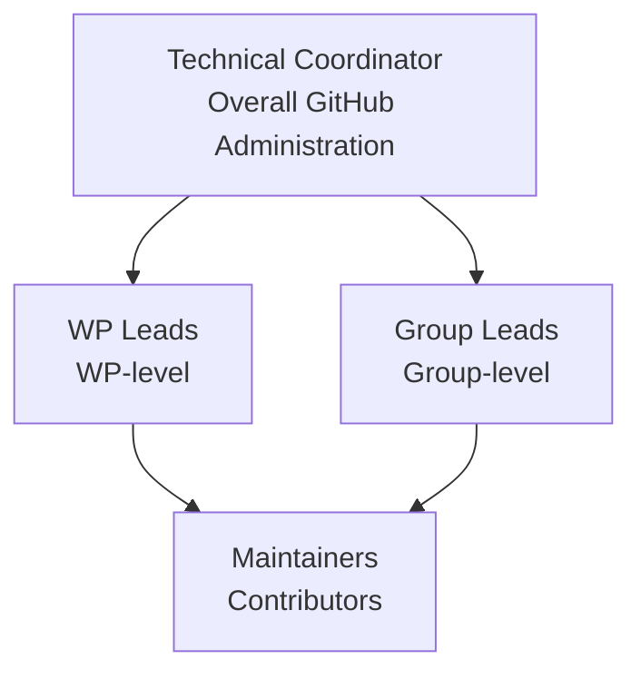

### 3.3 Repository Organization

Each Work Package (WP) and specialized groups within Work Packages maintain their own repositories within the consortium organization. This distributed ownership model recognizes that different technical areas require autonomy while still benefiting from the shared organizational infrastructure.

**Repository Structure:**

The WeBuild Consortium organization contains 10 repositories:

```
webuild-consortium/
├── .github/                           # Organization-level GitHub configuration (public)
├── eudi-wallet-rulebooks-and-schemas/ # Rulebooks and data schemas for WeBuild LSP use cases (public)
├── webuild-github-policies/           # GitHub Policies and Guidelines for WE BUILD Consortium (public)
├── wp3-technology-standards/          # WP3 Technology & Standards Working Group (private)
├── wp4-architecture/                  # Drafts and ADRs for Large Scale Pilot use cases (public)
├── wp4-interop-test-bed/              # Interoperability Test Bed implementing conformance (public)
├── wp4-qtsp-group/                    # Public resources shared within WP4 QTSP group (public)
├── wp4-semantics-group/               # Semantics group resources (public)
├── wp4-trust-group/                   # Public resources shared within WP4 Trust Infrastructure group (public)
└── wp4-wallets-group/                 # Repository for WP4 Wallet Providers Group (public)
```

**Repositories typically contain:**

- Technical Specifications: Formal definitions of interfaces, protocols, and standards
- API Definitions: Machine-readable and human-readable API documentation
- Test Tools and Environments: Software and configurations for testing implementations
- Example Implementations: Reference code demonstrating how to implement specifications
- Supporting Documentation: Guides, tutorials, and explanatory materials

### 3.4 Roles and Responsibilities

#### 3.4.1 Technical Coordinator

**Responsibilities:**
- Manage GitHub organization settings and security
- Add and remove members from the organization
- Approve new repositories and major changes
- Update policies as needed
- Resolve conflicts between teams

**GitHub Permission:** Organization Owner

**Contact:** webuild-github-support@grnet.gr

#### 3.4.2 Work Package (WP) Leads

**Responsibilities:**
- Oversee repositories within their Work Package
- Approve repository creation requests
- Manage team member access within their WP
- Ensure quality of WP deliverables

**GitHub Permission:** Admin on WP team

#### 3.4.3 Group Leads

**Responsibilities:**
- Manage day-to-day repository operations
- Add and remove team members within their group
- Coordinate code reviews
- Manage issues and project boards
- Maintain up-to-date documentation

**GitHub Permission:** Admin on repositories they manage

#### 3.4.4 Maintainers

**Responsibilities:**
- Review and merge pull requests
- Triage and manage issues
- Create releases
- Update documentation
- Support contributors

**GitHub Permission:** Write access with merge rights

#### 3.4.5 Contributors

**Responsibilities:**
- Submit code and documentation changes
- Report issues and bugs
- Participate in discussions
- Review pull requests from other contributors

**GitHub Permission:** Write or Read (depending on repository)

### 3.5 Decision-Making Authority

| Decision | Who Decides | Who to Consult |
|----------|-------------|----------------|
| Organization settings | Technical Coordinator | WP Leads |
| Create new repository | WP/Group Lead | Technical Coordinator (for approval) |
| Delete repository | Technical Coordinator | WP Lead, Group Lead |
| Add team members | Group Lead | - |
| Make repository public | WP Lead + Technical Coordinator | - |
| Change license | Technical Coordinator | WP Lead |
| Update policies | Technical Coordinator | WP Leads |

### 3.6 Essential Repository Components

Every repository within the consortium organization must include these foundational documents:

**README File**
The README serves as the entry point for anyone accessing the repository. It should clearly explain the repository's purpose, provide orientation for new contributors, and link to other relevant documentation. A well-crafted README significantly reduces the barrier to entry for partners joining ongoing technical work.

**LICENSE File**
The LICENSE file specifies the legal terms under which the repository's contents can be used, modified, and distributed. The default license is Apache License 2.0, which is used by most WeBuild repositories. Clear licensing is essential for ensuring that consortium outputs can be properly utilized by partners and, where appropriate, by the broader community.

**CONTRIBUTING Guide**
The CONTRIBUTING guide explains how partners can contribute to the repository. It should detail the expected workflow for proposing changes, coding standards or documentation conventions to follow, and the review process that contributions will undergo.

**Supporting Documentation**
Additional documentation may include architecture diagrams, decision records, meeting notes, or any other materials that help partners understand and contribute to the technical work effectively.

---

## 4. Access Management and Role Definitions

### 4.1 Account Requirements

All consortium members participating in GitHub activities must have their own GitHub accounts.

**You may use your personal GitHub account.** There is no requirement to create a separate work account or use a work email address in your GitHub account.

**Configure your Git client** to ensure commits are properly attributed:

```bash
git config --global user.name "Your Full Name"
git config --global user.email "your.email@organization.com"
```

### 4.2 Two-Factor Authentication (2FA)

Two-factor authentication is **required for all consortium members**. This is a mandatory security requirement that significantly enhances account security.

**Setup Steps:**

1. Go to GitHub Settings → Password and authentication
2. Click "Enable two-factor authentication"
3. Choose authentication method:
   - **Recommended:** Authenticator app (Google Authenticator, Authy, 1Password)
   - **Alternative:** Security key (YubiKey, etc.)
   - **Fallback:** SMS (least secure)
4. Save recovery codes securely
5. Verify 2FA is enabled

**Recovery Codes:**
- Store in secure password manager
- Keep offline backup
- Never share with anyone
- Generate new codes if compromised

### 4.3 Access Request Process

#### 4.3.1 For New Consortium Members

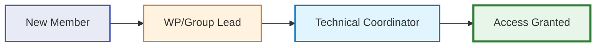

**Process:**

1. New member completes onboarding
2. WP/Group lead submits access request to Technical Coordinator
3. Technical Coordinator adds member to organization
4. WP/Group lead adds member to appropriate team(s)
5. Member receives welcome email with guidelines

**Access Request Template:**

```markdown
Subject: GitHub Access Request - [Member Name]

## Member Information
- Name: [Full Name]
- GitHub Username: [@username]
- Email: [work.email@organization.com]
- Organization: [Partner Organization]
- Work Package: [WP Number]
- Group: [Group Name]
- Role: [Developer/Researcher/etc.]

## Access Requirements
- Organization Access: Yes
- Teams: [@webuild-consortium/[team-name]]
- Repositories: [List specific repos if limited access]
- Permission Level: [Read/Write/Admin]

## Duration
- Start Date: [YYYY-MM-DD]
- End Date: [YYYY-MM-DD or "Ongoing"]
```

### 4.4 Permission Levels

| Level | Capabilities | Typical Role |
|-------|-------------|--------------|
| **Read** | View code, clone, download | External collaborators, observers |
| **Triage** | Read + manage issues/PRs | Community managers |
| **Write** | Triage + push to branches | Contributors |
| **Maintain** | Write + manage repo settings | Maintainers |
| **Admin** | Full control except deletion | Group leads |
| **Owner** | Full organizational control | Technical Coordinator |

### 4.5 Access Review and Maintenance

Access rights are reviewed as needed to ensure that:

- Permissions remain appropriate for each member's current role in the consortium
- Former partners or members who have left the consortium have their access revoked
- New partners receive appropriate access in a timely manner
- The principle of least privilege is maintained (members have only the access they need)

**Review Process:**

WP/Group leads review team membership when changes occur and submit access updates to the Technical Coordinator as needed.

### 4.6 Access Revocation

Access must be revoked immediately when:
- Member leaves the consortium
- Member changes role (no longer needs access)
- Security incident involving the account
- Violation of policies or code of conduct

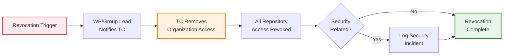

**Revocation Process:**

1. WP/Group lead notifies Technical Coordinator
2. Technical Coordinator removes organization access
3. All repository access automatically revoked
4. Incident logged if security-related

---

## 5. Working Practices and Workflows

### 5.1 Branching Strategy

The consortium employs the **Feature Branch Workflow** as the standard branching strategy. This approach balances stability with the need for ongoing development:

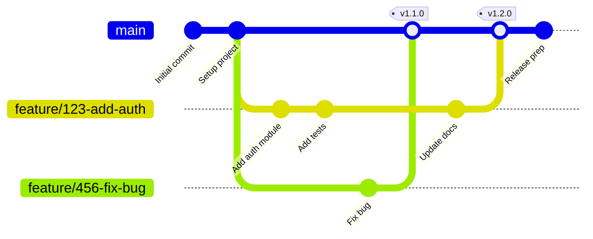

**Main Branch**
The [`main`](main) branch represents the stable, production-ready state of the repository. Content in the main branch should be thoroughly reviewed, tested, and approved. This branch serves as the authoritative source for released versions of specifications, stable APIs, and production-ready code.

**Feature Branches**
Feature branches are created for specific pieces of work—whether implementing a new capability, fixing a bug, or drafting a section of a specification. Feature branches should be short-lived (ideally less than 2 weeks) and are deleted after their changes have been merged. Keeping branches short-lived reduces integration conflicts and ensures code remains synchronized with the main branch.

**Branch Naming Convention:**

```
<type>/<issue-number>-<description>

Examples:
feature/123-add-jwt-authentication
bugfix/456-fix-memory-leak
hotfix/789-patch-security-vulnerability
docs/012-update-api-documentation
```

**Types:**
- `feature/` - New features
- `bugfix/` - Bug fixes
- `hotfix/` - Production hotfixes
- `docs/` - Documentation only
- `refactor/` - Code refactoring
- `test/` - Test additions/changes

This branching strategy provides clear separation between stable outputs and individual contributions, making it easier to manage complex collaborative efforts. The strategy isolates work in progress from stable code, enables parallel development, and facilitates easier testing and rollback if needed.

### 5.2 Pull Request Workflow

All contributions to repositories must follow the pull request (PR) workflow. This requirement is fundamental to maintaining quality and fostering collaboration:

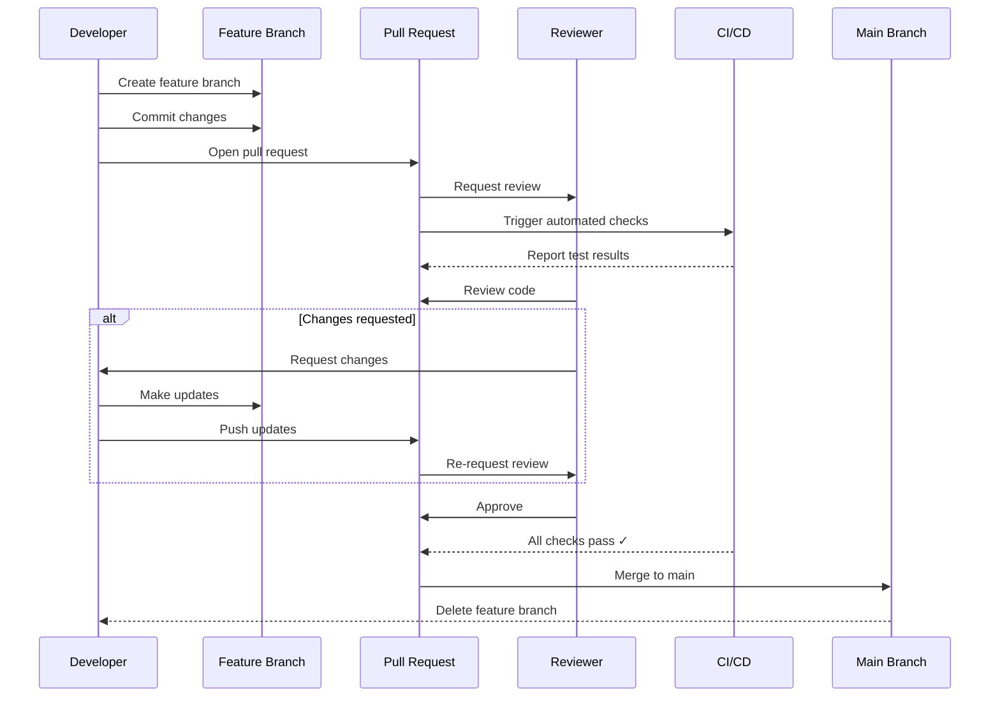

**Why Pull Requests Matter**
Pull requests serve multiple critical functions. They provide a structured mechanism for proposing changes, create a forum for technical discussion and review, maintain a permanent record of what changed and why, and ensure that at least two people (the author and a reviewer) have examined every change.

**Pull Request Requirements**
Every pull request should:

- Be linked to a relevant issue that explains the motivation for the change
- Include a clear description of what is being changed and why
- Be reviewed and approved by at least one other consortium partner before merging
- Pass any automated checks or tests that have been configured for the repository
- Address any feedback or concerns raised during the review process
- Be reviewed within 2 business days to maintain development momentum

**Pull Request Template:**

```markdown
## Description
Brief description of changes.

## Related Issues
Closes #[issue-number]

## Type of Change
- [ ] Bug fix
- [ ] New feature
- [ ] Breaking change
- [ ] Documentation update

## Testing
- [ ] Tests pass locally
- [ ] New tests added
- [ ] Manual testing completed

## Checklist
- [ ] Code follows style guidelines
- [ ] Self-review completed
- [ ] Documentation updated
- [ ] No new warnings
```

**Cross-Partner Review**
The requirement that pull requests be reviewed by another partner (not just another person from the same organization) is particularly important. This cross-partner review ensures that technical decisions consider multiple perspectives and that knowledge is shared across organizational boundaries.

**Code Review Best Practices:**

For Authors:
- Perform self-review before requesting review
- Keep pull requests focused and reasonably sized
- Provide context in the description
- Respond to feedback constructively
- Update the PR based on review comments

For Reviewers:
- Review promptly (within 2 business days)
- Be respectful and constructive
- Focus on important issues
- Explain your reasoning
- Test changes when possible
- Approve when satisfied with the quality

### 5.3 Commit Guidelines

**Commit Message Format:**

```
<type>(<scope>): <subject>

<body>

<footer>
```

**Commit Types:**

| Type | Description | Example |
|------|-------------|---------|
| `feat` | New feature | `feat: add user registration` |
| `fix` | Bug fix | `fix: resolve login timeout` |
| `docs` | Documentation only | `docs: update API guide` |
| `style` | Code style changes | `style: format code with prettier` |
| `refactor` | Code refactoring | `refactor: simplify auth logic` |
| `test` | Test additions/changes | `test: add integration tests` |
| `chore` | Maintenance tasks | `chore: update dependencies` |

**Example:**

```
feat(auth): implement JWT authentication

- Add JWT token generation
- Implement token validation middleware
- Add refresh token support
- Update API documentation

Closes #123
```

**Best Practices:**

- Write clear, descriptive messages in imperative mood
- Use present tense ("add" not "added")
- Keep subject line under 50 characters
- Explain what and why, not how
- Reference issues and PRs
- Make atomic commits (one logical change per commit)
- Commit frequently to avoid losing work
- Each commit should represent a complete, working state

**Atomic Commits:**
Keep commits atomic—each commit should represent a single unit of work. This makes it easier to:
- Understand the purpose of each change
- Review code more effectively
- Revert specific changes without side effects
- Track down bugs using git bisect

### 5.4 Issue Tracking

GitHub Issues serve as the primary mechanism for tracking technical work, documenting decisions, and managing discussions:

**Issue Purposes**
Issues are used to:

- **Track Technical Progress:** Break down large technical efforts into manageable, trackable pieces of work
- **Document Discussions:** Capture technical discussions and decisions in a searchable, permanent format
- **Manage Updates:** Coordinate changes to specifications, APIs, or implementations
- **Report Problems:** Document bugs, inconsistencies, or areas needing improvement
- **Propose Enhancements:** Suggest new features or improvements to existing work

**Issue Labels**

**Standard Labels:**

| Label | Description |
|-------|-------------|
| `bug` | Something isn't working |
| `enhancement` | New feature or request |
| `documentation` | Documentation improvements |
| `question` | Further information requested |
| `help wanted` | Extra attention needed |
| `good first issue` | Good for newcomers |
| `security` | Security-related |
| `priority: high` | Critical, needs immediate attention |
| `priority: medium` | Important, should be addressed soon |
| `priority: low` | Nice to have, can wait |

**Issue Best Practices**
Effective issue management requires:

- Clear, descriptive titles that summarize the issue at a glance
- Detailed descriptions that provide sufficient context for others to understand the issue
- Appropriate labels to categorize and prioritize issues
- Assignment to specific individuals when someone is actively working on the issue
- Regular updates to keep other partners informed of progress
- Closure with a summary of the resolution when work is complete
- Linking related issues and pull requests for traceability

### 5.5 Version Tagging and Releases

Version tags mark important milestones in the evolution of technical artifacts. Tags should follow semantic versioning principles:

**Semantic Versioning:**

```
MAJOR.MINOR.PATCH

Example: 1.2.3
```

**Version Increments:**

- **MAJOR (1.0.0 → 2.0.0):** Breaking changes
- **MINOR (1.0.0 → 1.1.0):** New features (backwards compatible)
- **PATCH (1.0.0 → 1.0.1):** Bug fixes (backwards compatible)

**Pre-release Versions:**

- `1.0.0-alpha.1` - Alpha release
- `1.0.0-beta.1` - Beta release
- `1.0.0-rc.1` - Release candidate

**When to Create Tags**
Tags should be created for:

- **Major Releases:** Significant versions of specifications or software that represent substantial milestones
- **Stable Snapshots:** Points in time when the repository contents are known to be stable and suitable for reference
- **Deliverable Submissions:** Versions that correspond to formal project deliverables
- **Breaking Changes:** Versions that introduce incompatible changes to APIs or interfaces

**Tag Documentation**
Each tag should be accompanied by release notes that explain what has changed since the previous version, highlight any breaking changes or important updates, and acknowledge contributors to that release.

**Creating Tags:**

```bash
# Create annotated tag
git tag -a v1.0.0 -m "First production release"

# Push tag to remote
git push origin v1.0.0

# List all tags
git tag -l
```

---

## 6. Repository Management

### 6.1 Repository Lifecycle

Repositories progress through distinct lifecycle stages:

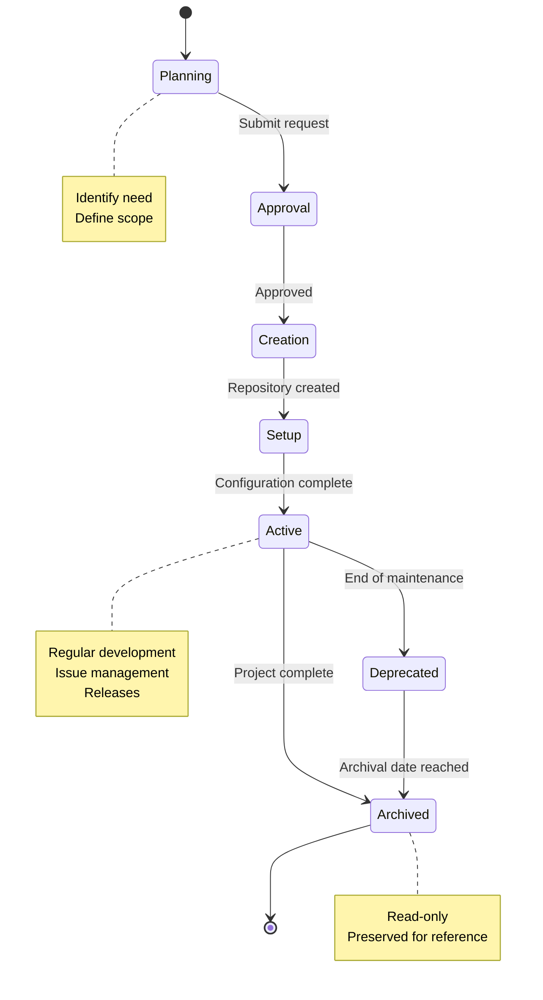

**Lifecycle Stages:**

1. **Planning:** Identify need, define purpose and scope
2. **Approval:** Submit creation request, review by WP/Group lead, approval by Technical Coordinator
3. **Creation:** Repository created in organization, initial structure set up
4. **Setup:** Complete configuration, add required files, configure branch protection
5. **Active:** Regular development activity, issue management, releases
6. **Deprecated:** No longer actively maintained, security updates only
7. **Archived:** Read-only status, preserved for reference

### 6.2 Creating New Repositories

**When to Create a New Repository:**

Create a new repository when:

- Starting a new component or service
- Separating concerns (e.g., API from UI)
- Creating standalone tools or libraries
- Establishing new group workspace
- Developing specifications or standards
- Setting up test frameworks

**Do not create new repository for:**

- Small features (use branches instead)
- Temporary experiments (use personal repos)
- Duplicate functionality
- Single files or scripts

**Repository Naming Best Practices:**

Follow a clear naming convention:
- Use descriptive, specific names
- Include project or team prefix if applicable
- Indicate technology stack when relevant
- Use lowercase with hyphens (e.g., `wp4-trust-api`)
- Avoid special characters
- Keep names concise but meaningful

**Repository Creation Request Template:**

```markdown
## Repository Creation Request

### Basic Information
- **Repository Name:** [e.g., wp4-new-component]
- **Purpose:** [Brief description]
- **Type:** [Code/Documentation/Specification]
- **Work Package:** [e.g., WP4]
- **Group:** [e.g., Trust Infrastructure]
- **Visibility:** Public (default)

### Justification
Explain why this repository is needed and how it fits into the project.

### Scope
- What will be included
- What will NOT be included
- Boundaries and interfaces

### Team
- **Owner:** [Group Lead Name]
- **Maintainers:** [List names]
- **Initial Contributors:** [List names]

### Approvals
- [ ] Group Lead: [Name]
- [ ] WP Lead: [Name]
- [ ] Technical Coordinator: [Pending]
```

### 6.3 Repository Configuration

#### 6.3.1 Required Files

Every repository MUST include:

- **README.md** - Project overview and documentation
- **LICENSE** - Apache License 2.0 (default)
- **CONTRIBUTING.md** - Contribution guidelines
- **.gitignore** - Files to exclude from version control
- **CODE_OF_CONDUCT.md** - Community standards
- **SECURITY.md** - Security policy

#### 6.3.2 Repository Topics

Classify repositories with topics to improve discoverability and organization:

- Navigate to repository Settings → About
- Add relevant topics (e.g., `api`, `python`, `authentication`, `wp4`)
- Topics help with searching, filtering, and organizing repositories
- Use consistent topics across similar repositories

#### 6.3.3 Branch Protection Rules

**For [`main`](main) branch:**

- Require pull request reviews (minimum 1 approval)
- Require status checks to pass before merging
- Require conversation resolution before merging
- Include administrators in restrictions
- Restrict force pushes (disabled)
- Restrict deletions (disabled)
- Require linear history (optional, for cleaner history)

#### 6.3.4 Security Settings

**Enable:**

- Dependency graph
- Dependabot alerts
- Dependabot security updates
- Secret scanning
- Code scanning (if applicable)

### 6.4 Repository Maintenance

**Regular Maintenance Tasks:**

**Daily/Weekly:**
- Monitor and triage new issues
- Review pull requests within 2 days
- Check CI/CD status
- Fix failing builds

**Monthly:**
- Review Dependabot PRs
- Update dependencies
- Check security alerts
- Update documentation
- Review and clean up stale branches

**Quarterly:**
- Review team access
- Remove inactive users
- Analyze repository metrics
- Plan improvements

### 6.5 Archiving and Deprecation

**When to Archive:**

- Project completed
- No longer maintained
- Replaced by newer version
- End of project phase
- Historical reference only

**Deprecation Process:**

1. Add deprecation notice to README
2. Create migration guide
3. Update documentation
4. Notify users
5. Set deprecation timeline
6. Plan archival date

**Deprecation Notice Template:**

```markdown
# DEPRECATED

**This repository is deprecated and no longer maintained.**

**Reason:** [Explain why deprecated]

**Alternative:** Please use [new-repository](link) instead.

**Migration Guide:** See [MIGRATION.md](MIGRATION.md) for migration instructions.

**Support:** Security fixes only until [date]. No new features will be added.
```

---

## 7. Licensing and Intellectual Property

### 7.1 Default License Policy

**Standard License:** Apache License 2.0

**Current Status in WeBuild:**
Most WeBuild repositories use Apache License 2.0, including:
- [`architecture`](https://github.com/webuild-consortium/architecture)
- [`wp4-interop-test-bed`](https://github.com/webuild-consortium/wp4-interop-test-bed)
- [`wp4-qtsp-group`](https://github.com/webuild-consortium/wp4-qtsp-group)
- [`wp4-trust-group`](https://github.com/webuild-consortium/wp4-trust-group)
- [`.github`](https://github.com/webuild-consortium/.github)

**Note:** Some repositories may not have license properly configured in GitHub metadata. All new repositories should explicitly include Apache 2.0 license.

**Rationale:**
- Permissive open-source license
- Compatible with commercial use
- Provides patent protection
- Widely recognized and understood
- Allows derivative works
- Minimal restrictions on use

### 7.2 License Implementation

**Every repository MUST include:**

1. **LICENSE file** in repository root
2. **License headers** in source files (where applicable)
3. **README notice** stating the license
4. **NOTICE file** for attributions (if needed)

**Copyright Notice:**

```
Copyright 2025 WeBuild Consortium

Licensed under the Apache License, Version 2.0 (the "License");
you may not use this file except in compliance with the License.
You may obtain a copy of the License at

    http://www.apache.org/licenses/LICENSE-2.0

Unless required by applicable law or agreed to in writing, software
distributed under the License is distributed on an "AS IS" BASIS,
WITHOUT WARRANTIES OR CONDITIONS OF ANY KIND, either express or implied.
See the License for the specific language governing permissions and
limitations under the License.
```

**Source File Headers:**

```python
# Copyright 2025 WeBuild Consortium
# SPDX-License-Identifier: Apache-2.0
```

### 7.3 Third-Party Dependencies

**Before Adding Dependencies:**

- Check dependency license
- Verify license compatibility
- Review license obligations
- Check for patent clauses
- Assess security implications
- Document license in project

**Acceptable Licenses:**

- Apache 2.0
- MIT
- BSD 2-Clause, 3-Clause
- ISC
- Python Software Foundation
- Unlicense / Public Domain

**Problematic Licenses (avoid):**

- GPL 2.0 (incompatible with Apache 2.0)
- AGPL (strong copyleft)
- Proprietary licenses
- Licenses with field-of-use restrictions

**Dependency Management Best Practices:**

- Lock package versions in manifest files
- Align package versions across projects when possible
- Document all dependencies and their licenses
- Regularly review and update dependencies
- Use automated tools to track dependency vulnerabilities

### 7.4 Intellectual Property

**Key Points:**

1. **Background IP:** Each partner retains ownership of pre-existing IP
2. **Foreground IP:** New IP created during project is jointly owned
3. **Access Rights:** Partners have access rights per consortium agreement
4. **Publication:** Open access publication required by EU grant
5. **Exploitation:** Partners may exploit results per agreement

**Contributors retain copyright** to their contributions, but grant rights to the consortium.

---

## 8. Security and Compliance

### 8.1 Security Principles

**Core Principles:**

1. **Defense in Depth:** Implement multiple layers of security
2. **Least Privilege:** Grant minimum necessary permissions
3. **Secure by Default:** Security should be the default state
4. **Zero Trust:** Never trust, always verify

**Mandatory Requirements:**

All members MUST:

- Enable two-factor authentication (2FA)
- Use strong, unique passwords
- Protect credentials and secrets
- Report security incidents immediately
- Follow secure coding practices
- Complete security training
- Review code for security issues
- Keep dependencies updated

**Prohibited Activities:**

Never:

- Commit secrets or credentials
- Store sensitive data in repositories
- Share accounts or credentials
- Disable security features
- Ignore security warnings
- Use weak or reused passwords
- Access unauthorized resources
- Bypass security controls

### 8.2 Secrets Management

**What Are Secrets?**

- API keys and tokens
- Passwords and passphrases
- Private keys and certificates
- Database credentials
- OAuth tokens
- Encryption keys
- Service account credentials

**Never Commit Secrets**

Secrets should never be committed to version control. Use environment variables and secure secret management tools instead.

**Use .gitignore:**

```gitignore
# Secrets and credentials
.env
.env.local
.env.*.local
secrets/
*.key
*.pem
*.p12
credentials.json
config/secrets.yml
```

**If Secrets Are Committed:**

1. **Rotate the secret immediately**
2. **Remove from history** using BFG Repo-Cleaner or git filter-branch
3. **Notify** Technical Coordinator and security team
4. **Document** the incident

**Secure Storage:**

- **Local development:** Use environment variables and `.env` files (excluded from git)
- **CI/CD:** Use GitHub Secrets for workflow automation
- **Production:** Use dedicated secret management services (AWS Secrets Manager, Azure Key Vault, HashiCorp Vault)

**GitHub Secrets Best Practices:**

- Store secrets at appropriate level (repository, environment, or organization)
- Use environment secrets for deployment-specific credentials
- Limit access to secrets through environment protection rules
- Rotate secrets regularly
- Never print secrets in logs or output
- Use secret scanning to detect accidental commits

### 8.3 Code Security

**Secure Coding Practices:**

**Input Validation:**
- Always validate and sanitize input
- Use parameterized queries
- Validate data type, length, and format
- Whitelist allowed values
- Encode output properly

**Authentication and Authorization:**
- Use strong password hashing (bcrypt, Argon2)
- Implement rate limiting
- Use secure session management
- Implement proper authorization checks
- Use HTTPS for all communications

**Error Handling:**
- Log detailed errors server-side
- Return generic messages to users
- Don't expose stack traces
- Don't reveal system information
- Handle errors gracefully

**Cryptography:**
- Use established libraries (cryptography, libsodium)
- Use strong algorithms (AES-256, RSA-2048+)
- Generate secure random keys
- Protect encryption keys
- Never implement your own crypto

### 8.4 Dependency Security

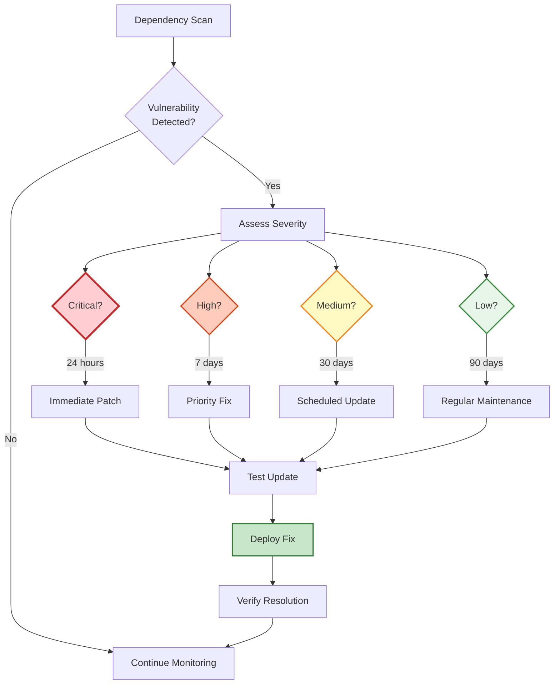

**Dependency Management:**

**Enable GitHub Features:**

1. Dependency graph
2. Dependabot alerts
3. Dependabot security updates

**Vulnerability Response:**

| Severity | Response Time | Action |
|----------|--------------|--------|
| Critical | 24 hours | Immediate patch |
| High | 7 days | Priority fix |
| Medium | 30 days | Scheduled update |
| Low | 90 days | Regular maintenance |

**Update Strategy:**

- **Patch versions:** Update automatically (1.2.3 → 1.2.4)
- **Minor versions:** Review and test (1.2.0 → 1.3.0)
- **Major versions:** Careful review and testing (1.0.0 → 2.0.0)

**Best Practices:**

- Don't commit dependencies to source code (use package managers)
- Lock dependency versions to ensure reproducible builds
- Regularly review and update dependencies
- Monitor security advisories
- Test updates in non-production environments first

### 8.5 Data Protection and GDPR Compliance

**Never store in repositories:**

- Names and contact information
- Email addresses
- Phone numbers
- Physical addresses
- IP addresses
- User IDs (if personally identifiable)
- Any other personal data

**If personal data needed for testing:**

- Use synthetic/fake data
- Anonymize real data
- Use data generators
- Obtain explicit consent (if real data required)

**Data Classification:**

| Level | Examples | Handling |
|-------|----------|----------|
| **Public** | Published docs, open source code | No restrictions |
| **Internal** | Internal docs, non-sensitive code | Consortium only |
| **Confidential** | Partner data, unpublished research | Restricted access |
| **Restricted** | Credentials, personal data | Never in repos |

### 8.6 Incident Response

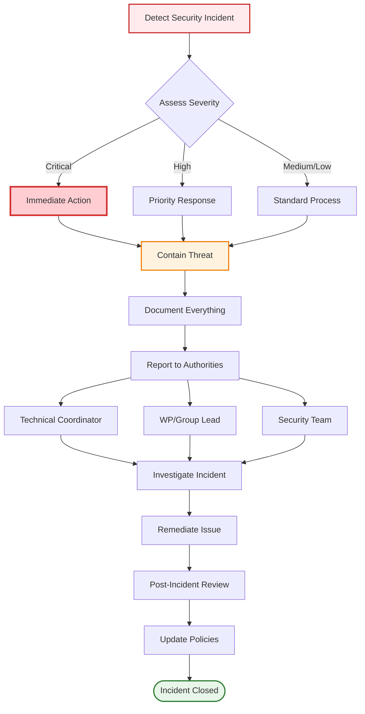

**What is a Security Incident?**

- Unauthorized access to repositories
- Compromised credentials
- Data breach or exposure
- Malware or malicious code
- Denial of service attack
- Vulnerability exploitation

**Reporting Incidents:**

**Immediate Actions:**

1. Don't panic
2. Document everything
3. Report immediately to:
   - Technical Coordinator
   - WP/Group Lead
   - Security team

**Include in report:**

- What happened
- When it happened
- What was affected
- Current status
- Actions taken
- Evidence collected

### 8.7 Compliance Requirements

**EU Regulations:**

**GDPR (General Data Protection Regulation):**

- Lawful basis for data processing
- Explicit consent when required
- Data minimization
- Purpose limitation
- Storage limitation
- Appropriate security measures
- Accountability and documentation

**Implementation:**

- Data protection impact assessment
- Privacy by design
- Data processing records
- Data breach procedures
- Data subject rights procedures

---

## 9. Contribution Guidelines

### 9.1 Getting Started

**Prerequisites:**

Before contributing, ensure you have:

- GitHub account with 2FA enabled
- Access to WeBuild organization
- Appropriate repository permissions
- Git installed and configured
- Development environment set up
- Familiarity with Git workflows

### 9.2 Contribution Workflow

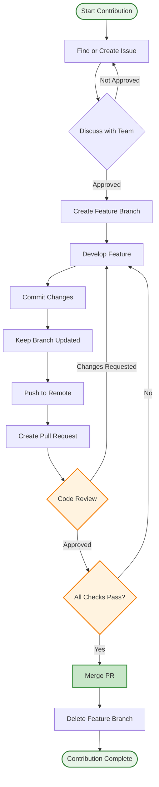

**Step-by-Step Process:**

#### Step 1: Find or Create an Issue

- Search existing issues for similar work
- If no issue exists, create one describing the problem or feature
- Discuss approach with team
- Get approval from maintainer
- Get issue assigned to you

#### Step 2: Create Feature Branch

```bash
# Update local main
git checkout main
git pull origin main

# Create feature branch
git checkout -b feature/123-add-user-profile

# Verify branch
git branch
```

#### Step 3: Develop the Feature

```bash
# Make changes
# ... edit files ...

# Stage changes
git add src/profile.py tests/test_profile.py

# Commit with clear message
git commit -m "feat: add user profile management

- Implement profile CRUD operations
- Add profile validation
- Create profile API endpoints
- Add comprehensive tests

Closes #123"
```

#### Step 4: Keep Branch Updated

```bash
# Fetch latest changes
git fetch origin

# Rebase on main (preferred)
git rebase origin/main

# Resolve conflicts if any
# ... fix conflicts ...
git add .
git rebase --continue
```

#### Step 5: Push and Create PR

```bash
# Push feature branch
git push origin feature/123-add-user-profile

# If rebased, may need force push
git push origin feature/123-add-user-profile --force-with-lease
```

#### Step 6: Address Review Feedback

```bash
# Make requested changes
# ... edit files ...

# Commit changes
git add .
git commit -m "refactor: address review feedback"

# Push updates
git push origin feature/123-add-user-profile
```

#### Step 7: Merge

After approval:

1. Ensure all checks pass
2. Resolve any conflicts
3. Squash commits if needed
4. Merge pull request
5. Delete feature branch

### 9.3 Code Standards

**General Principles:**

- Write clean, readable code
- Follow SOLID principles
- Keep it simple
- Use meaningful variable names
- Add comments for complex logic
- Write self-documenting code where possible

**Language-Specific Standards:**

Follow established style guides for each language:

- **Python:** PEP 8, use pylint, flake8, black
- **JavaScript/TypeScript:** Airbnb style guide, use ESLint, Prettier
- **Java:** Google Java Style Guide, use checkstyle

**Security Considerations:**

Always:

- Validate all inputs
- Sanitize user data
- Use parameterized queries
- Implement proper authentication
- Follow principle of least privilege
- Keep dependencies updated

Never:

- Store passwords in plain text
- Commit secrets or credentials
- Trust user input
- Use deprecated security libraries
- Ignore security warnings

### 9.4 Testing Requirements

**All code changes must include tests:**

- New features require new tests
- Bug fixes require regression tests
- Refactoring maintains test coverage
- Tests must pass before merging

**Types of Tests:**

- **Unit Tests:** Test individual components in isolation
- **Integration Tests:** Test component interactions
- **End-to-End Tests:** Test complete user workflows

**Minimum Requirements:**

- Unit test coverage: 80%
- Critical paths: 100%
- New code: Must include tests
- Bug fixes: Must include regression tests

### 9.5 Code Review Guidelines

**For Authors:**

- Self-review first
- Provide clear PR description
- Link to relevant issues
- Explain design decisions
- Be responsive to feedback
- Make requested changes promptly

**For Reviewers:**

- Review promptly (within 2 days)
- Be respectful and constructive
- Focus on important issues
- Explain reasoning
- Approve when satisfied
- Test if possible

**Review Checklist:**

- Functionality: Does it work as intended?
- Code Quality: Is it well-written and maintainable?
- Tests: Are there adequate tests?
- Documentation: Is it properly documented?
- Security: Are there security concerns?
- Performance: Are there performance issues?
- Standards: Does it follow coding standards?

---

## 10. Onboarding and Offboarding Procedures

### 10.1 Onboarding Journey

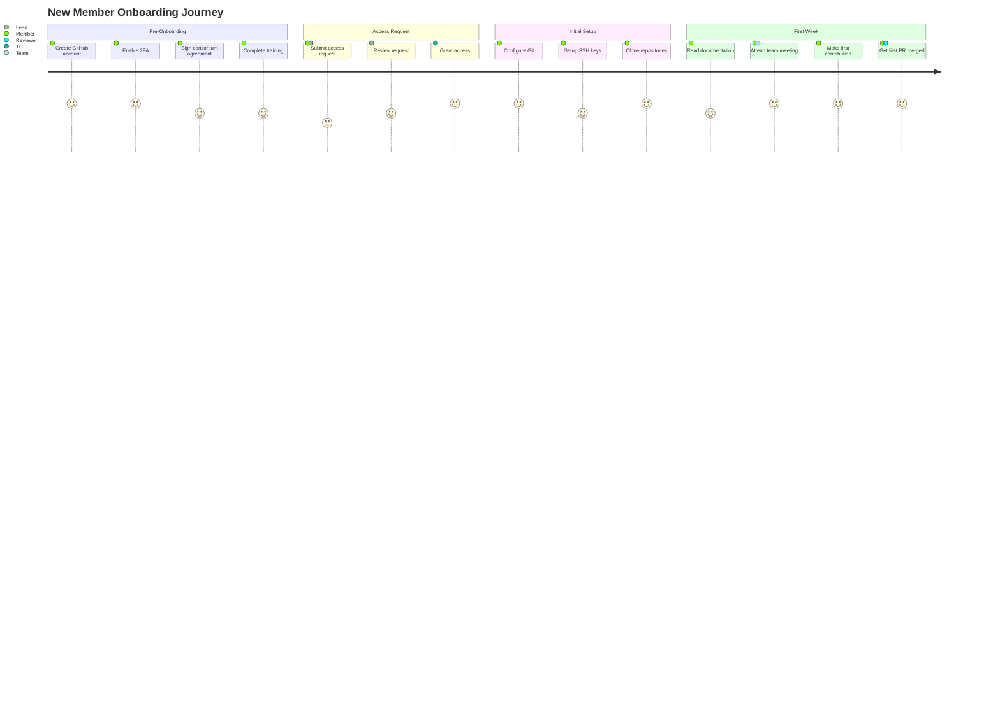

### 10.2 Pre-Onboarding Requirements

Before requesting access, new members must:

**Have a GitHub Account:**
- Create account at [github.com](https://github.com)
- Use professional username (preferably real name)
- Add profile picture
- Enable two-factor authentication (2FA)

**Complete Consortium Onboarding:**
- Sign consortium agreement
- Receive partner organization approval

**Understand Project Context:**
- Review project overview
- Understand WP/Group objectives
- Identify role and responsibilities
- Know reporting structure

### 10.3 Initial Setup

**Git Configuration:**

```bash
# Set your name and email
git config --global user.name "Your Full Name"
git config --global user.email "your.email@organization.com"

# Set default branch name
git config --global init.defaultBranch main

# Enable credential caching
git config --global credential.helper cache

# Verify configuration
git config --list
```

**SSH Key Setup (Recommended):**

```bash
# Generate SSH key
ssh-keygen -t ed25519 -C "your.email@organization.com"

# Start SSH agent
eval "$(ssh-agent -s)"

# Add key to agent
ssh-add ~/.ssh/id_ed25519

# Copy public key and add to GitHub
cat ~/.ssh/id_ed25519.pub
```

### 10.4 First Week Goals

**Week 1 Checklist:**

- [ ] Complete environment setup
- [ ] Clone relevant repositories
- [ ] Read all documentation
- [ ] Attend team meeting
- [ ] Make first contribution (even if small)
- [ ] Get first PR merged
- [ ] Introduce yourself to team
- [ ] Set up communication channels

### 10.5 Offboarding Procedures

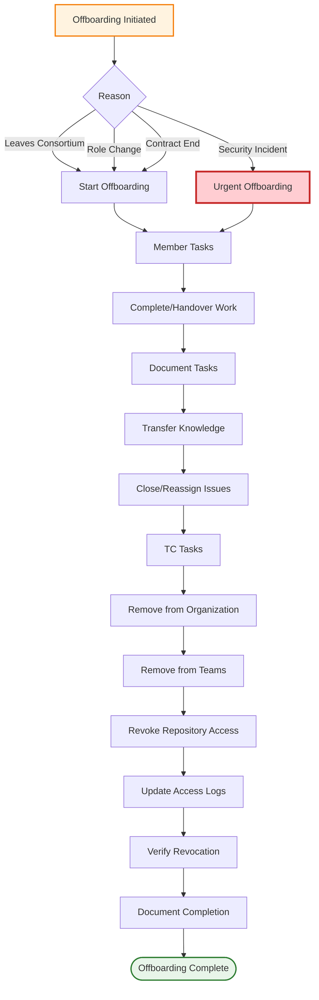

**When Offboarding is Required:**

- Member leaves the consortium
- Partner organization exits project
- Contract/assignment ends
- Role changes (no longer needs access)
- Security incident requires access revocation

**Offboarding Checklist:**

**For Departing Member:**
- [ ] Complete assigned work or hand over
- [ ] Document ongoing tasks
- [ ] Transfer knowledge to team
- [ ] Update documentation
- [ ] Close or reassign issues
- [ ] Finish open pull requests

**For Technical Coordinator:**
- [ ] Remove from organization
- [ ] Remove from all teams
- [ ] Revoke repository access
- [ ] Update access logs
- [ ] Verify access revocation complete
- [ ] Document offboarding completion

---

## 11. Best Practices Summary

### 11.1 General Best Practices

**Do:**

- Keep branches short-lived (< 2 weeks)
- Update from main frequently
- Write clear commit messages
- Make atomic commits
- Test before pushing
- Review your own code first
- Delete merged branches
- Use branch protection rules
- Follow naming conventions
- Document significant decisions
- Commit frequently to avoid losing work
- Pull before you push to avoid conflicts

**Don't:**

- Commit directly to main
- Force push to shared branches
- Leave branches unmerged for long
- Mix unrelated changes
- Commit broken code
- Ignore CI failures
- Skip code review
- Rewrite published history
- Commit dependencies or configuration files
- Hardcode secrets or credentials

### 11.2 Security Best Practices

**Always:**

- Enable 2FA on all accounts
- Use strong, unique passwords
- Protect credentials and secrets
- Validate all inputs
- Use parameterized queries
- Keep dependencies updated
- Review code for security issues
- Report incidents immediately
- Rotate secrets regularly
- Use environment variables for configuration

**Never:**

- Commit secrets or credentials
- Store sensitive data in repositories
- Share accounts or credentials
- Disable security features
- Ignore security warnings
- Trust user input without validation
- Use deprecated security libraries
- Expose secrets in logs

### 11.3 Code Quality Best Practices

**Write Clean Code:**

- Clear and readable
- Self-documenting where possible
- Consistent style
- Properly formatted
- Well-tested
- Adequately documented

**Follow SOLID Principles:**

- Single Responsibility
- Open/Closed
- Liskov Substitution
- Interface Segregation
- Dependency Inversion

**Keep It Simple:**

- Avoid over-engineering
- Use appropriate abstractions
- Prefer clarity over cleverness
- Make code maintainable

### 11.4 Repository Management Best Practices

**Organization:**

- Use clear naming conventions
- Classify repositories with topics
- Maintain comprehensive README files
- Keep repositories focused and scoped appropriately
- Archive dead or unmaintained repositories

**Collaboration:**

- Use pull requests for all changes
- Conduct thorough code reviews
- Leverage issue tracking effectively
- Use GitHub Projects for planning
- Communicate clearly and frequently

---

## 12. Support and Resources

### 12.1 Getting Help

**For GitHub Issues:**

1. Check repository documentation
2. Search existing issues
3. Open an issue in the relevant repository
4. Contact repository maintainers
5. Escalate to WP/Group lead

**For Policy Questions:**

1. Review this documentation
2. Contact your WP/Group lead
3. Reach out to Technical Coordinator

**Communication Channels:**
- GitHub Issues (for technical questions)
- Consortium internal channels (for policy/administrative questions)
- Note: Additional support channels (e.g., Slack) may be established as needed

### 12.2 Training and Resources

**Internal Resources:**

- Repository documentation
- Wiki pages
- Past pull requests and issues
- Team meeting notes
- Architecture diagrams

**External Resources:**

- [GitHub Documentation](https://docs.github.com)
- [Git Documentation](https://git-scm.com/doc)
- [Pro Git Book](https://git-scm.com/book)
- [Apache License 2.0](https://www.apache.org/licenses/LICENSE-2.0)
- [SPDX License List](https://spdx.org/licenses/)

### 12.3 Contact Information

**Technical Coordinator:** webuild-github-support@grnet.gr

**WP4 Lead:** Contact via consortium internal channels

**Group Leads:** Contact via consortium internal channels or repository discussions

**Support:**
- For technical issues: Open an issue in the relevant repository
- For policy questions: Contact your WP/Group lead
- For access requests: Contact Technical Coordinator through consortium channels

---

## 13. Appendices

### Appendix A: Quick Reference Checklist

**New Repository Setup:**

- [ ] Repository created with appropriate name
- [ ] README.md with required content
- [ ] LICENSE file (Apache 2.0)
- [ ] CONTRIBUTING.md
- [ ] .gitignore configured
- [ ] Branch protection rules set
- [ ] Topics added
- [ ] Team access configured
- [ ] EU funding acknowledgment included
- [ ] Security settings enabled

**Before Making Repository Public:**

- [ ] Pre-publication checklist completed
- [ ] No secrets or credentials
- [ ] No sensitive data
- [ ] Appropriate license
- [ ] Documentation complete
- [ ] Approvals obtained
- [ ] Announcement prepared

**Pull Request Checklist:**

- [ ] Code follows style guidelines
- [ ] All tests pass locally
- [ ] New tests added for new functionality
- [ ] Documentation updated
- [ ] Commit messages are clear
- [ ] No merge conflicts with main
- [ ] Self-review completed
- [ ] No debugging code or console logs

### Appendix B: Common Git Commands

**Branch Management:**

```bash
# Create branch
git checkout -b feature/123-name

# Update branch
git fetch origin
git rebase origin/main

# Delete branch
git branch -d feature/123-name
```

**Commit and Push:**

```bash
# Commit
git add .
git commit -m "type: description"

# Push
git push origin feature/123-name

# Force push (use with caution)
git push origin feature/123-name --force-with-lease
```

**Sync with Main:**

```bash
git checkout main
git pull origin main
git checkout feature/123-name
git rebase main
```

**Stash Changes:**

```bash
# Save work in progress
git stash save "WIP: feature implementation"

# Apply stash
git stash pop
```

### Appendix C: Troubleshooting

**Common Issues:**

**Issue: Merge Conflicts**

```bash
# Update your branch
git fetch origin
git rebase origin/main

# Fix conflicts in files
git add .
git rebase --continue
```

**Issue: Accidentally Committed to Main**

```bash
# Move commit to new branch
git branch feature/accidental-commit
git reset --hard HEAD~1
git checkout feature/accidental-commit
```

**Issue: Need to Change Last Commit Message**

```bash
git commit --amend -m "New commit message"
git push origin branch-name --force-with-lease
```

**Issue: Pushed Sensitive Data**

1. Rotate the secret immediately
2. Remove from history using BFG Repo-Cleaner
3. Notify Technical Coordinator
4. Document the incident

### Appendix D: Glossary

- **Consortium:** WeBuild project partners
- **WP:** Work Package
- **PR:** Pull Request
- **CI/CD:** Continuous Integration/Continuous Deployment
- **GDPR:** General Data Protection Regulation
- **IP:** Intellectual Property
- **EUDI:** European Digital Identity
- **2FA:** Two-Factor Authentication
- **SSH:** Secure Shell
- **API:** Application Programming Interface
- **Atomic Commit:** A commit containing a single logical change
- **Branch Protection:** Rules that prevent direct commits to protected branches
- **Code Owner:** Person or team responsible for reviewing changes to specific code
- **Dependency:** External library or package used by the project
- **Fork:** Personal copy of a repository
- **Merge Conflict:** When Git cannot automatically merge changes
- **Rebase:** Reapplying commits on top of another base
- **Semantic Versioning:** Version numbering scheme (MAJOR.MINOR.PATCH)
- **Tag:** Named reference to a specific commit

### Appendix E: EU Funding Acknowledgment

All repositories MUST include EU funding acknowledgment:

**Required Text:**

```markdown
## Funding


The WeBuild project is co-funded by the European Union. However, the views and
opinions expressed are those of the author(s) only and do not necessarily reflect
those of the European Union or the granting authority. Neither the European Union
nor the granting authority can be held responsible.
```

**Placement:** In README.md and major documentation files

---

## Conclusion

These policies and guidelines establish the foundation for effective, secure, and compliant use of GitHub within the WeBuild Consortium. By following these practices, partners can collaborate effectively across organizational boundaries while maintaining the quality, security, and integrity of technical work.

Success in collaborative technical work requires more than just tools—it requires shared understanding of how those tools should be used. These guidelines provide that shared understanding, enabling partners to focus on the technical challenges at hand rather than on process questions.

As the consortium's work evolves, these policies may be refined based on practical experience and changing needs. Partners are encouraged to provide feedback on these guidelines to help ensure they remain practical and effective.

---

## Document History

| Version | Date | Changes | Author |
|---------|------|---------|--------|
| 1.0 | October 2025 | Initial version based on Project Management Handbook | WeBuild Technical Coordination |
| 2.0 | October 2025 | Enhanced with content from 7 policy documents: GitHub Policies and Guidelines, Contribution Guidelines, Onboarding Procedures, Repository Management, Licensing Guidelines, Security and Compliance, and Branching and Workflow | WeBuild Technical Coordination |
| 3.0 | October 2025 | Incorporated insights from best practices documents covering branching strategies, version control workflows, secrets management, repository management, and general GitHub best practices | WeBuild Technical Coordination |
| 4.0 | October 2025 | Replaced ASCII diagrams with Mermaid diagrams and added additional visual diagrams for improved clarity and understanding | WeBuild Technical Coordination |
| 4.1 | November 2025 | Updated to reflect actual WeBuild repository structure, licenses, and communication channels | WeBuild Technical Coordination |
| 4.2 | December 2025 | Improved structure, eliminated redundancies, and enhanced readability | WeBuild Technical Coordination |

---

*This document is maintained in the `webuild-policies` repository. For questions or suggestions, please open an issue or contact the Technical Coordinator webuild-github-support@grnet.gr.*
