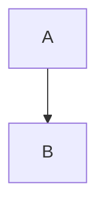

# Markdown to DOCX Conversion

This directory contains tools to convert `GITHUB_POLICIES_AND_GUIDELINES.md` to a professionally styled `.docx` document with rendered Mermaid diagrams.

## Quick Start

```bash
# Install prerequisites
make install

# Convert markdown to .docx
make docx
```

## Features

The conversion process provides:

✅ **Rendered Mermaid Diagrams** - All 11 Mermaid diagrams converted to high-quality PNG images

✅ **Styled Code Blocks** - Gray background (RGB: 240, 240, 240) with Consolas font

✅ **Styled Inline Code** - Reddish color highlighting with Consolas font

✅ **Professional Tables** - Black borders, gray headers, bold header text

✅ **Image Caching** - Existing diagrams aren't regenerated (faster subsequent conversions)

## Files

### Conversion Scripts

- **`create_styled_conversion.py`** - Main conversion script
  - Extracts Mermaid diagrams from markdown
  - Converts diagrams to PNG images using mermaid-cli
  - Creates custom reference document with styling
  - Converts markdown to .docx using pandoc

- **`add_table_borders.py`** - Table enhancement script
  - Adds borders to all tables
  - Styles header rows with gray background
  - Makes header text bold

### Configuration Files

- **`requirements.txt`** - Python dependencies
- **`Makefile`** - Build automation
- **`INSTALLATION.md`** - Detailed installation guide

### Generated Files

- **`GITHUB_POLICIES_AND_GUIDELINES.docx`** - Final output document
- **`custom-reference.docx`** - Pandoc reference document with custom styles
- **`mermaid_images/`** - Directory with rendered diagram images (cached)

## Usage

### Basic Conversion

```bash
make docx
```

### Manual Conversion

If you prefer to run scripts individually:

```bash
# Step 1: Convert markdown with diagrams
python3 create_styled_conversion.py

# Step 2: Add table borders
python3 add_table_borders.py
```

### Cleaning Up

```bash
# Remove generated files (keeps cached images)
make clean

# Remove everything including cached images
make clean-all
```

## Prerequisites

- **macOS** (Sonoma or later)
- **Python 3.8+**
- **Homebrew**
- **Google Chrome** (for rendering Mermaid diagrams)
- **pandoc** (installed via Homebrew)
- **mermaid-cli** (installed via Homebrew)
- **python-docx** (installed via pip)

See [`INSTALLATION.md`](INSTALLATION.md) for detailed installation instructions.

## How It Works

### Step 1: Extract Mermaid Diagrams

The script scans the markdown file for Mermaid code blocks:

```markdown

```

### Step 2: Render Diagrams

Each Mermaid diagram is converted to a PNG image using mermaid-cli (which uses Chrome/Puppeteer):

```bash
mmdc -i diagram.mmd -o diagram.png
```

### Step 3: Replace in Markdown

Mermaid code blocks are replaced with image references:

```markdown

```

### Step 4: Convert to DOCX

Pandoc converts the modified markdown to .docx using a custom reference document:

```bash
pandoc input.md -o output.docx --reference-doc custom-reference.docx
```

### Step 5: Enhance Tables

The `add_table_borders.py` script post-processes the .docx to add borders and styling to all tables.

## Customization

### Modifying Styles

Edit `create_styled_conversion.py` to customize:

- **Code block background**: Change `'F0F0F0'` to your preferred hex color
- **Inline code color**: Change `RGBColor(199, 37, 78)` values
- **Font**: Change `'Consolas'` to your preferred monospace font
- **Font size**: Change `Pt(9)` value

### Modifying Table Borders

Edit `add_table_borders.py` to customize:

- **Border size**: Change `"sz": "12"` (1/8 pt units)
- **Border color**: Change `"color": "000000"` (hex color)
- **Header background**: Change `header_shading = "D9D9D9"` (hex color)

### Diagram Rendering

The script uses these mermaid-cli options:

- `-b transparent` - Transparent background
- `-t default` - Default theme

Modify in `create_styled_conversion.py` if needed.

## Performance

### First Conversion
- **Time**: ~2-3 minutes (rendering 11 diagrams)
- **Output**: ~525KB .docx file

### Subsequent Conversions
- **Time**: ~10-15 seconds (using cached images)
- **Output**: Same size

### Image Cache

Diagram images are cached in `mermaid_images/`. The script checks if an image exists before regenerating it, significantly speeding up subsequent conversions.

To force regeneration of all diagrams:

```bash
make clean-all
make docx
```

## Troubleshooting

### Diagrams Not Rendering

1. Verify Chrome is installed at `/Applications/Google Chrome.app`
2. Check mermaid-cli: `mmdc --version`
3. Test manually: `mmdc -i test.mmd -o test.png`

### Tables Have No Borders

Ensure you run both scripts:
```bash
python3 create_styled_conversion.py
python3 add_table_borders.py
```

Or use `make docx` which runs both automatically.

### Python Import Errors

Install dependencies:
```bash
pip3 install -r requirements.txt --break-system-packages
```

### Permission Errors

Make scripts executable:
```bash
chmod +x create_styled_conversion.py add_table_borders.py
```

## Technical Details

### Dependencies

- **pandoc**: Universal document converter
- **mermaid-cli**: Mermaid diagram renderer (uses Puppeteer + Chrome)
- **python-docx**: Python library for creating/modifying .docx files

### Mermaid Diagram Types

The document contains these Mermaid diagram types:
- Flowcharts
- Sequence diagrams
- Gantt charts
- State diagrams
- Journey diagrams
- Git graphs

All are supported and rendered correctly.

### Document Structure

The .docx maintains the complete markdown structure:
- Headings (H1-H6)
- Paragraphs
- Lists (ordered and unordered)
- Tables
- Code blocks (inline and block)
- Images (including rendered diagrams)
- Links

## License

These conversion scripts are provided as-is for use with the WEBUILD project documentation.

## Support

For issues or questions:
1. Check [`INSTALLATION.md`](INSTALLATION.md) for setup help
2. Review this README for usage guidance
3. Check the Makefile for available commands: `make help`