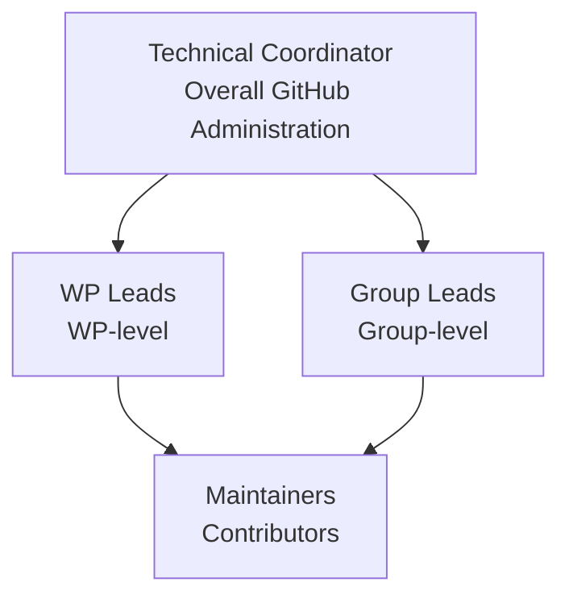
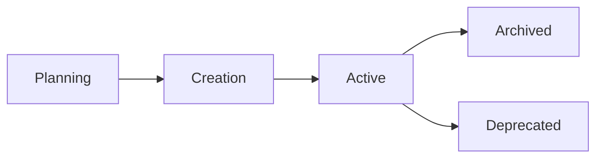
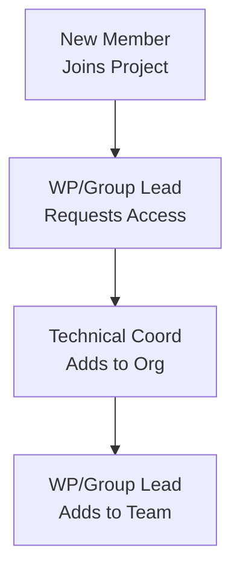
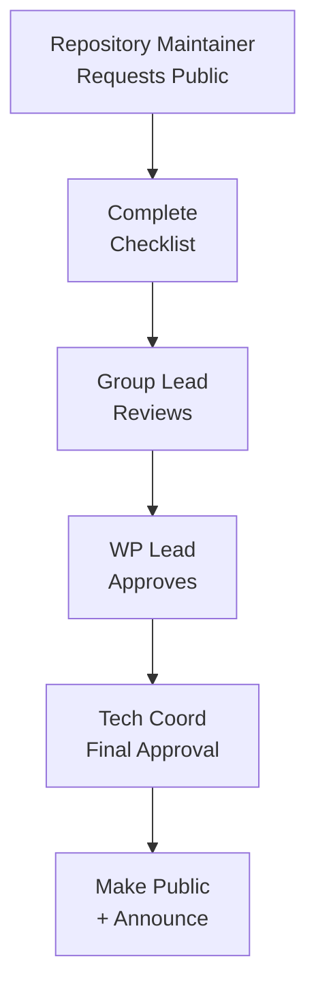

# GitHub Policies and Guidelines

**Document Version:** 1.2
**Last Updated:** December 2025
**Status:** Draft for Review
**Owner:** Technical Coordinator

---

## Table of Contents

1. [Introduction](#1-introduction)
2. [Purpose and Scope](#2-purpose-and-scope)
3. [Governance Structure](#3-governance-structure)
4. [Repository Organization](#4-repository-organization)
5. [Access Control and Permissions](#5-access-control-and-permissions)
6. [Repository Visibility and Public Access](#6-repository-visibility-and-public-access)
7. [Naming Conventions](#7-naming-conventions)
8. [Repository Standards](#8-repository-standards)
9. [Code Quality and Review](#9-code-quality-and-review)
10. [Documentation Requirements](#10-documentation-requirements)
11. [Issue and Project Management](#11-issue-and-project-management)
12. [Compliance and Legal](#12-compliance-and-legal)
13. [Support and Resources](#13-support-and-resources)
14. [Policy Updates and Amendments](#14-policy-updates-and-amendments)

---

## 1. Introduction

### 1.1 About WEBUILD Consortium

The WEBUILD consortium is a collaborative European project focused on building digital wallet infrastructure and related technologies. The consortium brings together multiple partners across Europe to develop interoperable, secure, and standards-compliant solutions.

**GitHub Organization:** [https://github.com/webuild-consortium](https://github.com/webuild-consortium)

### 1.2 Role of GitHub

GitHub serves as the primary platform for:
- Source code management and version control
- Technical collaboration across partners
- Documentation and knowledge sharing
- Issue tracking and project management
- Continuous integration and deployment
- Community engagement and transparency

### 1.3 Document Purpose

This document establishes the comprehensive policies and guidelines for using GitHub within the WEBUILD consortium. It ensures:
- Consistent practices across all Work Packages
- Secure and compliant repository management
- Effective collaboration among partners
- Quality assurance and accountability
- Alignment with EU project requirements

---

## 2. Purpose and Scope

### 2.1 Objectives

These policies aim to:

1. **Enable Collaboration:** Facilitate effective technical collaboration across consortium partners
2. **Ensure Quality:** Maintain high standards for code, documentation, and technical outputs
3. **Provide Security:** Protect intellectual property and sensitive information
4. **Support Transparency:** Enable open collaboration while respecting confidentiality requirements
5. **Maintain Compliance:** Ensure adherence to EU regulations and consortium agreements
6. **Streamline Workflows:** Establish efficient processes for development and deployment

### 2.2 Scope of Application

These policies apply to:

- All repositories under the `webuild-consortium` GitHub organization
- All consortium members with GitHub access
- All Work Packages and technical groups
- All types of content (code, documentation, specifications, tests)
- All development environments (DEV, TEST, PROD)

### 2.3 Relationship to Other Policies

These GitHub policies complement and must be read in conjunction with:
- WEBUILD Consortium Agreement
- Data Management Plan
- Intellectual Property Rights Agreement
- Security and Privacy Policies
- EU Grant Agreement requirements

---

## 3. Governance Structure

### 3.1 Organizational Hierarchy



### 3.2 Roles and Responsibilities

#### 3.2.1 Technical Coordinator

**Who:** [Technical Coordinator Name]

**What they do:**
- Manages GitHub organization settings and security
- Adds/removes members from the organization
- Approves new repositories and major changes
- Updates policies when needed
- Helps resolve conflicts between teams

**GitHub Permission:** Organization Owner

#### 3.2.2 Work Package (WP) Leads

**What they do:**
- Oversee repositories in their Work Package
- Approve repository creation requests
- Manage team member access within their WP
- Ensure quality of WP deliverables

**GitHub Permission:** Admin on WP team

#### 3.2.3 Group Leads

**What they do:**
- Manage day-to-day repository operations
- Add/remove team members in their group
- Coordinate code reviews
- Manage issues and project boards
- Keep documentation up to date

**GitHub Permission:** Admin on repositories they manage

#### 3.2.4 Maintainers

**What they do:**
- Review and merge pull requests
- Triage and manage issues
- Create releases
- Update documentation
- Help contributors

**GitHub Permission:** Write access with merge rights

#### 3.2.5 Contributors

**What they do:**
- Submit code and documentation changes
- Report issues and bugs
- Participate in discussions
- Review others' pull requests

**GitHub Permission:** Write or Read (depending on repository)

### 3.3 Decision-Making Authority

| Decision | Who Decides | Who to Consult |
|----------|-------------|----------------|
| Organization settings | Technical Coordinator | WP Leads |
| Create new repository | WP/Group Lead | Technical Coordinator (for approval) |
| Delete repository | Technical Coordinator | WP Lead, Group Lead |
| Add team members | Group Lead | - |
| Make repository public | WP Lead + Technical Coordinator | - |
| Change license | Technical Coordinator | WP Lead |
| Update policies | Technical Coordinator | WP Leads |

### 3.4 Owner Consolidation

**Current Status:** The organization currently has multiple owners. This will be consolidated to improve security and governance.

**Target State:**
- **Primary Owner:** Technical Coordinator
- **Backup Owner:** Designated deputy (1-2 persons maximum)
- **Rationale:** Minimize security risks, clarify accountability, simplify administration

**Transition Plan:**
1. Audit current owner list
2. Identify essential owner roles
3. Communicate changes to affected parties
4. Implement owner reduction
5. Document emergency access procedures

---

## 4. Repository Organization

### 4.1 Repository Structure

The WEBUILD consortium organizes repositories by Work Package and functional groups:

```
webuild-consortium/
├── .github/                    # Organization profile
├── architecture/               # Conformance Specifications and ADRs
├── wp4-interop-test-bed/      # Interoperability test bed
├── wp4-qtsp-group/            # QTSP group resources
├── wp4-semantics-group/       # Semantics group resources
├── wp4-trust-group/           # Trust infrastructure group
└── wp4-wallets-group/         # Wallet providers group
```

### 4.2 Repository Categories

#### 4.2.1 Technical Implementation Repositories
- Source code for components and services
- APIs and interfaces
- Test frameworks and tools
- Example implementations

#### 4.2.2 Specification Repositories
- Technical specifications
- Standards documentation
- Architecture documents
- Interface definitions

#### 4.2.3 Documentation Repositories
- User guides and manuals
- API documentation
- Tutorials and examples
- Project documentation (like this repository)

#### 4.2.4 Test and Validation Repositories
- Test suites and test cases
- Conformance testing tools
- Validation frameworks
- Test data and scenarios

### 4.3 Repository Lifecycle



See [Repository Management](04-repository-management.md) for detailed lifecycle procedures.

---

## 5. Access Control and Permissions

### 5.1 Access Management Principles

1. **Least Privilege:** Users receive minimum necessary permissions
2. **Need-to-Know:** Access granted based on role requirements
3. **Hierarchical Control:** WP/Group leads manage their team access
4. **Prompt Revocation:** Access removed when no longer needed

### 5.2 Access Request Process

#### 5.2.1 For New Consortium Members



**Process:**
1. New member completes onboarding (see [Onboarding Procedures](03-onboarding-procedures.md))
2. WP/Group lead submits access request to Technical Coordinator
3. Technical Coordinator adds member to organization
4. WP/Group lead adds member to appropriate team(s)
5. Member receives welcome email with guidelines

#### 5.2.2 For Existing Members (Additional Access)

**Process:**
1. Member requests access from their WP/Group lead
2. Lead evaluates need and approves/denies
3. Lead grants access to specific repositories/teams
4. Access logged in team records

### 5.3 Permission Levels

| Level | Capabilities | Typical Role |
|-------|-------------|--------------|
| **Read** | View code, clone, download | External collaborators, observers |
| **Triage** | Read + manage issues/PRs | Community managers |
| **Write** | Triage + push to branches | Contributors |
| **Maintain** | Write + manage repo settings | Maintainers |
| **Admin** | Full control except deletion | Group leads |
| **Owner** | Full organizational control | Technical Coordinator |

### 5.4 Team Structure

Teams are organized hierarchically:

```
@webuild-consortium/wp4-all
├── @webuild-consortium/wp4-qtsp
├── @webuild-consortium/wp4-trust
├── @webuild-consortium/wp4-semantics
├── @webuild-consortium/wp4-wallets
└── @webuild-consortium/wp4-interop
```

**Team Permissions:**
- Parent teams can access child team repositories
- Child teams inherit parent team members
- Permissions can be customized per repository

### 5.5 Access Review and Revocation

#### 5.5.1 Access Reviews

Access rights are reviewed as needed to ensure members have appropriate permissions.

**Review Process:**
1. WP/Group leads review team membership when changes occur
2. Identify inactive or departed members
3. Submit revocation requests to Technical Coordinator
4. Update team documentation

#### 5.5.2 Immediate Revocation

Access must be revoked immediately when:
- Member leaves the consortium
- Member changes role (no longer needs access)
- Security incident involving the account
- Violation of policies or code of conduct

**Revocation Process:**
1. WP/Group lead notifies Technical Coordinator
2. Technical Coordinator removes organization access
3. All repository access automatically revoked
4. Incident logged if security-related

---

## 6. Repository Visibility and Public Access

### 6.1 Current State

**Important:** All WEBUILD consortium repositories are currently **public**.

This reflects the consortium's commitment to:
- Open science and transparency
- Community engagement
- Knowledge sharing
- EU open access requirements

### 6.2 Public Repository Policy

#### 6.2.1 Default Visibility

**Default:** Public (unless specific reasons require private status)

**Rationale:**
- Promotes collaboration and community input
- Aligns with EU open access mandates
- Increases project visibility and impact
- Facilitates external contributions
- Supports reproducibility and transparency

#### 6.2.2 Content Suitable for Public Repositories

**Appropriate for public repositories:**
- Open source code and libraries
- Technical specifications and standards
- API documentation and examples
- Test frameworks and test cases
- User guides and tutorials
- Architecture documentation
- Research outputs and papers
- Community engagement materials

#### 6.2.3 Content Requiring Private Repositories

**Must remain private:**
- Credentials, API keys, passwords
- Personal or sensitive data
- Pre-publication research (if applicable)
- Security vulnerability details (until patched)
- Commercial partner confidential information
- Draft deliverables under review

### 6.3 Process for Making Repositories Public

Even though repositories are public by default, formal approval is required:

#### 6.3.1 Pre-Publication Checklist

Before making a repository public, verify:

- [ ] No credentials or secrets in code or history
- [ ] No personal or sensitive data
- [ ] No confidential partner information
- [ ] Appropriate license file present
- [ ] README with project description
- [ ] CONTRIBUTING guidelines included
- [ ] EU funding acknowledgment present
- [ ] Code of conduct defined
- [ ] Security policy documented
- [ ] All contributors aware of public status

#### 6.3.2 Approval Process



**Steps:**
1. Repository maintainer completes pre-publication checklist
2. Group lead reviews repository content and checklist
3. WP lead provides approval
4. Technical Coordinator gives final approval
5. Repository visibility changed to public
6. Announcement made to consortium and community

#### 6.3.3 Documentation Requirements

When making a repository public, document:
- Date made public
- Approval chain (who approved)
- Checklist completion status
- Any special considerations
- Communication plan

### 6.4 Private Repository Exceptions

In rare cases, repositories may remain private:

**Valid Reasons:**
- Contains pre-release security fixes
- Includes partner confidential information
- Under legal review or IP assessment
- Temporary private status during initial development
- Contractual obligations require privacy

**Approval Required:** Technical Coordinator + Legal review

**Review Period:** Private repositories reviewed every 6 months for potential publication

---

## 7. Naming Conventions

### 7.1 Repository Naming

#### 7.1.1 Standard Format

```
[wp-number]-[group-name]-[purpose]
```

**Examples from actual WeBuild repositories:**
- `architecture` - Conformance Specifications and ADRs
- `wp4-qtsp-group` - QTSP group public resources
- `wp4-trust-group` - Trust Infrastructure group resources
- `wp4-interop-test-bed` - Interoperability test bed
- `wp4-semantics-group` - Semantics group resources
- `wp4-wallets-group` - Wallet providers group

#### 7.1.2 Naming Rules

**Do:**
- Use lowercase letters
- Use hyphens (-) to separate words
- Be descriptive and specific
- Include WP number prefix
- Keep names concise (< 50 characters)
- Use consistent terminology

**Don't:**
- Use spaces or special characters
- Use camelCase or PascalCase
- Create ambiguous names
- Use abbreviations without context
- Include version numbers in name

#### 7.1.3 Special Repository Types

| Type | Format | Example |
|------|--------|---------|
| Specification | `wp[N]-[group]-spec` | `wp4-trust-spec` |
| Documentation | `wp[N]-[group]-docs` | `wp4-qtsp-docs` |
| Examples | `wp[N]-[group]-examples` | `wp4-wallets-examples` |
| Tools | `wp[N]-[group]-tools` | `wp4-interop-tools` |
| Templates | `wp[N]-[group]-templates` | `wp4-trust-templates` |

### 7.2 Branch Naming

See [Branching and Workflow](07-branching-and-workflow.md) for detailed branch naming conventions.

**Quick Reference:**
- `main` - Production-ready code
- `develop` - Integration branch
- `feature/[name]` - New features
- `bugfix/[name]` - Bug fixes
- `hotfix/[name]` - Urgent production fixes
- `release/[version]` - Release preparation

### 7.3 Tag Naming

**Version Tags:**
```
v[MAJOR].[MINOR].[PATCH]
```

**Examples:**
- `v1.0.0` - Major release
- `v1.1.0` - Minor release with new features
- `v1.1.1` - Patch release with bug fixes

**Pre-release Tags:**
- `v1.0.0-alpha.1` - Alpha release
- `v1.0.0-beta.2` - Beta release
- `v1.0.0-rc.1` - Release candidate

### 7.4 File Naming

#### 7.4.1 Documentation Files

- `README.md` - Repository overview (required)
- `CONTRIBUTING.md` - Contribution guidelines (required)
- `LICENSE` - License file (required)
- `CODE_OF_CONDUCT.md` - Code of conduct
- `SECURITY.md` - Security policy
- `CHANGELOG.md` - Change log

#### 7.4.2 Configuration Files

- `.gitignore` - Git ignore patterns
- `.github/` - GitHub-specific configurations
- `.editorconfig` - Editor configuration
- `package.json`, `pom.xml`, etc. - Language-specific configs

---

## 8. Repository Standards

### 8.1 Required Files

Every repository MUST include:

#### 8.1.1 README.md

**Minimum Content:**
- Project name and description
- Purpose and objectives
- Getting started instructions
- Installation/setup guide
- Usage examples
- Contributing guidelines link
- License information
- EU funding acknowledgment
- Contact information

**Template:** See repository templates (to be created)

#### 8.1.2 LICENSE

**Default License:** Apache License 2.0

**Requirements:**
- License file in repository root
- License headers in source files (where applicable)
- Clear attribution to WEBUILD Consortium
- Compliance with consortium IP agreement

See [Licensing Guidelines](05-licensing-guidelines.md) for details.

#### 8.1.3 CONTRIBUTING.md

**Minimum Content:**
- How to contribute
- Code of conduct reference
- Development setup
- Pull request process
- Code style guidelines
- Testing requirements
- Review process

See [Contribution Guidelines](02-contribution-guidelines.md) for template.

### 8.2 Recommended Files

Repositories SHOULD include:

- **CODE_OF_CONDUCT.md** - Community standards
- **SECURITY.md** - Security policy and vulnerability reporting
- **CHANGELOG.md** - Version history and changes
- **.gitignore** - Files to exclude from version control
- **docs/** - Additional documentation directory

### 8.3 Repository Settings

#### 8.3.1 General Settings

- **Description:** Clear, concise description of repository purpose
- **Website:** Link to project website or documentation
- **Topics:** Relevant tags for discoverability (e.g., `eudi-wallet`, `digital-identity`, `webuild`)
- **Features:**
  - Issues enabled
  - Projects enabled (if used)
  - Wiki disabled (use docs/ instead)
  - Discussions enabled (optional, for community engagement)

#### 8.3.2 Branch Protection

**For `main` branch:**
- Require pull request reviews (minimum 1 approval)
- Require status checks to pass
- Require conversation resolution
- Require linear history (optional, recommended)
- Include administrators in restrictions
- Allow force pushes (disabled)
- Allow deletions (disabled)

See [Branching and Workflow](07-branching-and-workflow.md) for complete branch protection rules.

### 8.4 Repository Topics

Use topics to improve discoverability:

**Consortium Topics:**
- `webuild-consortium`
- `eudi-wallet`
- `digital-identity`
- `eu-project`

**Technical Topics:**
- Technology stack (e.g., `python`, `java`, `typescript`)
- Domain (e.g., `trust-infrastructure`, `qtsp`, `semantics`)
- Type (e.g., `specification`, `implementation`, `testing`)

---

## 9. Code Quality and Review

### 9.1 Code Review Requirements

All code changes MUST:
1. Be submitted via pull request
2. Undergo review by at least one other developer
3. Pass all automated checks (CI/CD, linting, tests)
4. Resolve all review comments
5. Receive explicit approval before merging

### 9.2 Review Criteria

Reviewers should verify:

**Functionality:**
- Code works as intended
- Meets requirements
- Handles edge cases

**Quality:**
- Follows coding standards
- Well-structured and maintainable
- Properly documented
- Includes appropriate tests

**Security:**
- No security vulnerabilities
- No hardcoded credentials
- Proper input validation
- Secure dependencies

**Compliance:**
- Follows repository guidelines
- Appropriate license headers
- No sensitive data

### 9.3 Automated Quality Checks

Repositories SHOULD implement:

- **Linting:** Code style and quality checks
- **Testing:** Unit, integration, and e2e tests
- **Security Scanning:** Dependency and code vulnerability scanning
- **Coverage:** Code coverage reporting
- **Build Verification:** Successful build confirmation

### 9.4 Continuous Integration

Use GitHub Actions or similar CI/CD tools for:
- Automated testing on pull requests
- Build verification
- Security scanning
- Documentation generation
- Deployment automation

---

## 10. Documentation Requirements

### 10.1 Code Documentation

#### 10.1.1 Inline Comments

- Explain complex logic
- Document assumptions
- Clarify non-obvious decisions
- Use clear, concise language

#### 10.1.2 API Documentation

- Document all public APIs
- Include parameter descriptions
- Provide usage examples
- Document return values and exceptions
- Keep documentation synchronized with code

#### 10.1.3 Architecture Documentation

- System architecture diagrams
- Component interactions
- Data flows
- Integration points
- Deployment architecture

### 10.2 User Documentation

- Installation guides
- Configuration instructions
- Usage tutorials
- Troubleshooting guides
- FAQ sections

### 10.3 Developer Documentation

- Development environment setup
- Build instructions
- Testing procedures
- Contribution guidelines
- Release processes

### 10.4 Documentation Standards

- Use Markdown for text documentation
- Store documentation in `docs/` directory
- Keep documentation version-controlled
- Update documentation with code changes
- Review documentation in pull requests

---

## 11. Issue and Project Management

### 11.1 Issue Tracking

#### 11.1.1 Issue Types

Use labels to categorize issues:

- `bug` - Something isn't working
- `enhancement` - New feature or request
- `documentation` - Documentation improvements
- `question` - Further information requested
- `security` - Security-related issues
- `help wanted` - Extra attention needed
- `good first issue` - Good for newcomers

#### 11.1.2 Issue Templates

Repositories SHOULD provide templates for:
- Bug reports
- Feature requests
- Security vulnerabilities
- General questions

#### 11.1.3 Issue Management

- Triage new issues within 48 hours
- Assign appropriate labels
- Link related issues
- Close resolved issues promptly
- Document resolution

### 11.2 Project Boards

Use GitHub Projects for:
- Sprint planning
- Feature tracking
- Release management
- Roadmap visualization

**Recommended Columns:**
- Backlog
- To Do
- In Progress
- In Review
- Done

### 11.3 Milestones

Use milestones for:
- Release planning
- Deliverable tracking
- Sprint goals
- Major features

---

## 12. Compliance and Legal

### 12.1 EU Funding Acknowledgment

All repositories MUST include EU funding acknowledgment:

**Required Text:**
```markdown
## Funding


The WEBUILD project is co-funded by the European Union. However, the views and
opinions expressed are those of the author(s) only and do not necessarily reflect
those of the European Union or the granting authority. Neither the European Union
nor the granting authority can be held responsible.
```

**Placement:** In README.md and major documentation files

### 12.2 Intellectual Property

- All contributions subject to consortium IP agreement
- Default license: Apache 2.0
- Contributors retain copyright
- Consortium receives usage rights per agreement
- See [Licensing Guidelines](05-licensing-guidelines.md)

### 12.3 Data Protection

- No personal data in repositories
- GDPR compliance required
- Anonymize test data
- Secure credential management
- See [Security and Compliance](06-security-and-compliance.md)

### 12.4 Export Control

- Be aware of export control regulations
- Document any controlled technologies
- Consult legal team if uncertain
- Maintain compliance records

---

## 13. Support and Resources

### 13.1 Getting Help

**For GitHub Issues:**
1. Check repository documentation
2. Search existing issues
3. Open an issue in the relevant repository
4. Contact repository maintainers
5. Escalate to WP/Group lead

**For Policy Questions:**
1. Review this documentation
2. Contact your WP/Group lead
3. Reach out to Technical Coordinator

**Communication Channels:**
- GitHub Issues (for technical questions)
- Consortium internal channels (for policy/administrative questions)
- Note: Additional support channels (e.g., Slack) may be established as needed

### 13.2 Training and Onboarding

- New member onboarding sessions
- Git and GitHub training materials
- Best practices workshops
- Regular knowledge sharing sessions

### 13.3 Useful Resources

**Internal:**
- [Contribution Guidelines](02-contribution-guidelines.md)
- [Onboarding Procedures](03-onboarding-procedures.md)
- [Repository Management](04-repository-management.md)
- [Branching and Workflow](07-branching-and-workflow.md)

**External:**
- [GitHub Documentation](https://docs.github.com)
- [Git Documentation](https://git-scm.com/doc)
- [Apache License 2.0](https://www.apache.org/licenses/LICENSE-2.0)

---

## 14. Policy Updates and Amendments

### 14.1 Review Schedule

These policies are reviewed:
- **Quarterly:** Minor updates and clarifications
- **Annually:** Major review and updates
- **As Needed:** In response to incidents or changes

### 14.2 Amendment Process

1. Proposed changes submitted to Technical Coordinator
2. Review by WP leads
3. Consultation with affected parties
4. Approval by Technical Coordinator
5. Communication to all members
6. Documentation update
7. Grace period for implementation (if needed)

### 14.3 Version Control

Policy versions tracked in this repository:
- Major changes: New version number
- Minor updates: Revision number
- All changes documented in CHANGELOG.md

### 14.4 Feedback and Suggestions

Submit feedback via:
- GitHub issues in this repository
- Direct communication with Technical Coordinator
- WP/Group lead channels
- Consortium meetings

---

## Appendices

### Appendix A: Quick Reference Checklist

**New Repository Setup:**
- [ ] Repository created with appropriate name
- [ ] README.md with required content
- [ ] LICENSE file (Apache 2.0)
- [ ] CONTRIBUTING.md
- [ ] .gitignore configured
- [ ] Branch protection rules set
- [ ] Topics added
- [ ] Team access configured
- [ ] EU funding acknowledgment included

**Before Making Repository Public:**
- [ ] Pre-publication checklist completed
- [ ] No secrets or credentials
- [ ] No sensitive data
- [ ] Appropriate license
- [ ] Documentation complete
- [ ] Approvals obtained
- [ ] Announcement prepared

### Appendix B: Contact Information

**Technical Coordinator:** webuild-github-support@grnet.gr

**WP4 Lead:** Contact via consortium internal channels

**Group Leads:** Contact via consortium internal channels or repository discussions

**Support:**
- For technical issues: Open an issue in the relevant repository
- For policy questions: Contact your WP/Group lead
- For access requests: Contact Technical Coordinator through consortium channels

### Appendix C: Glossary

- **Consortium:** WEBUILD project partners
- **WP:** Work Package
- **PR:** Pull Request
- **CI/CD:** Continuous Integration/Continuous Deployment
- **GDPR:** General Data Protection Regulation
- **IP:** Intellectual Property
- **EUDI:** European Digital Identity

---

**Document Control:**

| Version | Date | Author | Changes |
|---------|------|--------|---------|
| 1.0 | October 2025 | Technical Coordinator | Initial draft |
| 1.1 | November 2025 | Technical Coordinator | General improvements |
| 1.2 | December 2025 | Technical Coordinator | General improvements & cleanup |

**Next Review Date:** March 2026

---

*This document is maintained in the `webuild-policies` repository. For questions or suggestions, please open an issue or contact the Technical Coordinator.*
