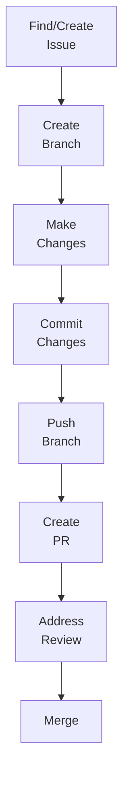

# Contribution Guidelines

**Document Version:** 1.2
**Last Updated:** December 2025
**Status:** Draft for Review

---

## Table of Contents

1. [Introduction](#1-introduction)
2. [Getting Started](#2-getting-started)
3. [Contribution Workflow](#3-contribution-workflow)
4. [Code Standards](#4-code-standards)
5. [Documentation Standards](#5-documentation-standards)
6. [Testing Requirements](#6-testing-requirements)
7. [Pull Request Process](#7-pull-request-process)
8. [Code Review Guidelines](#8-code-review-guidelines)
9. [Communication and Collaboration](#9-communication-and-collaboration)
10. [Troubleshooting](#10-troubleshooting)

---

## 1. Introduction

### 1.1 Welcome

These guidelines ensure high-quality, consistent contributions across all WEBUILD repositories.

### 1.2 Types of Contributions

We welcome various types of contributions:

**Code Contributions:**
- Bug fixes
- New features
- Performance improvements
- Refactoring

**Documentation:**
- User guides
- API documentation
- Tutorials and examples
- Translation improvements

**Testing:**
- Test cases
- Test automation
- Bug reports
- Quality assurance

**Community:**
- Issue triage
- Code reviews
- Discussions and feedback
- Helping other contributors

### 1.3 Code of Conduct

All contributors must adhere to our Code of Conduct:

- Be respectful and inclusive
- Welcome diverse perspectives
- Focus on constructive feedback
- Maintain professional communication
- Report unacceptable behavior

---

## 2. Getting Started

### 2.1 Prerequisites

**Access:**
- Access to WEBUILD organization (see [Onboarding Procedures](03-onboarding-procedures.md))
- Appropriate repository permissions

**Tools:**
- Git installed and configured
- Development environment set up
- Required dependencies installed

### 2.2 Setting Up Your Environment

#### 2.2.1 Configure Git

```bash
# Set your name and email
git config --global user.name "Your Name"
git config --global user.email "your.email@example.com"

# Set default branch name
git config --global init.defaultBranch main

# Enable helpful colorization
git config --global color.ui auto
```

#### 2.2.2 Clone the Repository

```bash
# Clone via SSH (recommended)
git clone git@github.com:webuild-consortium/repository-name.git

# Or via HTTPS
git clone https://github.com/webuild-consortium/repository-name.git

# Navigate to repository
cd repository-name
```

#### 2.2.3 Install Dependencies

Follow repository-specific instructions in the README.md:

```bash
# Example for Node.js projects
npm install

# Example for Python projects
pip install -r requirements.txt

# Example for Java projects
mvn install
```

### 2.3 Understanding the Repository

Before contributing:

1. Read the README.md
2. Review existing issues to avoid duplicate work
3. Explore the codebase structure
4. Check documentation for architecture and patterns
5. Run tests locally

---

## 3. Contribution Workflow

### 3.1 Standard Workflow Overview



### 3.2 Step-by-Step Process

#### Step 1: Find or Create an Issue

**Video: How to open an issue**


1. Search existing issues for similar work
2. If no issue exists, create one describing the problem, proposed solution, and expected impact
3. Wait for maintainer feedback/approval
4. Get issue assigned to you

**Video: Discussion on the issue**


**Issue Template Example:**

```markdown
## Description
Brief description of the issue

## Current Behavior
What currently happens

## Expected Behavior
What should happen

## Steps to Reproduce (for bugs)
1. Step one
2. Step two
3. ...

## Proposed Solution
Your suggested approach

## Additional Context
Any other relevant information
```

#### Step 2: Create a Feature Branch

**Video: Create a new branch**


```bash
# Update your local main branch
git checkout main
git pull origin main

# Create and switch to feature branch
git checkout -b feature/issue-123-add-authentication

# Or for bug fixes
git checkout -b bugfix/issue-456-fix-login-error
```

**Branch Naming Convention:**
- `feature/[issue-number]-[brief-description]`
- `bugfix/[issue-number]-[brief-description]`
- `hotfix/[issue-number]-[brief-description]`
- `docs/[issue-number]-[brief-description]`

#### Step 3: Make Your Changes

**Do:**
- Make focused, logical changes
- Add comments for complex logic
- Update relevant documentation
- Add/update tests

**Don't:**
- Mix unrelated changes
- Include debugging code or commented-out code
- Leave TODO comments without linked issues

#### Step 4: Commit Your Changes

**Video: How to commit changes**


**Commit Message Format:**

```
<type>: <subject>

<body>

<footer>
```

**Types:**
- `feat:` New feature
- `fix:` Bug fix
- `docs:` Documentation changes
- `style:` Code style changes (formatting)
- `refactor:` Code refactoring
- `test:` Test additions or changes
- `chore:` Build process or auxiliary tool changes

**Example:**

```bash
git add .
git commit -m "feat: add user authentication mechanism

- Implement JWT-based authentication
- Add login and logout endpoints
- Create authentication middleware
- Update API documentation

Closes #123"
```

**Good commits:**
- Atomic (one logical change per commit)
- Reference related issues
- Explain "why" not just "what"

**Bad commits:**
- Multiple unrelated changes
- Vague messages ("fix stuff", "updates")

#### Step 5: Push Your Branch

```bash
# Push branch to remote
git push origin feature/issue-123-add-authentication

# If branch already exists remotely, use --force-with-lease to avoid overwriting others' work
git push origin feature/issue-123-add-authentication --force-with-lease
```

#### Step 6: Create a Pull Request

**Video: How to open a pull request**


1. Navigate to repository on GitHub
2. Click "Pull requests" → "New pull request"
3. Select your branch as the source
4. Fill in PR template:

```markdown
## Description
Clear description of changes

## Related Issue
Closes #123

## Type of Change
- [ ] Bug fix
- [ ] New feature
- [ ] Breaking change
- [ ] Documentation update

## Testing
- [ ] Tests pass locally
- [ ] New tests added
- [ ] Manual testing completed

## Checklist
- [ ] Code follows style guidelines
- [ ] Self-review completed
- [ ] Documentation updated
- [ ] No new warnings
- [ ] Tests added/updated
```

5. Request review from maintainers
6. Link related issues

#### Step 7: Address Review Feedback

**When you receive feedback:**

1. Read all comments carefully
2. Ask questions if unclear
3. Make requested changes
4. Commit changes with clear messages
5. Push updates to your branch
6. Respond to comments
7. Request re-review when ready

**Handling Feedback:**

```bash
# Make changes based on feedback
# ... edit files ...

# Commit changes
git add .
git commit -m "refactor: address review feedback

- Simplify authentication logic
- Add error handling
- Update tests"

# Push updates
git push origin feature/issue-123-add-authentication
```

#### Step 8: Merge

Once approved:

1. Ensure all checks pass
2. Resolve any conflicts
3. Maintainer merges PR
4. Delete feature branch (optional)
5. Close related issues

```bash
# After merge, update local main
git checkout main
git pull origin main

# Delete local feature branch
git branch -d feature/issue-123-add-authentication
```

---

## 4. Code Standards

### 4.1 General Principles

**Write Clean Code:**
- Clear and readable
- Self-documenting where possible
- Consistent style
- Properly formatted

**Follow SOLID Principles:**
- Single Responsibility
- Open/Closed
- Liskov Substitution
- Interface Segregation
- Dependency Inversion

**Keep It Simple:**
- Avoid over-engineering
- Use appropriate abstractions
- Prefer clarity over cleverness

### 4.2 Language-Specific Standards

#### 4.2.1 Python

```python
# Follow PEP 8 style guide
# Use meaningful variable names
# Add docstrings to functions and classes

def authenticate_user(username: str, password: str) -> bool:
    """
    Authenticate a user with username and password.

    Args:
        username: The user's username
        password: The user's password

    Returns:
        True if authentication successful, False otherwise
    """
    # Implementation
    pass
```

**Tools:**
- Linting: `pylint`, `flake8`
- Formatting: `black`, `autopep8`
- Type checking: `mypy`

#### 4.2.2 JavaScript/TypeScript

```typescript
// Use ESLint and Prettier
// Follow Airbnb style guide
// Use TypeScript for type safety

/**
 * Authenticate a user with username and password
 * @param username - The user's username
 * @param password - The user's password
 * @returns Promise resolving to authentication result
 */
async function authenticateUser(
  username: string,
  password: string
): Promise<boolean> {
  // Implementation
}
```

**Tools:**
- Linting: `eslint`
- Formatting: `prettier`
- Type checking: `typescript`

#### 4.2.3 Java

```java
// Follow Google Java Style Guide
// Use meaningful names
// Add Javadoc comments

/**
 * Authenticates a user with username and password.
 *
 * @param username the user's username
 * @param password the user's password
 * @return true if authentication successful, false otherwise
 */
public boolean authenticateUser(String username, String password) {
    // Implementation
}
```

**Tools:**
- Linting: `checkstyle`
- Formatting: `google-java-format`
- Build: `maven`, `gradle`

### 4.3 Code Organization

```
src/
├── main/
│   ├── java/com/webuild/
│   │   ├── controllers/
│   │   ├── services/
│   │   ├── models/
│   │   └── utils/
│   └── resources/
└── test/
    └── java/com/webuild/
        ├── controllers/
        ├── services/
        └── integration/
```

**Principles:**
- Logical grouping by feature or layer
- Clear separation of concerns
- Consistent structure across projects

### 4.4 Error Handling

```python
# Good: Specific exception handling
try:
    result = authenticate_user(username, password)
except AuthenticationError as e:
    logger.error(f"Authentication failed: {e}")
    raise
except DatabaseError as e:
    logger.error(f"Database error: {e}")
    raise

# Bad: Catching all exceptions
try:
    result = authenticate_user(username, password)
except Exception:
    pass  # Silent failure
```

**Best Practices:**
- Catch specific exceptions
- Log errors with context
- Provide meaningful error messages
- Clean up resources properly

### 4.5 Security Considerations

**Always:**
- Validate all inputs
- Sanitize user data
- Use parameterized queries
- Implement proper authentication
- Follow principle of least privilege
- Keep dependencies updated

**Never:**
- Store passwords in plain text
- Commit secrets or credentials
- Trust user input
- Use deprecated security libraries
- Ignore security warnings

---

## 5. Documentation Standards

### 5.1 Code Documentation

#### 5.1.1 Inline Comments

```python
# Good: Explain why, not what
# Use exponential backoff to handle rate limiting
retry_delay = base_delay * (2 ** attempt)

# Bad: State the obvious
# Set retry_delay to base_delay times 2 to the power of attempt
retry_delay = base_delay * (2 ** attempt)
```

#### 5.1.2 Function/Method Documentation

**Required Elements:**
- Purpose description
- Parameter descriptions
- Return value description
- Exception documentation
- Usage examples (for complex functions)

#### 5.1.3 Class Documentation

```python
class AuthenticationService:
    """
    Service for handling user authentication.

    This service provides methods for authenticating users,
    managing sessions, and handling authentication tokens.

    Attributes:
        token_expiry: Token expiration time in seconds
        max_attempts: Maximum login attempts before lockout

    Example:
        >>> auth_service = AuthenticationService()
        >>> result = auth_service.authenticate("user", "pass")
    """
```

### 5.2 README Documentation

Every repository must have a comprehensive README.md:

```markdown
# Project Name

Brief description of the project

## Features

- Feature 1
- Feature 2
- Feature 3

## Installation

```bash
npm install
```

## Usage

```javascript
const example = require('example');
example.doSomething();
```

## Configuration

Describe configuration options

## Contributing

See [CONTRIBUTING.md](CONTRIBUTING.md)

## License

Apache 2.0 - See [LICENSE](LICENSE)

## Funding

EU funding acknowledgment

### 5.3 API Documentation

For APIs, provide:
- Endpoint descriptions
- Request/response formats
- Authentication requirements
- Error codes and messages
- Usage examples

**Example:**

```markdown
### POST /api/auth/login

Authenticate a user and return a JWT token.

**Request:**
```json
{
  "username": "user@example.com",
  "password": "securepassword"
}
```

**Response (200 OK):**
```json
{
  "token": "eyJhbGciOiJIUzI1NiIs...",
  "expiresIn": 3600
}
```

**Errors:**
- 401: Invalid credentials
- 429: Too many attempts

### 5.4 Architecture Documentation

Include diagrams and descriptions for:
- System architecture
- Component interactions
- Data flows
- Deployment architecture
- Integration points

Use tools like:
- Mermaid for diagrams in Markdown
- PlantUML for UML diagrams
- Draw.io for complex diagrams

---

## 6. Testing Requirements

### 6.1 Testing Principles

All code changes must include tests:
- New features require new tests
- Bug fixes require regression tests
- Tests must pass before merging

### 6.2 Types of Tests

#### 6.2.1 Unit Tests

Test individual components in isolation:

```python
def test_authenticate_user_success():
    """Test successful user authentication."""
    service = AuthenticationService()
    result = service.authenticate("valid_user", "valid_password")
    assert result is True

def test_authenticate_user_invalid_password():
    """Test authentication with invalid password."""
    service = AuthenticationService()
    result = service.authenticate("valid_user", "wrong_password")
    assert result is False
```

#### 6.2.2 Integration Tests

Test component interactions:

```python
def test_authentication_flow():
    """Test complete authentication flow."""
    # Setup
    client = TestClient()

    # Execute
    response = client.post("/api/auth/login", json={
        "username": "test@example.com",
        "password": "password123"
    })

    # Verify
    assert response.status_code == 200
    assert "token" in response.json()
```

#### 6.2.3 End-to-End Tests

Test complete user workflows:

```python
def test_user_registration_and_login():
    """Test user can register and then login."""
    # Register new user
    register_response = client.post("/api/auth/register", json={
        "username": "newuser@example.com",
        "password": "securepass123"
    })
    assert register_response.status_code == 201

    # Login with new credentials
    login_response = client.post("/api/auth/login", json={
        "username": "newuser@example.com",
        "password": "securepass123"
    })
    assert login_response.status_code == 200
```

### 6.3 Test Coverage

**Minimum Requirements:**
- Unit test coverage: 80%
- Critical paths: 100%
- New code: Must include tests
- Bug fixes: Must include regression tests

**Check Coverage:**

```bash
# Python
pytest --cov=src --cov-report=html

# JavaScript
npm run test -- --coverage

# Java
mvn test jacoco:report
```

### 6.4 Test Best Practices

**Do:**
- Write clear, descriptive test names
- Test one thing per test
- Use arrange-act-assert pattern
- Make tests independent

**Don't:**
- Write flaky tests
- Test implementation details
- Create test dependencies

---

## 7. Pull Request Process

### 7.1 Before Creating a PR

**Pre-submission Checklist:**

- [ ] Code follows style guidelines
- [ ] All tests pass locally
- [ ] New tests added for new functionality
- [ ] Documentation updated
- [ ] No merge conflicts with main
- [ ] Self-review completed
- [ ] No debugging code or console logs

### 7.2 PR Title and Description

**Title Format:**
```
<type>: <brief description> (#issue-number)
```

**Examples:**
- `feat: add JWT authentication (#123)`
- `fix: resolve login timeout issue (#456)`
- `docs: update API documentation (#789)`

**Description Template:**

```markdown
## Summary
Brief overview of changes

## Changes Made
- Change 1
- Change 2
- Change 3

## Related Issues
Closes #123
Related to #456

## Testing
- [ ] Unit tests added/updated
- [ ] Integration tests pass
- [ ] Manual testing completed

## Screenshots (if applicable)
[Add screenshots for UI changes]

## Breaking Changes
[Describe any breaking changes]

## Additional Notes
[Any other relevant information]
```

### 7.3 PR Size Guidelines

**Ideal PR Size:**
- Small: < 200 lines changed (preferred)
- Medium: 200-500 lines changed
- Large: > 500 lines changed (should be split if possible)

**For Large PRs:**
- Provide detailed description
- Break into logical commits
- Consider splitting into multiple PRs
- Discuss with maintainers first

### 7.4 Linking Issues

Always link related issues:

```markdown
Closes #123
Fixes #456
Related to #789
```

This automatically closes issues when PR is merged.

### 7.5 Draft Pull Requests

Use draft PRs for:
- Work in progress
- Early feedback
- Design discussions
- Collaboration on complex features

**Mark as draft:**
- Click "Create draft pull request" when creating
- Convert to ready when complete

---

## 8. Code Review Guidelines

### 8.1 For Authors

**Preparing for Review:**

1. Self-review all changes before requesting review
2. Provide clear PR description with context
3. Link to relevant issues and explain design decisions
4. Highlight areas needing special attention

**Responding to Feedback:**

- Be open to suggestions and explain your reasoning
- Respond to comments promptly
- Mark conversations as resolved when addressed
- Request re-review when ready

### 8.2 For Reviewers

**Review Checklist:**

- [ ] Functionality: Does it work as intended?
- [ ] Code Quality: Is it well-written and maintainable?
- [ ] Tests: Are there adequate tests?
- [ ] Documentation: Is it properly documented?
- [ ] Security: Are there security concerns?
- [ ] Performance: Are there performance issues?
- [ ] Standards: Does it follow coding standards?

**Providing Feedback:**

#### Option 1: Leave Quick Feedback

**Video: Review with comment**


Click the "+" icon next to a line number to add a comment on that line.

#### Option 2: Make a Suggestion

**Video: Review with suggestion**


Use markdown code suggestion blocks to propose specific edits. The PR author can apply suggestions with one click.

#### Option 3: Submit a Complete Review

**Video: Submit a review**


Add multiple review comments, then click "Review changes" → "Submit review":
- **Comment:** General feedback
- **Approve:** Ready to merge
- **Request changes:** Needs updates before merging

**Good feedback:**
```markdown
Consider using a more descriptive variable name here.
`userAuthToken` would be clearer than `token`.
```

**Poor feedback:**
```markdown
This is wrong.
```

**Review Etiquette:**

- Be respectful and constructive
- Explain the "why" behind suggestions
- Ask questions to understand intent
- Focus on the code, not the person
- Don't block on personal preferences

### 8.3 Review Response Times

**Target Response Times:**
- Initial review: Within 2 business days
- Follow-up reviews: Within 1 business day
- Urgent fixes: Same day

**If delayed:**
- Communicate expected timeline
- Suggest alternative reviewers
- Prioritize critical PRs

### 8.4 Approval Process

**Approval Requirements:**
- Minimum 1 approval from maintainer
- All conversations resolved
- All checks passing
- No merge conflicts

**Merge Methods:**
- **Squash and merge:** For feature branches (preferred)
- **Rebase and merge:** For clean history
- **Merge commit:** For preserving branch history

---

## 9. Communication and Collaboration

### 9.1 Communication Channels

**GitHub:**
- Issues: Bug reports, feature requests
- Pull Requests: Code review discussions
- Discussions: General questions and ideas

**Consortium Channels:**
- Email: Official communications
- Meetings: Regular sync-ups
- Chat: Quick questions and coordination

### 9.2 Asking for Help

Before asking, search existing issues and documentation. When asking:
- Provide context and details
- Include error messages
- Describe what you've tried
- Be specific about what you need

**Example:**

```markdown
## Problem
I'm getting an authentication error when testing the login endpoint.

## Error Message
AuthenticationError: Invalid token format

## What I've Tried
- Verified token generation
- Checked token expiration
- Reviewed authentication middleware

## Environment
- Node.js version: 18.0.0
- Branch: feature/auth-improvements
- Commit: abc123

## Question
Should the token include the 'Bearer ' prefix, or is that added by the middleware?
```

### 9.3 Reporting Issues

**Bug Report Template:**

```markdown
## Description
Clear description of the bug

## Steps to Reproduce
1. Step one
2. Step two
3. Step three

## Expected Behavior
What should happen

## Actual Behavior
What actually happens

## Environment
- OS: macOS 13.0
- Browser: Chrome 120
- Version: 1.2.3

## Screenshots
[If applicable]

## Additional Context
[Any other relevant information]
```

### 9.4 Feature Requests

**Feature Request Template:**

```markdown
## Feature Description
Clear description of the proposed feature

## Problem It Solves
What problem does this address?

## Proposed Solution
How should it work?

## Alternatives Considered
What other approaches were considered?

## Additional Context
[Any other relevant information]
```

---

## 10. Troubleshooting

### 10.1 Common Issues

#### Issue: Merge Conflicts

**Solution:**

```bash
# Update your branch with latest main
git checkout main
git pull origin main
git checkout your-feature-branch
git merge main

# Resolve conflicts in your editor
# After resolving, commit the merge
git add .
git commit -m "resolve merge conflicts with main"
git push origin your-feature-branch
```

#### Issue: Failed Tests

**Solution:**

```bash
# Run tests locally
npm test  # or pytest, mvn test, etc.

# Check test output for failures
# Fix the issues
# Re-run tests to verify
# Commit fixes
git add .
git commit -m "fix: resolve test failures"
git push origin your-feature-branch
```

#### Issue: CI/CD Pipeline Failures

**Solution:**

1. Check pipeline logs in GitHub Actions
2. Identify failing step
3. Reproduce locally if possible
4. Fix the issue
5. Push changes
6. Verify pipeline passes

#### Issue: Accidentally Committed Secrets

**Solution:**

```bash
# Remove file from Git history
git filter-branch --force --index-filter \
  'git rm --cached --ignore-unmatch path/to/secret/file' \
  --prune-empty --tag-name-filter cat -- --all

# Force push (coordinate with team first!)
git push origin --force --all

# Rotate the exposed secret immediately
# Update .gitignore to prevent recurrence
```

**Important:** Notify maintainers immediately if secrets are exposed.

### 10.2 Getting Unstuck

If you're stuck:

1. **Review documentation** - Check README and guides
2. **Search issues** - Someone may have had the same problem
3. **Ask in discussions** - Post your question
4. **Contact maintainers** - Reach out directly
5. **Attend office hours** - Join sync meetings

### 10.3 Useful Git Commands

```bash
# View commit history
git log --oneline --graph

# Undo last commit (keep changes)
git reset --soft HEAD~1

# Undo last commit (discard changes)
git reset --hard HEAD~1

# Stash changes temporarily
git stash
git stash pop

# View changes
git diff
git diff --staged

# Amend last commit
git commit --amend

# Cherry-pick a commit
git cherry-pick <commit-hash>

# Rebase interactive (clean up commits)
git rebase -i HEAD~3
```

---

## Appendices

### Appendix A: Quick Reference

**Creating a PR:**
```bash
git checkout -b feature/my-feature
# Make changes
git add .
git commit -m "feat: add my feature"
git push origin feature/my-feature
# Create PR on GitHub
```

**Updating PR:**
```bash
# Make changes based on review
git add .
git commit -m "refactor: address review feedback"
git push origin feature/my-feature
```

**Syncing with main:**
```bash
git checkout main
git pull origin main
git checkout feature/my-feature
git merge main
```

### Appendix B: Commit Message Examples

**Good:**
```
feat: add user authentication with JWT

- Implement JWT token generation
- Add authentication middleware
- Create login and logout endpoints
- Update API documentation

Closes #123
```

**Bad:**
```
fixed stuff
```

### Appendix C: Resources

**Git Resources:**
- [Pro Git Book](https://git-scm.com/book)
- [GitHub Guides](https://guides.github.com)
- [Git Cheat Sheet](https://education.github.com/git-cheat-sheet-education.pdf)

**Coding Standards:**
- [PEP 8 (Python)](https://pep8.org)
- [Airbnb JavaScript Style Guide](https://github.com/airbnb/javascript)
- [Google Java Style Guide](https://google.github.io/styleguide/javaguide.html)

**Testing:**
- [pytest Documentation](https://docs.pytest.org)
- [Jest Documentation](https://jestjs.io)
- [JUnit Documentation](https://junit.org)

---

## Questions?

If you have questions about these guidelines:

1. Check the [GitHub Policies and Guidelines](01-github-policies-and-guidelines.md)
2. Search existing issues and discussions
3. Ask your WP/Group lead
4. Contact the Technical Coordinator (webuild-github-support@grnet.gr)

---

**Document Control:**

| Version | Date | Author | Changes |
|---------|------|--------|---------|
| 1.0 | October 2025 | Technical Coordinator | Initial draft |
| 1.1 | November 2025 | Technical Coordinator | General improvements |
| 1.2 | December 2025 | Technical Coordinator | General improvements & cleanup |

**Next Review Date:** March 2026

---

*This document is maintained in the `webuild-policies` repository. For questions or suggestions, please open an issue or contact the Technical Coordinator.*
