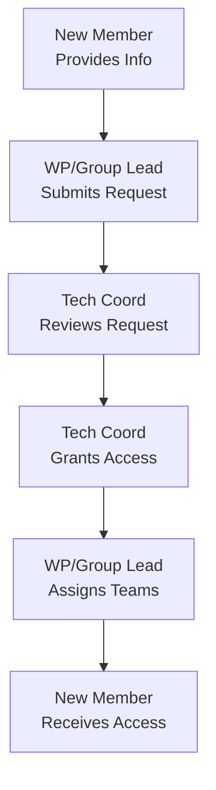
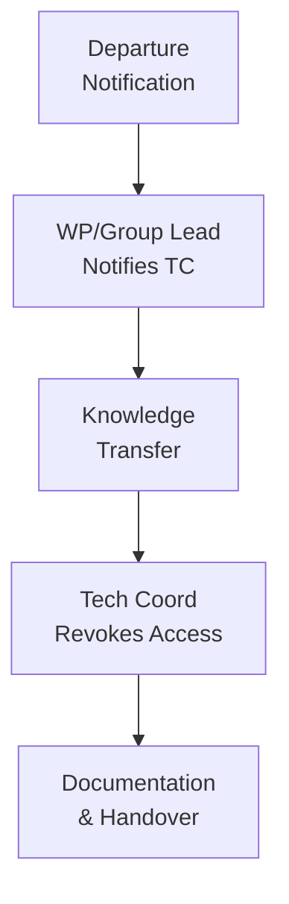

# Onboarding Procedures

**Document Version:** 1.0
**Last Updated:** October 2025
**Status:** Draft for Review

---

## Table of Contents

1. [Introduction](#1-introduction)
2. [Pre-Onboarding Requirements](#2-pre-onboarding-requirements)
3. [Access Request Process](#3-access-request-process)
4. [Initial Setup](#4-initial-setup)
5. [Repository Access](#5-repository-access)
6. [Training and Resources](#6-training-and-resources)
7. [First Contributions](#7-first-contributions)
8. [Offboarding Procedures](#8-offboarding-procedures)

---

## 1. Introduction

### 1.1 Purpose

This document outlines the procedures for onboarding new members to the WEBUILD consortium's GitHub organization and offboarding members when they leave the project.

### 1.2 Who Needs Onboarding?

Onboarding is required for:

- New consortium partners joining the project
- New team members from existing partners
- External collaborators requiring repository access
- Temporary contributors (interns, contractors)

### 1.3 Onboarding Timeline

```
Day 1-2: Access Request & Approval
Day 3-5: Account Setup & Initial Access
Week 1: Training & Orientation
Week 2: First Contributions
Ongoing: Continuous Learning
```

### 1.4 Roles in Onboarding

| Role | Responsibility |
|------|----------------|
| **New Member** | Complete setup, attend training, ask questions |
| **WP/Group Lead** | Request access, provide guidance, assign tasks |
| **Technical Coordinator** | Grant organization access, verify setup |
| **Buddy/Mentor** | Provide day-to-day support, answer questions |

---

## 2. Pre-Onboarding Requirements

### 2.1 Before Requesting Access

New members must:

**Have a GitHub Account:**
- Create account at [github.com](https://github.com)
- Use professional username (preferably real name)
- Add profile picture
- Enable two-factor authentication (2FA)

**Complete Consortium Onboarding:**
- Sign consortium agreement
- Receive partner organization approval

**Understand Project Context:**
- Review project overview
- Understand WP/Group objectives
- Identify role and responsibilities
- Know reporting structure

### 2.2 GitHub Account Setup

#### 2.2.1 Creating a GitHub Account

If you don't have a GitHub account:

1. Go to [https://github.com/signup](https://github.com/signup)
2. Enter your email address
3. Create a strong password
4. Choose a username (professional, preferably your name)
5. Verify your email address
6. Complete the setup wizard

**Username Guidelines:**
- Good: `john-smith`, `jsmith`, `john.smith`
- Avoid: `cooldude123`, `hackerman`, random strings

#### 2.2.2 Enabling Two-Factor Authentication (2FA)

**Required for all consortium members.**

**Steps:**

1. Go to Settings → Password and authentication
2. Click "Enable two-factor authentication"
3. Choose authentication method:
   - **Recommended:** Authenticator app (Google Authenticator, Authy)
   - Alternative: SMS (less secure)
4. Scan QR code with authenticator app
5. Enter verification code
6. Save recovery codes securely
7. Verify 2FA is enabled

⚠️ **Important:** Store recovery codes in a secure location. You'll need them if you lose access to your authentication device.

#### 2.2.3 Profile Setup

Complete your GitHub profile:

```markdown
Name: Your Full Name
Bio: Role | WEBUILD Consortium
```

**Add Profile Picture (Optional):**
- Professional photo preferred
- Clear, recognizable image

### 2.3 Required Information

Before requesting access, gather:

- [ ] GitHub username
- [ ] Email address
- [ ] Organization/Partner name
- [ ] Work Package assignment
- [ ] Group assignment (if applicable)
- [ ] Required repository access

---

## 3. Access Request Process

### 3.1 Request Workflow



### 3.2 For WP/Group Leads: Submitting Access Request

#### 3.2.1 Access Request Template

Send to Technical Coordinator:

```markdown
Subject: GitHub Access Request - [Member Name]

## Member Information
- Name: [Full Name]
- GitHub Username: [@username]
- Email: [work.email@organization.com]
- Organization: [Partner Organization]
- Work Package: [WP Number]
- Group: [Group Name]
- Role: [Developer/Researcher/etc.]

## Access Requirements
- Organization Access: Yes
- Teams: [@webuild-consortium/wp4-trust]
- Repositories: [List specific repos if limited access]
- Permission Level: [Read/Write/Admin]

## Duration
- Start Date: [YYYY-MM-DD]
- End Date: [YYYY-MM-DD or "Ongoing"]

## Additional Notes
[Any special requirements or context]

## Approvals
- WP Lead: [Name] - Approved
- Partner Organization: [Name] - Approved
```

#### 3.2.2 Approval Requirements

Access requests require approval from:
- WP/Group Lead (submitter)
- Partner organization representative
- Technical Coordinator (final approval)

### 3.3 For Technical Coordinator: Granting Access

#### 3.3.1 Verification Steps

Before granting access:

1. **Verify Request:**
   - Check request completeness
   - Confirm approvals present
   - Validate GitHub username exists
   - Verify 2FA enabled on account

2. **Check Eligibility:**
   - Confirm consortium membership
   - Verify partner organization
   - Check role appropriateness

3. **Determine Access Level:**
   - Review requested permissions
   - Ensure least privilege principle
   - Confirm with WP lead if needed

#### 3.3.2 Granting Organization Access

**Steps:**

1. Go to [https://github.com/orgs/webuild-consortium/people](https://github.com/orgs/webuild-consortium/people)
2. Click "Invite member"
3. Enter GitHub username or email
4. Select role: "Member" (default)
5. Click "Send invitation"
6. Notify WP/Group lead of invitation sent

#### 3.3.3 Documentation

Log the access grant:

```markdown
## Access Grant Log

Date: [YYYY-MM-DD]
Member: [Name] (@username)
Organization: [Partner]
WP/Group: [WP4/Trust]
Granted By: [Your Name]
Access Level: Member
Teams: [List teams]
Notes: [Any relevant notes]
```

### 3.4 For WP/Group Leads: Team Assignment

After organization access granted:

#### 3.4.1 Add to Team

1. Go to team page (e.g., `@webuild-consortium/wp4-trust`)
2. Click "Members" tab
3. Click "Add a member"
4. Search for username
5. Select member
6. Choose role:
   - **Member:** Standard access
   - **Maintainer:** Can manage team membership

#### 3.4.2 Repository Access

Grant repository-specific access if needed:

1. Go to repository Settings → Collaborators and teams
2. Click "Add teams"
3. Select team
4. Choose permission level:
   - **Read:** View and clone
   - **Triage:** Read + manage issues
   - **Write:** Triage + push to branches
   - **Maintain:** Write + manage settings
   - **Admin:** Full control

### 3.5 For New Members: Accepting Invitation

#### 3.5.1 Accept Organization Invitation

1. Check email for invitation from GitHub
2. Click "Join @webuild-consortium"
3. Review organization profile
4. Click "Join webuild-consortium"
5. Verify you see organization in your profile

#### 3.5.2 Verify Access

Check your access:

1. Go to [https://github.com/webuild-consortium](https://github.com/webuild-consortium)
2. Verify you can see repositories
3. Check team memberships in your profile
4. Test cloning a repository

---

## 4. Initial Setup

### 4.1 Git Configuration

#### 4.1.1 Install Git

**macOS:**
```bash
# Using Homebrew
brew install git

# Or download from git-scm.com
```

**Linux:**
```bash
# Ubuntu/Debian
sudo apt-get install git

# Fedora
sudo dnf install git
```

**Windows:**
```bash
# Download from git-scm.com
# Or use Git for Windows
```

#### 4.1.2 Configure Git

```bash
# Set your name (use real name)
git config --global user.name "Your Full Name"

# Set your email
git config --global user.email "your.email@organization.com"

# Set default branch name
git config --global init.defaultBranch main

# Enable credential caching
git config --global credential.helper cache

# Set default editor (optional)
git config --global core.editor "code --wait"  # VS Code
# or
git config --global core.editor "vim"  # Vim

# Verify configuration
git config --list
```

#### 4.1.3 SSH Key Setup (Recommended)

**Generate SSH Key:**

```bash
# Generate new SSH key
ssh-keygen -t ed25519 -C "your.email@organization.com"

# Press Enter to accept default location
# Enter passphrase (recommended)

# Start SSH agent
eval "$(ssh-agent -s)"

# Add key to agent
ssh-add ~/.ssh/id_ed25519
```

**Add SSH Key to GitHub:**

1. Copy public key:
```bash
# macOS
pbcopy < ~/.ssh/id_ed25519.pub

# Linux
cat ~/.ssh/id_ed25519.pub
# Copy the output

# Windows
clip < ~/.ssh/id_ed25519.pub
```

2. Go to GitHub Settings → SSH and GPG keys
3. Click "New SSH key"
4. Add title: "Work Laptop" or similar
5. Paste key
6. Click "Add SSH key"

**Test Connection:**

```bash
ssh -T git@github.com
# Should see: "Hi username! You've successfully authenticated..."
```

### 4.2 Development Environment

#### 4.2.1 Required Tools

Install based on project needs:

**General:**
- Git (required)
- Code editor (VS Code, IntelliJ, etc.)
- Terminal/Command line

**Language-Specific:**
- **Python:** Python 3.8+, pip, virtualenv
- **Node.js:** Node.js 18+, npm/yarn
- **Java:** JDK 11+, Maven/Gradle
- **Docker:** Docker Desktop (if needed)

#### 4.2.2 IDE/Editor Setup

**VS Code (Recommended):**

Install extensions:
- GitLens
- GitHub Pull Requests
- Language-specific extensions
- EditorConfig
- Prettier/ESLint (for JavaScript)

**Configuration:**

```json
{
  "editor.formatOnSave": true,
  "editor.rulers": [80, 120],
  "files.trimTrailingWhitespace": true,
  "files.insertFinalNewline": true
}
```

### 4.3 Clone Your First Repository

#### 4.3.1 Find Repository

1. Go to [https://github.com/webuild-consortium](https://github.com/webuild-consortium)
2. Find your WP/Group repository
3. Click on repository name

#### 4.3.2 Clone Repository

**Using SSH (Recommended):**

```bash
# Navigate to your workspace
cd ~/workspace

# Clone repository
git clone git@github.com:webuild-consortium/wp4-trust-group.git

# Navigate into repository
cd wp4-trust-group
```

**Using HTTPS:**

```bash
git clone https://github.com/webuild-consortium/wp4-trust-group.git
cd wp4-trust-group
```

#### 4.3.3 Verify Setup

```bash
# Check remote
git remote -v

# Check branches
git branch -a

# Pull latest changes
git pull origin main

# Check status
git status
```

---

## 5. Repository Access

### 5.1 Understanding Repository Structure

```
webuild-consortium/
├── wp4-qtsp-group/          # QTSP Group
├── wp4-trust-group/         # Trust Infrastructure
├── wp4-semantics-group/     # Semantics Group
├── wp4-wallets-group/       # Wallet Providers
├── wp4-interop-test-bed/    # Interoperability Testing
└── webuild-policies/        # This documentation
```

### 5.2 Repository Permissions

Your access level determines what you can do:

| Permission | Can Do |
|-----------|--------|
| **Read** | View code, clone, download, open issues |
| **Triage** | Read + manage issues and PRs |
| **Write** | Triage + push branches, create PRs |
| **Maintain** | Write + manage repo settings (limited) |
| **Admin** | Full control except deletion |

### 5.3 Requesting Additional Access

If you need access to additional repositories:

1. Identify repository needed
2. Explain reason for access
3. Contact your WP/Group lead
4. Lead evaluates and approves/denies
5. Lead grants access or escalates to Technical Coordinator

---

## 6. Training and Resources

### 6.1 Orientation Checklist

Complete within first week:

- [ ] Read [GitHub Policies and Guidelines](01-github-policies-and-guidelines.md)
- [ ] Review [Contribution Guidelines](02-contribution-guidelines.md)
- [ ] Understand [Branching and Workflow](07-branching-and-workflow.md)
- [ ] Read repository README files
- [ ] Meet with WP/Group lead (if needed)
- [ ] Set up development environment

### 6.2 Training Materials

#### 6.2.1 Git and GitHub Basics

**If new to Git:**
- [Git Handbook](https://guides.github.com/introduction/git-handbook/)
- [GitHub Skills](https://skills.github.com/)
- [Pro Git Book](https://git-scm.com/book) (free online)

**Key Concepts to Learn:**
- Repositories and commits
- Branches and merging
- Pull requests
- Code review
- Conflict resolution

#### 6.2.2 WEBUILD-Specific Training

**Required Reading:**
1. Project overview and objectives
2. WP/Group specific documentation
3. Architecture documentation
4. API specifications (if applicable)
5. Testing procedures

**Recommended:**
- Attend weekly team meetings
- Review recent pull requests
- Explore codebase structure
- Read issue discussions

### 6.3 Buddy/Mentor Program

#### 6.3.1 For New Members

Your buddy/mentor will:
- Answer day-to-day questions
- Review your first contributions
- Provide guidance on processes
- Introduce you to the team
- Help you navigate the codebase

**How to work with your buddy:**
- Schedule regular check-ins
- Ask questions (no question is too small)
- Share your progress
- Request code reviews
- Seek feedback

#### 6.3.2 For Buddies/Mentors

Your responsibilities:
- Be available and responsive
- Provide constructive feedback
- Share knowledge and resources
- Review early contributions
- Report progress to lead

### 6.4 Learning Resources

**Internal Resources:**
- Repository documentation
- Wiki pages (if available)
- Past pull requests and issues
- Team meeting notes
- Architecture diagrams

**External Resources:**
- [GitHub Documentation](https://docs.github.com)
- [Git Documentation](https://git-scm.com/doc)
- Language-specific documentation
- Framework documentation
- Standards and specifications

---

## 7. First Contributions

### 7.1 Getting Started with Contributions

#### 7.1.1 Find a Good First Issue

Look for issues labeled:
- `good first issue` - Suitable for newcomers
- `help wanted` - Extra attention needed
- `documentation` - Documentation improvements
- `beginner-friendly` - Easy to start with

**How to find issues:**

1. Go to repository
2. Click "Issues" tab
3. Filter by labels
4. Read issue descriptions
5. Comment to express interest
6. Wait for assignment

#### 7.1.2 Your First Pull Request

**Recommended approach:**

1. **Start small:**
   - Fix typos in documentation
   - Update README
   - Add code comments
   - Improve error messages

2. **Get familiar with process:**
   - Create branch
   - Make changes
   - Commit with good messages
   - Push and create PR
   - Respond to review feedback

3. **Learn from feedback:**
   - Don't take it personally
   - Ask questions
   - Understand the reasoning
   - Apply learnings to next PR

### 7.2 First Week Goals

**Week 1 Checklist:**

- [ ] Complete environment setup
- [ ] Clone relevant repositories
- [ ] Read all documentation
- [ ] Attend team meeting
- [ ] Make first contribution (even if small)
- [ ] Get first PR merged
- [ ] Introduce yourself to team
- [ ] Set up communication channels

### 7.3 First Month Goals

**Month 1 Checklist:**

- [ ] Make multiple contributions
- [ ] Review others' pull requests
- [ ] Participate in discussions
- [ ] Understand codebase structure
- [ ] Complete assigned tasks
- [ ] Build relationships with team
- [ ] Identify areas for improvement
- [ ] Provide feedback on onboarding

### 7.4 Getting Help

**When you need help:**

1. **Check documentation first:**
   - README files
   - Contributing guidelines
   - Issue discussions
   - Past pull requests

2. **Ask your buddy/mentor:**
   - Quick questions
   - Process clarifications
   - Code review requests
   - General guidance

3. **Contact WP/Group lead:**
   - Access issues
   - Policy questions
   - Escalated problems
   - Strategic decisions

4. **Use GitHub discussions:**
   - Technical questions
   - Design discussions
   - Community input
   - Knowledge sharing

---

## 8. Offboarding Procedures

### 8.1 When Offboarding is Required

Offboarding is necessary when:

- Member leaves the consortium
- Partner organization exits project
- Contract/assignment ends
- Role changes (no longer needs access)
- Security incident requires access revocation

### 8.2 Offboarding Workflow



### 8.3 Offboarding Checklist

#### 8.3.1 For Departing Member

- [ ] Complete assigned work or hand over
- [ ] Document ongoing tasks
- [ ] Transfer knowledge to team
- [ ] Update documentation
- [ ] Close or reassign issues
- [ ] Finish open pull requests
- [ ] Return any credentials or access tokens
- [ ] Provide handover notes

#### 8.3.2 For WP/Group Lead

- [ ] Notify Technical Coordinator
- [ ] Identify knowledge transfer needs
- [ ] Reassign open issues and PRs
- [ ] Update team documentation
- [ ] Conduct exit interview (optional)
- [ ] Document lessons learned

#### 8.3.3 For Technical Coordinator

- [ ] Remove from organization
- [ ] Remove from all teams
- [ ] Revoke repository access
- [ ] Remove from communication channels
- [ ] Update access logs
- [ ] Verify access revocation complete
- [ ] Document offboarding completion

### 8.4 Knowledge Transfer

**Before departure:**

1. **Document work:**
   - Current tasks and status
   - Pending decisions
   - Known issues
   - Future plans

2. **Transfer knowledge:**
   - Schedule handover meetings
   - Share documentation
   - Explain complex areas
   - Answer questions

3. **Update documentation:**
   - Code comments
   - README files
   - Architecture docs
   - Process documentation

### 8.5 Access Revocation

**Technical Coordinator actions:**

```bash
# Remove from organization
# Via GitHub UI: Organization → People → Remove member

# Verify removal
# Check member no longer appears in:
# - Organization members list
# - Team members lists
# - Repository collaborators
```

**Verification:**

- [ ] Organization access removed
- [ ] Team memberships removed
- [ ] Repository access revoked
- [ ] No pending invitations
- [ ] Access logs updated

### 8.6 Post-Offboarding

**Follow-up actions:**

1. **Review access:**
   - Audit remaining team members
   - Verify no orphaned permissions
   - Update team documentation

2. **Update records:**
   - Access logs
   - Team rosters
   - Contact lists
   - Documentation

3. **Lessons learned:**
   - What went well?
   - What could improve?
   - Update onboarding based on feedback

---

## Appendices

### Appendix A: Quick Start Checklist

**Day 1:**
- [ ] Create GitHub account
- [ ] Enable 2FA
- [ ] Complete profile
- [ ] Provide info to WP/Group lead

**Day 2-3:**
- [ ] Accept organization invitation
- [ ] Configure Git
- [ ] Set up SSH keys
- [ ] Clone first repository

**Week 1:**
- [ ] Read all documentation
- [ ] Set up development environment
- [ ] Meet buddy/mentor
- [ ] Make first contribution

### Appendix B: Useful Commands

**Git Setup:**
```bash
git config --global user.name "Your Name"
git config --global user.email "your.email@org.com"
git config --global init.defaultBranch main
```

**SSH Key:**
```bash
ssh-keygen -t ed25519 -C "your.email@org.com"
ssh-add ~/.ssh/id_ed25519
ssh -T git@github.com
```

**Clone Repository:**
```bash
git clone git@github.com:webuild-consortium/repo-name.git
cd repo-name
git status
```

### Appendix C: Contact Information

**Technical Coordinator:** [Contact via consortium channels]

**WP4 Lead:** [Contact via consortium channels]

**Group Leads:**
- QTSP: [Contact]
- Trust: [Contact]
- Semantics: [Contact]
- Wallets: [Contact]
- Interop: [Contact]

### Appendix D: Troubleshooting

**Can't accept invitation:**
- Check spam folder
- Verify GitHub username correct
- Contact Technical Coordinator

**Can't clone repository:**
- Verify SSH key added
- Check repository access
- Try HTTPS instead

**2FA issues:**
- Use recovery codes
- Contact GitHub support
- Reset 2FA with Technical Coordinator approval

---

**Welcome to WEBUILD! 🎉**

We're excited to have you on the team. If you have any questions during onboarding, don't hesitate to ask!

---

*Last updated: October 2025*