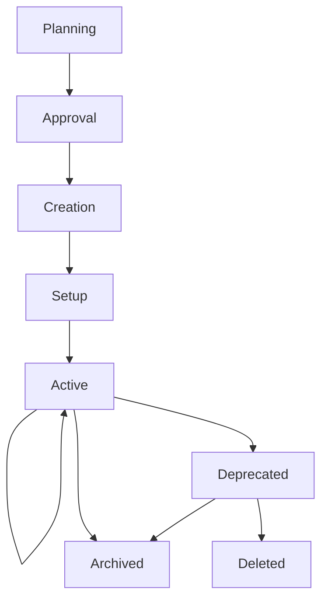
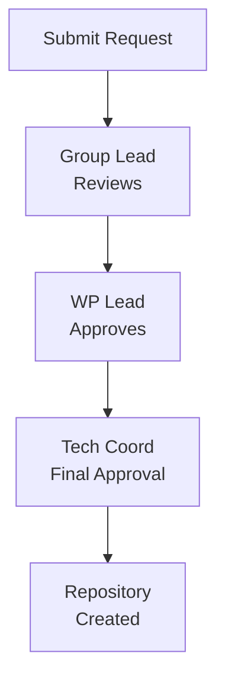
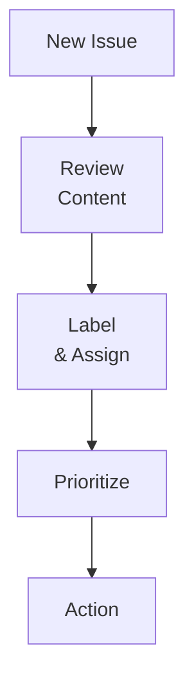
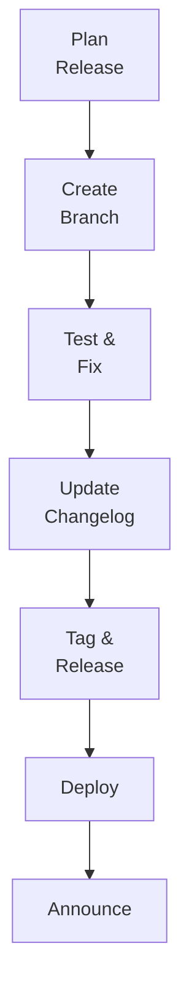
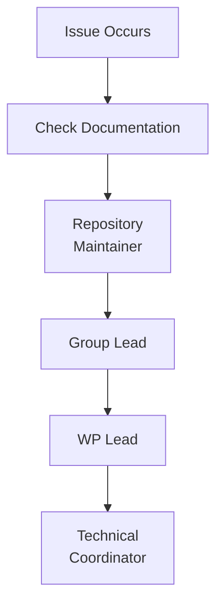

# Repository Management

**Document Version:** 1.2
**Last Updated:** December 2025
**Status:** Draft for Review

---

## Table of Contents

1. [Introduction](#1-introduction)
2. [Repository Lifecycle](#2-repository-lifecycle)
3. [Creating New Repositories](#3-creating-new-repositories)
4. [Repository Configuration](#4-repository-configuration)
5. [Maintaining Repositories](#5-maintaining-repositories)
6. [Repository Templates](#6-repository-templates)
7. [Archiving and Deprecation](#7-archiving-and-deprecation)
8. [Repository Deletion](#8-repository-deletion)
9. [Best Practices](#9-best-practices)
10. [Troubleshooting](#10-troubleshooting)

---

## 1. Introduction

### 1.1 Purpose

This document provides comprehensive guidelines for managing repositories throughout their lifecycle in the WEBUILD consortium, from creation to archival or deletion.

### 1.2 Scope

These guidelines apply to:

- All repositories in the `webuild-consortium` organization
- All repository types (code, documentation, specifications)
- All Work Packages and groups
- All stages of repository lifecycle

### 1.3 Roles and Responsibilities

| Role | Responsibilities |
|------|-----------------|
| **Technical Coordinator** | Organization-level repository management, policy enforcement |
| **WP Lead** | WP-level repository oversight, creation approval |
| **Group/UC Lead** | Day-to-day repository management, maintenance |
| **Repository Maintainer** | Active maintenance, issue management, releases |
| **Contributors** | Code contributions, issue reporting |

---

## 2. Repository Lifecycle

### 2.1 Lifecycle Stages



### 2.2 Stage Descriptions

#### 2.2.1 Planning

Define repository purpose, scope, ownership, and initial structure.

#### 2.2.2 Approval

Submit creation request through WP/Group lead to Technical Coordinator for approval and resource allocation.

#### 2.2.3 Creation

Repository is created in the organization with initial structure, access permissions, and basic files.

#### 2.2.4 Setup

Complete configuration including required files, branch protection, CI/CD setup, and team member access.

#### 2.2.5 Active

Repository is under active development with regular issue management, pull request reviews, releases, and documentation updates.

#### 2.2.6 Deprecated

Repository receives security updates only. Migration path and deprecation notice provided, with scheduled archival date.

#### 2.2.7 Archived

Repository is read-only and preserved for reference with clear archival notice.

#### 2.2.8 Deleted

Permanent removal in exceptional cases only, with full backup and documented justification.

### 2.3 Lifecycle Duration

**Typical Timelines:**

| Stage | Duration | Notes |
|-------|----------|-------|
| Planning | 1-2 weeks | Varies by complexity |
| Approval | 2-3 days | Depends on availability |
| Creation | 1 day | Quick process |
| Setup | 1-3 days | Initial configuration |
| Active | Ongoing | Project duration |
| Deprecated | 3-6 months | Before archival |
| Archived | Indefinite | Permanent preservation |

---

## 3. Creating New Repositories

### 3.1 When to Create a New Repository

Create a new repository when:

- Starting a new component or service
- Separating concerns (e.g., API from UI)
- Creating standalone tools or libraries
- Establishing new group workspace
- Developing specifications or standards
- Setting up test frameworks

Avoid creating repositories for small features, temporary experiments, duplicate functionality, or single files.

### 3.2 Repository Creation Request

#### 3.2.1 Request Template

Submit to WP/Group lead:

`````markdown
## Repository Creation Request

### Basic Information
- **Repository Name:** [e.g., wp4-new-component]
- **Purpose:** [Brief description]
- **Type:** [Code/Documentation/Specification]
- **Work Package:** [e.g., WP4]
- **Group:** [e.g., Trust Infrastructure]

### Justification
[Why this repository is needed and how it fits into the project]

### Scope
[What will be included, excluded, and key boundaries]

### Team
- **Owner:** [Group Lead Name]
- **Maintainers:** [Names]
- **Initial Contributors:** [Names]

### Technical Details
- **Primary Language:** [e.g., Python, TypeScript]
- **Key Dependencies:** [Main dependencies]
- **Integration Points:** [Other repos/services]

### Approvals
- [ ] Group Lead: [Name]
- [ ] WP Lead: [Name]
- [ ] Technical Coordinator: [Pending]
`````

#### 3.2.2 Approval Process



**Approval Criteria:**

- Clear purpose and scope
- No duplication of existing repos
- Appropriate team identified
- Resources available
- Aligns with project goals
- Follows naming conventions

### 3.3 Creating the Repository

#### 3.3.1 For Technical Coordinator

**Steps to create repository:**

1. **Navigate to Organization:**
   - Go to [https://github.com/webuild-consortium](https://github.com/webuild-consortium)
   - Click "New repository"

2. **Configure Repository:**
   ```
   Repository name: [as approved in request]
   Description: [Brief description for WeBuild project]
   Visibility: Public (default for WeBuild)
   Initialize with:
   ☑ README
   ☑ .gitignore (select appropriate template)
   ☑ License: Apache License 2.0
   ```

3. **Create Repository:**
   - Click "Create repository"
   - Note repository URL

4. **Initial Configuration:**
   - Add topics/tags
   - Configure settings
   - Set up branch protection
   - Add teams

5. **Notify Requestor:**
   - Send repository URL
   - Confirm access granted
   - Provide next steps

#### 3.3.2 Using GitHub CLI

```bash
# Create repository
gh repo create webuild-consortium/[repository-name] \
  --public \
  --description "[Repository description]" \
  --license apache-2.0 \
  --gitignore [template]

# Clone locally
gh repo clone webuild-consortium/[repository-name]

# Set up initial structure
cd [repository-name]
mkdir -p docs
touch CONTRIBUTING.md
git add .
git commit -m "chore: initial repository structure"
git push origin main
```

### 3.4 Post-Creation Setup

#### 3.4.1 Required Files Checklist

- [ ] **README.md** - Project overview and documentation
- [ ] **LICENSE** - Apache 2.0 license file
- [ ] **CONTRIBUTING.md** - Contribution guidelines
- [ ] **.gitignore** - Files to ignore
- [ ] **CODE_OF_CONDUCT.md** - Community standards
- [ ] **SECURITY.md** - Security policy
- [ ] **.github/** - GitHub-specific configs

#### 3.4.2 README.md Template

`````markdown
# [Repository Name]

Brief description of the repository purpose.

## Overview

Detailed description of what this repository contains and its role in the WeBuild project.

## Getting Started

### Prerequisites

- [List any prerequisites]

### Installation

```bash
# Installation commands if applicable
```

### Usage

```bash
# Usage examples if applicable
```

## Documentation

- [Additional documentation](docs/)
- [Contributing Guidelines](CONTRIBUTING.md)

## Contributing

See [CONTRIBUTING.md](CONTRIBUTING.md) for details on how to contribute.

## License

Licensed under the Apache License 2.0 - see [LICENSE](LICENSE) file for details.

## Funding


The WeBuild project is co-funded by the European Union. However, the views and opinions expressed are those of the author(s) only and do not necessarily reflect those of the European Union or the granting authority. Neither the European Union nor the granting authority can be held responsible.

## Contact

For questions and support, please open an issue in this repository.
`````

---

## 4. Repository Configuration

### 4.1 General Settings

#### 4.1.1 Repository Details

**Navigate to:** Settings → General

**Configure:**

```
Name: [repository-name]
Description: [Brief description for WeBuild project]
Website: https://www.webuildconsortium.eu (if applicable)
Topics: webuild-consortium, eudi-wallet, [relevant-topics]
```

**Features:**

- ☑ Issues
- ☑ Projects (if used)
- ☐ Wiki (use docs/ instead)
- ☑ Discussions (optional)
- ☑ Sponsorships (disabled)

**Pull Requests:**

- ☑ Allow merge commits
- ☑ Allow squash merging (recommended)
- ☑ Allow rebase merging
- ☑ Always suggest updating pull request branches
- ☑ Automatically delete head branches

### 4.2 Branch Protection Rules

#### 4.2.1 Protect Main Branch

**Navigate to:** Settings → Branches → Add rule

**Branch name pattern:** `main`

**Protection Rules:**

- Require pull request reviews before merging
  - Required approving reviews: 1
  - Dismiss stale pull request approvals when new commits are pushed
  - Require review from Code Owners (if CODEOWNERS file exists)

- Require status checks to pass before merging
  - Require branches to be up to date before merging
  - Status checks: (add CI/CD checks)

- Require conversation resolution before merging

- Require signed commits (optional, recommended)

- Require linear history (optional)

- Include administrators

- Allow force pushes (disabled)

- Allow deletions (disabled)

#### 4.2.2 Additional Branch Protection (Optional)

**For repositories using alternative branching strategies:**

If your repository uses GitFlow or another strategy requiring a `develop` branch (see [07-branching-and-workflow.md](07-branching-and-workflow.md) Appendix D), you may configure additional branch protection:

**Branch name pattern:** `develop`

**Protection rules:**

- Require pull request reviews: 1
- Require status checks to pass
- May allow force pushes for maintainers
- May have different status check requirements than `main`

**Note:** Most WEBUILD repositories use Feature Branch Workflow and only need to protect the `main` branch.

### 4.3 Access and Permissions

#### 4.3.1 Team Access

**Navigate to:** Settings → Collaborators and teams

**Add Teams:**

| Team | Permission Level | Purpose |
|------|-----------------|---------|
| `@webuild-consortium/[group-team]` | Write | Group members |
| `@webuild-consortium/wp4-all` | Read | WP visibility (if applicable) |
| `@webuild-consortium/[group]-maintainers` | Maintain | Repository maintainers (if team exists) |

#### 4.3.2 Individual Collaborators

Only add individual collaborators for:

- External contributors
- Temporary access
- Special cases

**Prefer team-based access for consortium members.**

### 4.4 Security Settings

#### 4.4.1 Security Features

**Navigate to:** Settings → Security & analysis

**Enable:**

- **Dependency graph**
  - Automatically enabled for public repos
  - Shows repository dependencies

- **Dependabot alerts**
  - Get notified of security vulnerabilities
  - Automatic security updates

- **Dependabot security updates**
  - Automatically create PRs for security fixes

- **Secret scanning**
  - Detect committed secrets
  - Receive alerts for exposed secrets

- **Code scanning** (if applicable)
  - Automated code security analysis
  - Configure via GitHub Actions

#### 4.4.2 Security Policy

Create `SECURITY.md`:

```markdown
# Security Policy

## Supported Versions

| Version | Supported |
| ------- | --------- |
| 1.x.x   | Yes       |
| < 1.0   | No        |

## Reporting a Vulnerability

Do not report security vulnerabilities through public GitHub issues.

Report via:
1. Email to [security contact]
2. Private security advisory on GitHub

Include:
- Description of the vulnerability
- Steps to reproduce
- Potential impact
- Suggested fix (if any)

We will respond within 48 hours and provide updates on the fix timeline.

## Security Update Process

1. Vulnerability reported
2. Assessment and verification
3. Fix development
4. Security advisory published
5. Patch released
6. Public disclosure
```

### 4.5 Automation and Integrations

#### 4.5.1 GitHub Actions

**Create:** `.github/workflows/ci.yml`

```yaml
name: CI

on:
  push:
    branches: [ main, develop ]
  pull_request:
    branches: [ main, develop ]

jobs:
  test:
    runs-on: ubuntu-latest

    steps:
    - uses: actions/checkout@v3

    - name: Set up environment
      uses: actions/setup-python@v4
      with:
        python-version: '3.11'

    - name: Install dependencies
      run: |
        pip install -r requirements.txt
        pip install -r requirements-dev.txt

    - name: Run linter
      run: |
        flake8 src/

    - name: Run tests
      run: |
        pytest tests/ --cov=src/

    - name: Upload coverage
      uses: codecov/codecov-action@v3
```

#### 4.5.2 Issue Templates

**Create:** `.github/ISSUE_TEMPLATE/bug_report.md`

```markdown
---
name: Bug Report
about: Create a report to help us improve
title: '[BUG] '
labels: bug
assignees: ''
---

## Description
A clear description of the bug.

## Steps to Reproduce
1. Step one
2. Step two
3. ...

## Expected Behavior
What should happen.

## Actual Behavior
What actually happens.

## Environment
- OS: [e.g., Ubuntu 22.04]
- Version: [e.g., 1.2.3]
- Browser: [if applicable]

## Additional Context
Any other relevant information.
```

#### 4.5.3 Pull Request Template

**Create:** `.github/PULL_REQUEST_TEMPLATE.md`

```markdown
## Description
Brief description of changes.

## Related Issues
Closes #

## Type of Change
- [ ] Bug fix
- [ ] New feature
- [ ] Breaking change
- [ ] Documentation update

## Testing
- [ ] Tests pass locally
- [ ] New tests added
- [ ] Manual testing completed

## Checklist
- [ ] Code follows style guidelines
- [ ] Self-review completed
- [ ] Documentation updated
- [ ] No new warnings
```

---

## 5. Maintaining Repositories

### 5.1 Regular Maintenance Tasks

#### 5.1.1 Daily/Weekly Tasks

- Monitor and triage new issues
- Review pull requests within 2 days
- Monitor CI/CD build status and security alerts

#### 5.1.2 Monthly Tasks

- Review and merge Dependabot dependency updates
- Address security alerts and review access permissions
- Update documentation and check for broken links
- Close stale issues and delete merged branches

#### 5.1.3 Quarterly Tasks

- Review team membership and remove inactive users
- Analyze repository metrics and contribution patterns
- Review roadmap and plan next release

### 5.2 Issue Management

#### 5.2.1 Issue Triage Process



**Triage Checklist:**

1. Read and understand the issue, reproduce if necessary
2. Add appropriate labels (type, priority, component)
3. Assign to team member and link to milestone
4. Acknowledge and provide timeline estimate

#### 5.2.2 Issue Labels

**Standard Labels:**

| Label | Color | Description |
|-------|-------|-------------|
| `bug` | #d73a4a | Something is not working |
| `enhancement` | #a2eeef | New feature or request |
| `documentation` | #0075ca | Documentation improvements |
| `question` | #d876e3 | Further information requested |
| `help wanted` | #008672 | Extra attention needed |
| `good first issue` | #7057ff | Good for newcomers |
| `wontfix` | #ffffff | This will not be worked on |
| `duplicate` | #cfd3d7 | Duplicate of another issue |
| `invalid` | #e4e669 | Invalid issue |
| `security` | #ee0701 | Security-related |

**Priority Labels:**

- `priority: high` - Critical, needs immediate attention
- `priority: medium` - Important, should be addressed soon
- `priority: low` - Nice to have, can wait

### 5.3 Release Management

#### 5.3.1 Release Process



#### 5.3.2 Semantic Versioning

Follow [Semantic Versioning 2.0.0](https://semver.org/):

**Format:** `MAJOR.MINOR.PATCH`

- **MAJOR:** Incompatible API changes
- **MINOR:** Backwards-compatible new features
- **PATCH:** Backwards-compatible bug fixes

**Examples:**

- `1.0.0` - Initial release
- `1.1.0` - New feature added
- `1.1.1` - Bug fix
- `2.0.0` - Breaking changes

**Pre-release versions:**

- `1.0.0-alpha.1` - Alpha release
- `1.0.0-beta.1` - Beta release
- `1.0.0-rc.1` - Release candidate

#### 5.3.3 Creating a Release

**For Feature Branch Workflow (Standard):**

Since `main` is always in a deployable state, releases are created directly from `main`:

```bash
# 1. Ensure main is up to date
git checkout main
git pull origin main

# 2. Update version and CHANGELOG
# Edit version files (package.json, setup.py, etc.)
# Update CHANGELOG.md with release notes
git add .
git commit -m "chore: prepare release v1.2.0"
git push origin main

# 3. Create and push tag
git tag -a v1.2.0 -m "Release version 1.2.0"
git push origin v1.2.0

# 4. Create GitHub Release
# - Go to repository → Releases
# - Click "Draft a new release"
# - Select tag: v1.2.0
# - Title: "Version 1.2.0"
# - Description: Copy from CHANGELOG
# - Attach binaries if applicable
# - Click "Publish release"
```

**For Scheduled Releases with Preparation:**

If you need a preparation period before release:

```bash
# 1. Create release branch from main
git checkout main
git pull origin main
git checkout -b release/v1.2.0

# 2. Prepare release (version updates, CHANGELOG, bug fixes only)
git add .
git commit -m "chore: prepare release v1.2.0"
git push origin release/v1.2.0

# 3. Create PR to merge back to main
# After approval and merge, tag the release on main

# 4. Delete release branch
git branch -d release/v1.2.0
```

**For GitFlow Workflow:**

If your repository uses GitFlow (see [07-branching-and-workflow.md](07-branching-and-workflow.md) Appendix D), follow the GitFlow release process with `develop` and `main` branches.

#### 5.3.4 CHANGELOG.md Format

```markdown
# Changelog

All notable changes to this project will be documented in this file.

The format is based on [Keep a Changelog](https://keepachangelog.com/),
and this project adheres to [Semantic Versioning](https://semver.org/).

## [Unreleased]

### Added
- New features in development

### Changed
- Changes to existing features

### Deprecated
- Features to be removed

### Removed
- Removed features

### Fixed
- Bug fixes

### Security
- Security fixes

## [1.2.0] - 2025-10-22

### Added
- User authentication with JWT
- API rate limiting
- Comprehensive API documentation

### Changed
- Improved error handling
- Updated dependencies

### Fixed
- Fixed login timeout issue
- Resolved memory leak in cache

## [1.1.0] - 2025-09-15

...
```

### 5.4 Documentation Maintenance

#### 5.4.1 Documentation Structure

```
docs/
├── README.md              # Documentation index
├── getting-started.md     # Quick start guide
├── installation.md        # Installation instructions
├── configuration.md       # Configuration guide
├── api/                   # API documentation
│   ├── README.md
│   ├── authentication.md
│   └── endpoints.md
├── architecture/          # Architecture docs
│   ├── overview.md
│   └── components.md
├── guides/                # How-to guides
│   ├── deployment.md
│   └── troubleshooting.md
└── contributing/          # Contribution docs
    ├── development.md
    └── testing.md
```

#### 5.4.2 Documentation Review

**Regular Reviews:**

- [ ] Check for accuracy
- [ ] Update outdated information
- [ ] Fix broken links
- [ ] Improve clarity
- [ ] Add missing sections
- [ ] Update examples
- [ ] Review screenshots

---

## 6. Repository Templates

### 6.1 Using Templates

**Benefits of templates:**

- Consistent structure
- Required files included
- Faster repository creation
- Best practices enforced

### 6.2 Creating a Template Repository

**Steps:**

1. Create repository with ideal structure
2. Add all required files
3. Configure settings
4. Go to Settings → Template repository
5. Check "Template repository"

**Template Contents:**

```
template-repo/
├── .github/
│   ├── workflows/
│   │   └── ci.yml
│   ├── ISSUE_TEMPLATE/
│   │   ├── bug_report.md
│   │   └── feature_request.md
│   └── PULL_REQUEST_TEMPLATE.md
├── docs/
│   └── README.md
├── src/
│   └── .gitkeep
├── tests/
│   └── .gitkeep
├── .gitignore
├── .editorconfig
├── README.md
├── LICENSE
├── CONTRIBUTING.md
├── CODE_OF_CONDUCT.md
└── SECURITY.md
```

### 6.3 Using a Template

**Create from template:**

1. Go to template repository
2. Click "Use this template"
3. Enter repository name
4. Choose visibility
5. Click "Create repository from template"
6. Customize for specific needs

---

## 7. Archiving and Deprecation

### 7.1 When to Archive

Archive a repository when:

- Project completed
- No longer maintained
- Replaced by newer version
- End of project phase
- Historical reference only

### 7.2 Deprecation Process

#### 7.2.1 Deprecation Notice

**Add to README.md:**

```markdown
# DEPRECATED

This repository is deprecated and no longer maintained.

**Reason:** [Explain why deprecated]

**Alternative:** Please use [new-repository](https://github.com/webuild-consortium/new-repository) instead.

**Migration Guide:** See [MIGRATION.md](MIGRATION.md) for migration instructions.

**Support:** Security fixes only until [date]. No new features will be added.

---

[Original README content follows...]
```

#### 7.2.2 Deprecation Checklist

- [ ] Add deprecation notice to README
- [ ] Create migration guide
- [ ] Update documentation
- [ ] Notify users (issues, discussions)
- [ ] Add deprecation label to issues
- [ ] Update related repositories
- [ ] Set deprecation timeline
- [ ] Plan archival date

### 7.3 Archiving Process

#### 7.3.1 Pre-Archive Checklist

- [ ] All issues resolved or transferred
- [ ] All PRs merged or closed
- [ ] Documentation complete
- [ ] Migration guide available
- [ ] Users notified
- [ ] Alternative solution documented
- [ ] Final release tagged
- [ ] Backup created

#### 7.3.2 Archive Repository

**Steps:**

1. **Final Update:**

```bash
# Add archive notice
echo "# ARCHIVED\n\nThis repository has been archived..." > ARCHIVE.md
git add ARCHIVE.md
git commit -m "chore: archive repository"
git push origin main
```

2. **Create Final Release:**
   - Tag final version
   - Create GitHub release
   - Mark as "archived" in release notes

3. **Archive on GitHub:**
   - Go to Settings → General
   - Scroll to "Danger Zone"
   - Click "Archive this repository"
   - Confirm archival

**Effects of archiving:**

- Repository becomes read-only
- No new issues or PRs
- No new commits
- Existing content preserved
- Still visible and clonable
- Can be unarchived if needed

#### 7.3.3 Post-Archive

- [ ] Update organization documentation
- [ ] Remove from active project lists
- [ ] Update related repositories
- [ ] Notify stakeholders
- [ ] Document archival reason
- [ ] Update website/documentation

---

## 8. Repository Deletion

### 8.1 When Deletion is Appropriate

**Note:** Deletion is rare and requires strong justification.

**Valid reasons:**

- Created by mistake
- Duplicate repository
- Contains sensitive data (after cleanup)
- Legal requirement
- Security incident

Use archival instead for repositories that are no longer needed, have low activity, or are outdated.

### 8.2 Deletion Process

#### 8.2.1 Pre-Deletion Requirements

**Must have:**

- [ ] Written justification
- [ ] Approval from WP lead
- [ ] Approval from Technical Coordinator
- [ ] Full backup created
- [ ] No active dependencies
- [ ] Users notified (if applicable)
- [ ] Alternative documented (if applicable)

#### 8.2.2 Backup Creation

```bash
# Clone with full history
git clone --mirror git@github.com:webuild-consortium/repo-name.git

# Create archive
tar -czf repo-name-backup-$(date +%Y%m%d).tar.gz repo-name.git/

# Store backup securely
# Document backup location
```

#### 8.2.3 Delete Repository

**Steps:**

1. **Final Verification:**
   - Confirm backup exists
   - Verify no dependencies
   - Check all approvals

2. **Delete on GitHub:**
   - Go to Settings → General
   - Scroll to "Danger Zone"
   - Click "Delete this repository"
   - Type repository name to confirm
   - Click "I understand, delete this repository"

3. **Document Deletion:**

```markdown
## Repository Deletion Log

Date: [YYYY-MM-DD]
Repository: webuild-consortium/repo-name
Reason: [Detailed reason]
Approved By:
- WP Lead: [Name]
- Technical Coordinator: [Name]
Backup Location: [Path/URL]
Deleted By: [Name]
```

---

## 9. Best Practices

### 9.1 Create a Comprehensive README

**Why it matters:** A well-crafted README is the first thing people see and is essential for understanding and navigating your work.

**Every repository MUST include a README.md with:**

- **Project name and clear description** - What does this repository do?
- **Purpose and objectives** - Why does this exist in the WEBUILD project?
- **Getting started instructions** - How to begin using or contributing
- **Installation/setup guide** - Step-by-step setup instructions
- **Usage examples** - Practical examples showing how to use the code
- **Contributing guidelines link** - Point to [`CONTRIBUTING.md`](02-contribution-guidelines.md)
- **License information** - Reference to [`LICENSE`](05-licensing-guidelines.md) file
- **EU funding acknowledgment** - Required for all consortium repositories
- **Contact information** - How to get help or report issues

**Template Example:**

```markdown
# WP4 Trust Infrastructure

A comprehensive trust framework for the WEBUILD digital wallet ecosystem.

## Overview

This repository implements the trust infrastructure components including...

## Getting Started

### Prerequisites
- Node.js 18+
- Docker 20+

### Installation
\`\`\`bash
npm install
docker-compose up -d
\`\`\`

### Usage
\`\`\`bash
npm start
\`\`\`

## Documentation

See [`docs/`](docs/) for detailed documentation.

## Contributing

See [`CONTRIBUTING.md`](CONTRIBUTING.md) for contribution guidelines.

## License

Licensed under Apache License 2.0 - see [`LICENSE`](LICENSE)

## Funding


The WEBUILD project is co-funded by the European Union...
```

For more information, see GitHub's guide on [About READMEs](https://docs.github.com/en/repositories/managing-your-repositorys-settings-and-features/customizing-your-repository/about-readmes).

### 9.2 Secure Your Repository

**Security is not optional.** Protect your code from vulnerabilities, unauthorized access, and security threats.

#### 9.2.1 Essential Security Features

**At minimum, enable these features (free for public repositories):**

1. **Dependabot Alerts**
   - Notifies you of security vulnerabilities in dependencies
   - Automatically suggests updates to secure versions
   - **Enable:** Settings → Security & analysis → Dependabot alerts

2. **Secret Scanning**
   - Scans repository for exposed secrets (API keys, tokens, passwords)
   - Alerts you immediately when secrets are detected
   - **Enable:** Settings → Security & analysis → Secret scanning

3. **Push Protection**
   - Prevents secrets from being committed in the first place
   - Blocks pushes containing supported secrets
   - **Enable:** Settings → Security & analysis → Push protection

4. **Code Scanning**
   - Identifies vulnerabilities and errors in your code
   - Provides automated security analysis
   - **Enable:** Settings → Security & analysis → Code scanning

#### 9.2.2 Additional Security Measures

**Also consider:**

- **Add `SECURITY.md` file** - Provides instructions for reporting security vulnerabilities and encourages responsible disclosure
- **Enable Private Vulnerability Reporting** - Allows collaborators to privately disclose vulnerabilities
- **Implement branch protection rules** - Require reviews and status checks before merging
- **Use signed commits** - Verify commit authenticity with GPG signatures
- **Regular security audits** - Review access permissions and security settings quarterly

**Example `SECURITY.md`:**

```markdown
# Security Policy

## Reporting a Vulnerability

**Do not report security vulnerabilities through public GitHub issues.**

Please report via:
1. Email to security@webuild-consortium.eu
2. Private security advisory on GitHub

Include:
- Description of the vulnerability
- Steps to reproduce
- Potential impact
- Suggested fix (if any)

We will respond within 48 hours.
```

For comprehensive guidance, see [Quickstart for securing your repository](https://docs.github.com/en/code-security/getting-started/quickstart-for-securing-your-repository).

### 9.3 Favor Branching Over Forking

**For consortium collaboration, use branches instead of forks.**

#### 9.3.1 Why Branching?

**Branching streamlines collaboration by:**

- Keeping all work in a single repository
- Simplifying code review and discussion
- Maintaining clear project history
- Enabling better access control
- Facilitating CI/CD integration

**When to use branching:**

- Regular consortium members and collaborators
- Internal development work
- Features and bug fixes
- Documentation updates

**When to use forking:**

- External contributors not affiliated with the project
- Open-source community contributions
- Experimental work that may not be merged

#### 9.3.2 Implementing Branch-Based Workflow

**Use protected branches to maintain quality:**

```yaml
Branch Protection Rules for 'main':
- ✓ Require pull request reviews (minimum 1 approval)
- ✓ Require status checks to pass
- ✓ Require conversation resolution
- ✓ Require linear history (optional)
- ✓ Include administrators
- ✗ Allow force pushes
- ✗ Allow deletions
```

**Workflow example:**

```bash
# Create feature branch from main
git checkout main
git pull origin main
git checkout -b feature/123-new-feature

# Make changes and commit
git add .
git commit -m "feat: implement new feature"

# Push and create pull request
git push origin feature/123-new-feature
# Create PR via GitHub UI

# After approval and merge, delete branch
git branch -d feature/123-new-feature
```

For more information, see [About protected branches](https://docs.github.com/en/repositories/configuring-branches-and-merges-in-your-repository/managing-protected-branches/about-protected-branches).

### 9.4 Use Git Large File Storage (LFS)

**GitHub limits file sizes to optimize performance.**

#### 9.4.1 File Size Limits

GitHub has the following limits:

- **Warning:** Files larger than 50 MB
- **Block:** Files larger than 100 MB
- **Repository size:** Recommended under 1 GB, ideally under 5 GB

#### 9.4.2 When to Use Git LFS

**Use Git LFS for:**

- Binary files (images, videos, audio)
- Large datasets
- Compiled binaries
- Design files (PSD, AI, Sketch)
- 3D models
- Large documentation assets

**Do not use Git LFS for:**

- Source code files
- Text-based configuration
- Small images (< 1 MB)
- Files that change frequently

#### 9.4.3 Setting Up Git LFS

```bash
# Install Git LFS
git lfs install

# Track large file types
git lfs track "*.psd"
git lfs track "*.zip"
git lfs track "*.mp4"

# Commit .gitattributes
git add .gitattributes
git commit -m "chore: configure Git LFS"

# Add and commit large files normally
git add large-file.psd
git commit -m "docs: add design mockup"
git push origin main
```

**`.gitattributes` example:**

```
*.psd filter=lfs diff=lfs merge=lfs -text
*.zip filter=lfs diff=lfs merge=lfs -text
*.mp4 filter=lfs diff=lfs merge=lfs -text
*.pdf filter=lfs diff=lfs merge=lfs -text
```

For more information, see:
- [About large files on GitHub](https://docs.github.com/en/repositories/working-with-files/managing-large-files/about-large-files-on-github)
- [About Git Large File Storage](https://docs.github.com/en/repositories/working-with-files/managing-large-files/about-git-large-file-storage)

### 9.5 Repository Naming Conventions

**Clear, consistent naming improves discoverability and organization.**

#### 9.5.1 Naming Rules

**Do:**

- Use lowercase letters
- Use hyphens (-) to separate words
- Be descriptive and specific
- Include WP prefix when applicable
- Keep names concise (< 50 characters)
- Use consistent terminology

**Do not:**

- Use spaces or special characters
- Use camelCase or PascalCase
- Create ambiguous names
- Use abbreviations without context
- Include version numbers in name

**Examples:**

**Good:**

- `wp4-trust-infrastructure`
- `webuild-documentation`
- `interoperability-test-suite`
- `wp4-qtsp-group`

**Bad:**

- `WP4_Trust` (wrong case and separator)
- `repo1` (not descriptive)
- `temp-test` (temporary naming)
- `myProject` (camelCase)

### 9.6 Documentation Standards

**Documentation is as important as code.**

#### 9.6.1 Required Files

Every repository MUST include:

- **[`README.md`](#91-create-a-comprehensive-readme)** - Project overview and getting started
- **[`LICENSE`](05-licensing-guidelines.md)** - Apache License 2.0 (default)
- **[`CONTRIBUTING.md`](02-contribution-guidelines.md)** - How to contribute
- **[`CODE_OF_CONDUCT.md`](02-contribution-guidelines.md#12-code-of-conduct)** - Community standards
- **[`SECURITY.md`](#922-additional-security-measures)** - Security policy
- **`.gitignore`** - Files to exclude from version control

#### 9.6.2 Recommended Files

- **`CHANGELOG.md`** - Version history and changes
- **`docs/`** - Additional documentation directory
- **`.github/`** - GitHub-specific configurations
  - `ISSUE_TEMPLATE/` - Issue templates
  - `PULL_REQUEST_TEMPLATE.md` - PR template
  - `workflows/` - GitHub Actions workflows

#### 9.6.3 Documentation Best Practices

- **Keep documentation up-to-date** - Update docs with code changes
- **Use clear, simple language** - Write for your audience
- **Include examples** - Show, do not just tell
- **Organize logically** - Structure information hierarchically
- **Link related documents** - Create a documentation web
- **Review in pull requests** - Treat docs like code

### 9.7 Security Best Practices

**Beyond enabling security features, follow these practices:**

#### 9.7.1 Access Control

- **Apply least privilege principle** - Grant minimum necessary permissions
- **Review access regularly** - Audit team membership quarterly
- **Use teams, not individuals** - Manage access through teams
- **Revoke access promptly** - Remove access when no longer needed
- **Enable 2FA for all members** - Require two-factor authentication

#### 9.7.2 Secrets Management

- **Never commit secrets** - Use environment variables or secret management
- **Use GitHub Secrets** - For CI/CD workflows
- **Rotate credentials regularly** - Change passwords and tokens periodically
- **Scan for exposed secrets** - Use secret scanning and pre-commit hooks
- **Remove secrets from history** - If accidentally committed, remove completely

#### 9.7.3 Dependency Management

- **Keep dependencies updated** - Review and merge Dependabot PRs
- **Audit dependencies** - Check for known vulnerabilities
- **Use lock files** - Commit `package-lock.json`, `yarn.lock`, etc.
- **Review dependency licenses** - Ensure compatibility
- **Minimize dependencies** - Only add what you need

### 9.8 Collaboration Best Practices

**Effective collaboration requires clear communication and processes.**

#### 9.8.1 Pull Request Guidelines

- **Keep PRs small and focused** - One feature or fix per PR
- **Write clear descriptions** - Explain what, why, and how
- **Link related issues** - Use "Closes #123" syntax
- **Request appropriate reviewers** - Tag relevant team members
- **Respond to feedback promptly** - Address comments within 1-2 days
- **Test before requesting review** - Ensure all checks pass

#### 9.8.2 Code Review Guidelines

- **Review within 2 business days** - Do not block progress
- **Be constructive and respectful** - Focus on code, not person
- **Explain your reasoning** - Help others learn
- **Approve when ready** - Do not nitpick minor issues
- **Test changes locally** - Verify functionality

#### 9.8.3 Issue Management

- **Triage new issues within 48 hours** - Acknowledge and label
- **Use descriptive titles** - Summarize the issue clearly
- **Provide context** - Include steps to reproduce, environment details
- **Label appropriately** - Use consistent labeling scheme
- **Link related issues** - Connect related work
- **Close resolved issues** - Keep issue tracker clean

### 9.9 Maintenance Best Practices

**Regular maintenance keeps repositories healthy and productive.**

#### 9.9.1 Daily/Weekly Tasks

- **Monitor new issues and PRs** - Stay on top of incoming work
- **Review pull requests** - Do not let PRs go stale
- **Check CI/CD status** - Ensure builds are passing
- **Review security alerts** - Address vulnerabilities promptly

#### 9.9.2 Monthly Tasks

- **Update dependencies** - Review and merge Dependabot PRs
- **Review access permissions** - Ensure appropriate access levels
- **Update documentation** - Keep docs current with code
- **Check for broken links** - Validate documentation links
- **Clean up stale branches** - Delete merged feature branches
- **Close stale issues** - Address or close inactive issues

#### 9.9.3 Quarterly Tasks

- **Review team membership** - Remove inactive users
- **Analyze repository metrics** - Review contribution patterns
- **Update roadmap** - Plan next quarter's work
- **Security audit** - Comprehensive security review
- **Performance review** - Check repository health metrics

#### 9.9.4 Automation Opportunities

**Automate repetitive tasks:**

- **Stale issue management** - Auto-close inactive issues
- **Dependency updates** - Automated Dependabot PRs
- **Code quality checks** - Automated linting and testing
- **Security scanning** - Automated vulnerability detection
- **Branch cleanup** - Auto-delete merged branches

### 9.10 Hands-On Practice

**Learn by doing with GitHub Skills exercises.**

GitHub provides free, interactive courses to improve your repository management skills:

- **[Introduction to Repository Management](https://github.com/skills/introduction-to-repository-management/)** - Practical experience with repository management fundamentals

**Topics covered:**

- Creating and configuring repositories
- Managing branches and protection rules
- Working with issues and pull requests
- Implementing security best practices
- Collaborating effectively with teams

**Recommended for:**

- New consortium members
- Team leads setting up repositories
- Anyone wanting to improve their GitHub skills

---

## 10. Troubleshooting

### 10.1 Common Issues

#### 10.1.1 Permission Denied

**Problem:** Cannot push to repository

**Solutions:**

1. Verify you have write access
2. Check if branch is protected
3. Ensure you are authenticated
4. Contact repository maintainer

```bash
# Check your access level
gh repo view webuild-consortium/[repo-name]

# Verify authentication
gh auth status
```

#### 10.1.2 Branch Protection Conflicts

**Problem:** Cannot merge PR due to protection rules

**Solutions:**

1. Ensure all required reviews are approved
2. Verify CI/CD checks pass
3. Resolve all conversations
4. Update branch with latest main
5. Check if signed commits are required

#### 10.1.3 Failed CI/CD Builds

**Problem:** Automated tests failing

**Solutions:**

1. Review build logs
2. Run tests locally
3. Check for dependency issues
4. Verify environment configuration
5. Update failing tests if needed

```bash
# Run tests locally
npm test
# or
pytest tests/
# or
go test ./...
```

#### 10.1.4 Merge Conflicts

**Problem:** Cannot merge due to conflicts

**Solutions:**

1. Update your branch with latest main
2. Resolve conflicts locally
3. Test after resolving
4. Push resolved changes

```bash
# Update branch
git checkout main
git pull origin main
git checkout feature-branch
git merge main

# Resolve conflicts in editor
# Then:
git add .
git commit -m "fix: resolve merge conflicts"
git push origin feature-branch
```

#### 10.1.5 Missing Required Files

**Problem:** Repository lacks required files

**Solutions:**

1. Add missing files from templates
2. Follow repository structure guidelines
3. Update documentation
4. Commit and push changes

### 10.2 Access Issues

#### 10.2.1 Cannot Access Repository

**Problem:** Repository not visible or accessible

**Checklist:**

- [ ] Verify you are logged into GitHub
- [ ] Check if you are member of organization
- [ ] Confirm repository exists
- [ ] Verify repository visibility (public/private)
- [ ] Check if you have required team membership

**Contact:** Technical Coordinator or WP Lead

#### 10.2.2 Cannot Create Repository

**Problem:** No permission to create repository

**Solution:**

- Only Technical Coordinator can create repositories
- Submit repository creation request
- Follow approval process
- Wait for repository to be created

#### 10.2.3 Lost Access to Repository

**Problem:** Previously had access, now do not

**Possible Causes:**

- Team membership changed
- Repository archived
- Access permissions updated
- Organization membership changed

**Solution:** Contact repository maintainer or Technical Coordinator

### 10.3 Configuration Issues

#### 10.3.1 Branch Protection Not Working

**Problem:** Protection rules not enforced

**Verification:**

1. Go to Settings → Branches
2. Check rule configuration
3. Verify pattern matches branch name
4. Ensure "Include administrators" is checked
5. Test with a PR

#### 10.3.2 CI/CD Not Running

**Problem:** GitHub Actions not executing

**Checklist:**

- [ ] Workflow file exists in `.github/workflows/`
- [ ] Workflow syntax is correct
- [ ] Trigger conditions are met
- [ ] Actions are enabled for repository
- [ ] No workflow run limits exceeded

**Debug:**

```bash
# Validate workflow syntax locally
gh workflow view [workflow-name]

# Check workflow runs
gh run list
```

#### 10.3.3 Dependabot Not Creating PRs

**Problem:** No automatic dependency updates

**Solutions:**

1. Verify Dependabot is enabled
2. Check for `dependabot.yml` configuration
3. Review Dependabot logs
4. Ensure dependencies are outdated
5. Check if PRs are being created but closed

### 10.4 Repository Management Issues

#### 10.4.1 Cannot Archive Repository

**Problem:** Archive option not available

**Requirements:**

- Must be repository admin
- Must have organization permissions
- Repository must not have active dependencies
- All issues/PRs should be resolved

**Process:**

1. Complete pre-archive checklist
2. Get necessary approvals
3. Contact Technical Coordinator if needed

#### 10.4.2 Cannot Delete Repository

**Problem:** Delete option not available or fails

**Requirements:**

- Must be organization owner
- Must have written justification
- Must have approvals
- Must have backup created

**Note:** Repository deletion is restricted. Contact Technical Coordinator.

#### 10.4.3 Repository Transfer Issues

**Problem:** Need to transfer repository

**Process:**

1. Contact Technical Coordinator
2. Provide justification
3. Specify target organization/user
4. Wait for approval and transfer
5. Update references in other repositories

### 10.5 Getting Help

#### 10.5.1 Internal Support

**For repository-specific issues:**

1. Check repository documentation
2. Search existing issues
3. Ask in repository discussions
4. Contact repository maintainer

**For organization-level issues:**

1. Contact WP Lead
2. Contact Technical Coordinator
3. Refer to this documentation
4. Check FAQ in appendices

#### 10.5.2 GitHub Support

**For GitHub platform issues:**

- [GitHub Documentation](https://docs.github.com)
- [GitHub Community](https://github.community)
- [GitHub Support](https://support.github.com)

#### 10.5.3 Escalation Path



**Escalation Guidelines:**

1. Try to resolve using documentation
2. Contact repository maintainer
3. Escalate to Group Lead if unresolved
4. Escalate to WP Lead if needed
5. Contact Technical Coordinator for organization-level issues

### 10.6 Preventive Measures

**To avoid common issues:**

- [ ] Read documentation before starting
- [ ] Follow established processes
- [ ] Use templates and examples
- [ ] Test changes locally first
- [ ] Keep dependencies updated
- [ ] Monitor security alerts
- [ ] Maintain clear documentation
- [ ] Communicate with team
- [ ] Request help early
- [ ] Learn from past issues

---

## Appendices

### A. Quick Reference

**Repository Creation:**

1. Submit request to WP/Group lead
2. Wait for approval
3. Technical Coordinator creates repository
4. Complete post-creation setup

**Repository Maintenance:**

- Daily: Monitor issues and PRs
- Weekly: Triage and respond
- Monthly: Update dependencies and docs
- Quarterly: Review access and metrics

**Repository Lifecycle:**

Planning → Approval → Creation → Setup → Active → Deprecated/Archived

---

**Document Control:**

| Version | Date | Author | Changes |
|---------|------|--------|---------|
| 1.0 | October 2025 | Technical Coordinator | Initial draft |
| 1.1 | November 2025 | Technical Coordinator | General improvements |
| 1.2 | December 2025 | Technical Coordinator | General improvements & cleanup |

**Next Review Date:** March 2026

---

*This document is maintained in the `webuild-policies` repository. For questions or suggestions, please open an issue or contact the Technical Coordinator (webuild-github-support@grnet.gr).*
