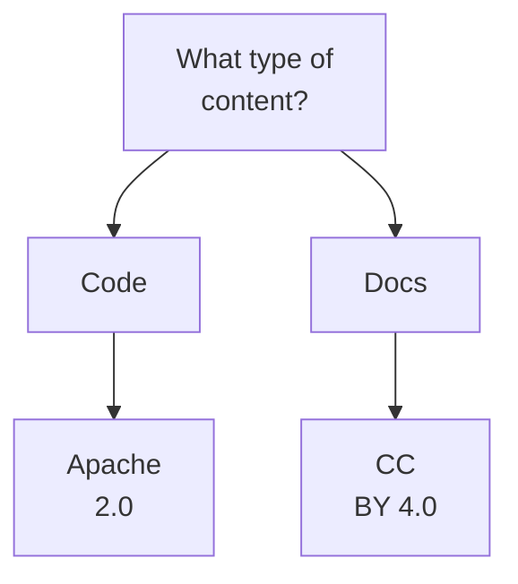
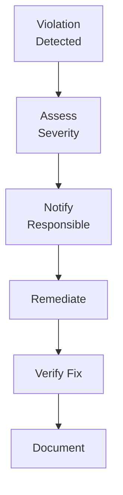

# Licensing Guidelines

**Document Version:** 1.2
**Last Updated:** December 2025
**Status:** Draft for Review

---

## Table of Contents

1. [Introduction](#1-introduction)
2. [Default License Policy](#2-default-license-policy)
3. [Apache License 2.0](#3-apache-license-20)
4. [License Selection Criteria](#4-license-selection-criteria)
5. [License Implementation](#5-license-implementation)
6. [Third-Party Dependencies](#6-third-party-dependencies)
7. [Intellectual Property](#7-intellectual-property)
8. [Compliance and Enforcement](#8-compliance-and-enforcement)

---

## 1. Introduction

### 1.1 Purpose

This document establishes licensing policies and guidelines for all code, documentation, and other materials produced by the WEBUILD consortium. It ensures compliance with EU regulations, consortium agreements, and open-source best practices.

### 1.2 Scope

These guidelines apply to:

- Source code repositories
- Documentation and specifications
- Test suites and tools
- Examples and tutorials
- Configuration files and scripts
- Any other project outputs

### 1.3 Legal Framework

Licensing within WEBUILD must comply with:

- **EU Grant Agreement:** Open access requirements
- **Consortium Agreement:** Intellectual property rights and obligations
- **Partner Agreements:** Individual partner IP policies
- **Open Source Licenses:** License terms and conditions
- **Export Control:** Applicable regulations

### 1.4 Key Principles

1. **Open by Default:** Promote open access and collaboration
2. **Clear Attribution:** Provide proper credit to contributors and consortium
3. **Legal Compliance:** Adhere to all legal requirements
4. **Compatibility:** Ensure license compatibility across dependencies
5. **Transparency:** Communicate licensing terms clearly

---

## 2. Default License Policy

### 2.1 Standard License

**Default License:** Apache License 2.0

**Current Status in WeBuild:**

Most WeBuild repositories use Apache License 2.0, including:

- [`architecture`](https://github.com/webuild-consortium/architecture) - Apache 2.0
- [`wp4-interop-test-bed`](https://github.com/webuild-consortium/wp4-interop-test-bed) - Apache 2.0
- [`wp4-qtsp-group`](https://github.com/webuild-consortium/wp4-qtsp-group) - Apache 2.0
- [`wp4-trust-group`](https://github.com/webuild-consortium/wp4-trust-group) - Apache 2.0 (per README)
- [`.github`](https://github.com/webuild-consortium/.github) - Apache 2.0

**Note:** Some repositories may not have the license properly configured in GitHub metadata. All new repositories must explicitly include the Apache 2.0 license.

**Rationale:**

- Permissive open-source license
- Compatible with commercial use
- Provides patent protection
- Widely recognized and understood
- Allows derivative works
- Minimal restrictions on use

### 2.2 When to Use Apache 2.0

Use Apache License 2.0 for all code-related content, including:

- Source code
- Libraries
- Tools
- APIs
- Examples
- Scripts

### 2.3 Exceptions to Default License

Alternative licenses may be considered for:

- **Documentation:** Creative Commons
- **Specifications:** W3C or IETF standards
- **Data Sets:** Open Data Commons
- **Media Files:** Creative Commons
- **Special Requirements:** Case-by-case basis

**Approval Required:** Technical Coordinator and legal review

### 2.4 License Declaration

Every repository must include:

- LICENSE file in the repository root
- Copyright notice in README
- License headers in source files (where applicable)
- NOTICE file for attributions (if needed)
- GitHub license detection configuration
- License documentation in package metadata
- License badge in README

---

## 3. Apache License 2.0

### 3.1 License Overview

**Full Name:** Apache License, Version 2.0
**SPDX Identifier:** Apache-2.0
**OSI Approved:** Yes
**URL:** https://www.apache.org/licenses/LICENSE-2.0

### 3.2 Key Terms

**Permissions:**

- Commercial use
- Modification
- Distribution
- Patent use
- Private use

**Conditions:**

- License and copyright notice required
- State changes in modified files
- Include NOTICE file if present

**Limitations:**

- No trademark use
- No liability
- No warranty

### 3.3 License Text

**LICENSE File Content:**

```
                                 Apache License
                           Version 2.0, January 2004
                        http://www.apache.org/licenses/

   TERMS AND CONDITIONS FOR USE, REPRODUCTION, AND DISTRIBUTION

   [Full Apache 2.0 license text - see https://www.apache.org/licenses/LICENSE-2.0.txt]
```

**Download from:** https://www.apache.org/licenses/LICENSE-2.0.txt

### 3.4 Copyright Notice

**Standard Copyright Notice:**

```
Copyright [year] WeBuild Consortium

Licensed under the Apache License, Version 2.0 (the "License");
you may not use this file except in compliance with the License.
You may obtain a copy of the License at

    http://www.apache.org/licenses/LICENSE-2.0

Unless required by applicable law or agreed to in writing, software
distributed under the License is distributed on an "AS IS" BASIS,
WITHOUT WARRANTIES OR CONDITIONS OF ANY KIND, either express or implied.
See the License for the specific language governing permissions and
limitations under the License.
```

**Note:** Use "WeBuild Consortium" (not "WEBUILD") to match actual repository usage.

### 3.5 Source File Headers

#### 3.5.1 Recommended Header Format

**For most source files:**

```
/*
 * Copyright 2025 WeBuild Consortium
 *
 * Licensed under the Apache License, Version 2.0 (the "License");
 * you may not use this file except in compliance with the License.
 * You may obtain a copy of the License at
 *
 *     http://www.apache.org/licenses/LICENSE-2.0
 *
 * Unless required by applicable law or agreed to in writing, software
 * distributed under the License is distributed on an "AS IS" BASIS,
 * WITHOUT WARRANTIES OR CONDITIONS OF ANY KIND, either express or implied.
 * See the License for the specific language governing permissions and
 * limitations under the License.
 */
```

#### 3.5.2 Language-Specific Headers

**Python:**

```python
# Copyright 2025 WeBuild Consortium
#
# Licensed under the Apache License, Version 2.0 (the "License");
# you may not use this file except in compliance with the License.
# You may obtain a copy of the License at
#
#     http://www.apache.org/licenses/LICENSE-2.0
#
# Unless required by applicable law or agreed to in writing, software
# distributed under the License is distributed on an "AS IS" BASIS,
# WITHOUT WARRANTIES OR CONDITIONS OF ANY KIND, either express or implied.
# See the License for the specific language governing permissions and
# limitations under the License.
```

**JavaScript/TypeScript:**

```javascript
/**
 * Copyright 2025 WeBuild Consortium
 *
 * Licensed under the Apache License, Version 2.0 (the "License");
 * you may not use this file except in compliance with the License.
 * You may obtain a copy of the License at
 *
 *     http://www.apache.org/licenses/LICENSE-2.0
 *
 * Unless required by applicable law or agreed to in writing, software
 * distributed under the License is distributed on an "AS IS" BASIS,
 * WITHOUT WARRANTIES OR CONDITIONS OF ANY KIND, either express or implied.
 * See the License for the specific language governing permissions and
 * limitations under the License.
 */
```

**HTML/XML:**

```html
<!--
  Copyright 2025 WeBuild Consortium

  Licensed under the Apache License, Version 2.0 (the "License");
  you may not use this file except in compliance with the License.
  You may obtain a copy of the License at

      http://www.apache.org/licenses/LICENSE-2.0

  Unless required by applicable law or agreed to in writing, software
  distributed under the License is distributed on an "AS IS" BASIS,
  WITHOUT WARRANTIES OR CONDITIONS OF ANY KIND, either express or implied.
  See the License for the specific language governing permissions and
  limitations under the License.
-->
```

#### 3.5.3 When to Include Headers

**Include headers in:**

- All source code files
- Configuration files (where comments are allowed)
- Build scripts
- SQL files
- Shell scripts

**Omit headers in:**

- Generated files (note generation in header)
- Very small files (fewer than 10 lines)
- Data files (JSON, CSV, etc.)
- Binary files

### 3.6 NOTICE File

**When to include NOTICE:**

Create a NOTICE file when:

- Using third-party code with attribution requirements
- Including code from other Apache projects
- Required by dependencies
- Consortium-specific attributions are needed

**NOTICE File Format:**

```
WeBuild Consortium
Copyright 2025 WeBuild Consortium

This product includes software developed by the WeBuild Consortium
(https://www.webuildconsortium.eu).

This project is co-funded by the European Union.

---

This product includes software developed by [Third Party]
Copyright [year] [Third Party Name]
[License information]

[Additional attributions as needed]
```

---

## 4. License Selection Criteria

### 4.1 Decision Framework



### 4.2 License Options

#### 4.2.1 For Source Code

**Primary Choice:** Apache License 2.0

**Alternative Options:**

- **MIT License:** Simpler, less patent protection
- **BSD 3-Clause:** Similar to MIT
- **GPL 3.0:** Copyleft, requires derivative works to be open

**When to use alternatives:**

- Apache 2.0 for patent protection
- MIT for simplicity
- GPL 3.0 when copyleft is required

#### 4.2.2 For Documentation

**Recommended:** Creative Commons Attribution 4.0 (CC BY 4.0)

- Designed for creative works
- Allows commercial use
- Requires attribution

**Alternatives:**

- **CC BY-SA 4.0:** Share-alike requirement
- **CC0:** Public domain dedication

#### 4.2.3 For Specifications

**Options:**

- **W3C Software and Document License:** For web standards
- **IETF Trust License:** For internet standards
- **Apache 2.0:** General specifications

**Selection criteria:**

- Standards body requirements
- Intended use
- Compatibility needs

#### 4.2.4 For Data

**Options:**

- **Open Data Commons Attribution (ODC-By):** Requires attribution
- **CC0:** Public domain dedication
- **Open Database License (ODbL):** Share-alike for databases

### 4.3 License Compatibility

#### 4.3.1 Compatible Licenses

Apache 2.0 is compatible with:

**Permissive Licenses:**

- MIT License
- BSD 2-Clause and 3-Clause
- ISC License
- Python Software Foundation License

**Copyleft Licenses (one-way):**

- GPL 3.0 (can incorporate Apache code)
- LGPL 3.0
- AGPL 3.0

#### 4.3.2 Incompatible Licenses

**Incompatible with:**

- GPL 2.0 (without exception)
- Some proprietary licenses
- Licenses with field-of-use restrictions

#### 4.3.3 Compatibility Matrix

| License | Compatible with Apache 2.0 | Notes |
|---------|---------------------------|-------|
| MIT | Yes | Fully compatible |
| BSD 3-Clause | Yes | Fully compatible |
| GPL 2.0 | No | Incompatible |
| GPL 3.0 | Yes (one-way) | Can use Apache in GPL |
| LGPL 3.0 | Yes | Compatible |
| MPL 2.0 | Yes | Compatible |
| CC BY 4.0 | Partial | For docs, not code |

---

## 5. License Implementation

### 5.1 New Repository Setup

#### 5.1.1 Setup Checklist

When creating a new repository:

1. Add LICENSE file
2. Include copyright notice in README
3. Add license headers in source files
4. Create NOTICE file (if needed)
5. Configure GitHub license detection
6. Document license in package metadata
7. Add license badge to README

#### 5.1.2 LICENSE File

Download and add the Apache 2.0 license:

```bash
curl -o LICENSE https://www.apache.org/licenses/LICENSE-2.0.txt
git add LICENSE
git commit -m "chore: add Apache 2.0 license"
git push origin main
```

Verify the license is detected as "Apache-2.0" in repository settings.

#### 5.1.3 README License Section

Add to README.md:

```markdown
## License

Licensed to the WeBuild Consortium under the consortium agreements.
The WeBuild Consortium licenses this file to you under the
[Apache License, Version 2.0](LICENSE) (the "License"); you may not
use these files except in compliance with the License.

Unless required by applicable law or agreed to in writing, software
distributed under the License is distributed on an "AS IS" BASIS,
WITHOUT WARRANTIES OR CONDITIONS OF ANY KIND, either express or implied.
See the License for the specific language governing permissions and
limitations under the License.
```

#### 5.1.4 License Badge

Add badge to README.md:

```markdown
[](https://opensource.org/licenses/Apache-2.0)
```

### 5.2 Adding License Headers

#### 5.2.1 Manual Addition

For new files, include the header at the top:

```python
# Copyright 2025 WeBuild Consortium
# SPDX-License-Identifier: Apache-2.0

# [Your code here]
```

#### 5.2.2 Automated Tools

**Using addlicense tool:**

```bash
# Install
go install github.com/google/addlicense@latest

# Add headers to all files
addlicense -c "WeBuild Consortium" -l apache .

# Check for missing headers
addlicense -check .
```

**Using pre-commit hook:**

```yaml
# .pre-commit-config.yaml
repos:
  - repo: https://github.com/Lucas-C/pre-commit-hooks
    rev: v1.5.1
    hooks:
      - id: insert-license
        files: \.(py|js|ts|java)$
        args:
          - --license-filepath
          - LICENSE-HEADER.txt
```

#### 5.2.3 IDE Configuration

**VS Code:**

Create snippet in `.vscode/snippets.code-snippets`:

```json
{
  "Apache License Header": {
    "prefix": "apache-header",
    "body": [
      "/*",
      " * Copyright 2025 WeBuild Consortium",
      " *",
      " * Licensed under the Apache License, Version 2.0 (the \"License\");",
      " * you may not use this file except in compliance with the License.",
      " * You may obtain a copy of the License at",
      " *",
      " *     http://www.apache.org/licenses/LICENSE-2.0",
      " *",
      " * Unless required by applicable law or agreed to in writing, software",
      " * distributed under the License is distributed on an \"AS IS\" BASIS,",
      " * WITHOUT WARRANTIES OR CONDITIONS OF ANY KIND, either express or implied.",
      " * See the License for the specific language governing permissions and",
      " * limitations under the License.",
      " */"
    ]
  }
}
```

### 5.3 Package Metadata

#### 5.3.1 Python (setup.py / pyproject.toml)

**setup.py:**

```python
setup(
    name="webuild-package",
    version="1.0.0",
    license="Apache-2.0",
    # ...
)
```

**pyproject.toml:**

```toml
[project]
name = "webuild-package"
version = "1.0.0"
license = {text = "Apache-2.0"}
```

#### 5.3.2 Node.js (package.json)

```json
{
  "name": "webuild-package",
  "version": "1.0.0",
  "license": "Apache-2.0",
  "repository": {
    "type": "git",
    "url": "https://github.com/webuild-consortium/repo-name.git"
  }
}
```

#### 5.3.3 Java (pom.xml)

```xml
<project>
  <licenses>
    <license>
      <name>Apache License, Version 2.0</name>
      <url>https://www.apache.org/licenses/LICENSE-2.0.txt</url>
      <distribution>repo</distribution>
    </license>
  </licenses>
</project>
```

---

## 6. Third-Party Dependencies

### 6.1 Dependency Review

#### 6.1.1 Before Adding Dependencies

Before adding any dependency:

1. Verify license compatibility
2. Check for patent clauses
3. Document the license in your project

#### 6.1.2 Acceptable Licenses

**Permissive licenses (generally acceptable):**

- Apache 2.0
- MIT
- BSD 2-Clause, 3-Clause
- ISC
- Python Software Foundation
- Unlicense / Public Domain

**Copyleft licenses (use with caution):**

- LGPL 2.1, 3.0 (linking allowed)
- MPL 2.0 (file-level copyleft)
- EPL 2.0 (Eclipse Public License)

**Problematic licenses (avoid):**

- GPL 2.0 (incompatible with Apache 2.0)
- AGPL (strong copyleft)
- Proprietary licenses
- "Commons Clause" additions
- Licenses with field-of-use restrictions

#### 6.1.3 License Scanning

**Automated Tools:**

```bash
# Python
pip install pip-licenses
pip-licenses --format=markdown

# Node.js
npm install -g license-checker
license-checker --summary

# Java
mvn license:aggregate-third-party-report
```

**GitHub Features:**

- Dependency graph
- Dependabot alerts
- License detection

### 6.2 Attribution Requirements

#### 6.2.1 When Attribution is Required

Provide attribution when:

- The license requires it
- Using substantial code portions
- Modifying third-party code
- Redistributing dependencies

#### 6.2.2 Attribution Methods

**In NOTICE file:**

```
This product includes software developed by [Project Name]
Copyright [year] [Copyright holder]
Licensed under [License Name]
```

**In documentation:**

```markdown
## Third-Party Licenses

This project uses the following third-party libraries:

- **Library Name** - [License] - https://github.com/org/repo
  Copyright [year] [Author]
```

**In package metadata:**

Include license information in package files (package.json, pom.xml, etc.)

### 6.3 Dependency Documentation

#### 6.3.1 DEPENDENCIES.md

Create a file documenting all dependencies:

```markdown
# Dependencies

## Direct Dependencies

### Production Dependencies

| Package | Version | License | Purpose |
|---------|---------|---------|---------|
| express | 4.18.0 | MIT | Web framework |
| jsonwebtoken | 9.0.0 | MIT | JWT handling |

### Development Dependencies

| Package | Version | License | Purpose |
|---------|---------|---------|---------|
| jest | 29.0.0 | MIT | Testing framework |
| eslint | 8.0.0 | MIT | Linting |

## License Compliance

All dependencies use licenses compatible with Apache 2.0.

## Attribution

See [NOTICE](NOTICE) file for required attributions.
```

#### 6.3.2 Automated Documentation

**Generate automatically:**

```bash
# Python
pip-licenses --format=markdown > DEPENDENCIES.md

# Node.js
license-checker --markdown > DEPENDENCIES.md

# Java
mvn license:aggregate-add-third-party
```

---

## 7. Intellectual Property

### 7.1 Consortium IP Agreement

**Key provisions:**

- Partners retain ownership of pre-existing IP (Background IP)
- New IP created during the project (Foreground IP) is jointly owned
- Partners have access rights per consortium agreement
- Open access publication is required by EU grant
- Partners may exploit results per agreement

### 7.2 Contributor Rights

#### 7.2.1 Copyright Ownership

Contributors retain copyright to their contributions but grant rights to the consortium:

```
Copyright [year] [Contributor Name]
Copyright [year] WEBUILD Consortium

Licensed under the Apache License, Version 2.0...
```

#### 7.2.2 Contributor License Agreement (CLA)

**Not required for:**

- Consortium members (covered by consortium agreement)

**May be required for:**

- External contributors
- Non-partner organizations
- Individual contributors outside the consortium

### 7.3 Patent Rights

#### 7.3.1 Apache 2.0 Patent Grant

Apache 2.0 includes a patent grant:

- Contributors license their patents for their contributions
- Protects users from patent claims
- Grant terminates if the user initiates patent litigation

#### 7.3.2 Consortium Patent Policy

Follow consortium agreement regarding:

- Patent filing procedures
- Ownership
- Licensing
- Enforcement

### 7.4 Trademark Rights

#### 7.4.1 WEBUILD Trademarks

Protected trademarks include:

- WEBUILD name
- Logo
- Project names
- Service marks

**Usage guidelines:**

- Commercial use requires permission
- Attribution is allowed for factual reference
- Follow trademark usage guidelines

#### 7.4.2 Third-Party Trademarks

Respect third-party trademarks:

- Obtain permission before use
- Provide proper attribution
- Follow trademark guidelines
- Remove upon request

---

## 8. Compliance and Enforcement

### 8.1 License Compliance

#### 8.1.1 Compliance Checklist

Ensure each repository has:

- LICENSE file
- License headers in source files
- README license information
- NOTICE file (if required)
- Documented dependencies
- Verified compatibility
- Proper attributions
- Correct package metadata

#### 8.1.2 Automated Compliance Checks

**CI/CD Integration:**

```yaml
# .github/workflows/license-check.yml
name: License Check

on: [push, pull_request]

jobs:
  license-check:
    runs-on: ubuntu-latest
    steps:
      - uses: actions/checkout@v3

      - name: Check license headers
        run: |
          addlicense -check .

      - name: Check dependencies
        run: |
          # Check dependency licenses
          npm run license-check
```

### 8.2 License Violations

#### 8.2.1 Identifying Violations

Common violations include:

- Missing LICENSE files
- Missing license headers
- Incompatible dependencies
- Missing attributions
- Incorrect license statements

#### 8.2.2 Remediation Process



**Process steps:**

1. Identify violation through audit or report
2. Assess severity and impact
3. Notify repository maintainer and WP lead
4. Remediate the issue
5. Verify the fix
6. Document the violation and resolution

### 8.3 License Audits

#### 8.3.1 Regular Audits

**Schedule:**

- Quarterly reviews of all active repositories
- Verification before releases
- Ad-hoc audits as needed

**Audit Checklist:**

- Verify LICENSE files
- Check license headers
- Review documented dependencies
- Confirm license compatibility
- Validate attributions
- Verify NOTICE files
- Check package metadata

#### 8.3.2 Audit Tools

**Recommended tools:**

```bash
# FOSSA - Comprehensive license scanning
fossa analyze

# ScanCode - Open source license scanner
scancode -clpieu --json output.json /path/to/code

# License Finder (Ruby)
license_finder

# FOSSology - License compliance system
fossology
```

### 8.4 Questions and Support

#### 8.4.1 Getting Help

For licensing questions:

1. Review this documentation
2. Check the FAQ below
3. Consult your WP/Group lead
4. Contact the Technical Coordinator
5. Seek legal advice if needed

#### 8.4.2 FAQ

**Q: Can I use GPL code in WEBUILD projects?**

A: GPL 3.0 is compatible (one-way), but GPL 2.0 is not. Consult the Technical Coordinator before using GPL code.

**Q: Do I need to add license headers to every file?**

A: Yes, for all source code files. Small files (fewer than 10 lines) and generated files may be exempt.

**Q: Can I use a different license for my contribution?**

A: No, all contributions must use Apache 2.0 unless an exception is approved.

**Q: What if a dependency has an incompatible license?**

A: Find an alternative or seek approval. Do not use incompatible dependencies without approval.

**Q: How do I handle code from Stack Overflow?**

A: Small snippets (fewer than 10 lines) are acceptable with attribution. Larger portions require careful consideration due to CC BY-SA licensing.

---

## Appendices

### Appendix A: License Templates

**Apache 2.0 Short Header:**

```
Copyright 2025 WeBuild Consortium
SPDX-License-Identifier: Apache-2.0
```

**Full Header:** See Section 3.5

### Appendix B: Useful Resources

**License Information:**

- [Apache License 2.0](https://www.apache.org/licenses/LICENSE-2.0)
- [SPDX License List](https://spdx.org/licenses/)
- [Choose a License](https://choosealicense.com/)
- [TLDRLegal](https://tldrlegal.com/)

**Compliance Tools:**

- [FOSSA](https://fossa.com/)
- [ScanCode](https://github.com/nexB/scancode-toolkit)
- [FOSSology](https://www.fossology.org/)
- [License Finder](https://github.com/pivotal/LicenseFinder)

**Legal Resources:**

- [Open Source Initiative](https://opensource.org/)
- [Software Freedom Law Center](https://softwarefreedom.org/)
- [European Commission Open Source Observatory](https://joinup.ec.europa.eu/collection/open-source-observatory-osor)

### Appendix C: Contact Information

**For licensing questions:**

- Technical Coordinator: webuild-github-support@grnet.gr
- WP Leads: Contact via consortium internal channels
- Repository maintainers: Open an issue in the relevant repository

---

**Document Control:**

| Version | Date | Author | Changes |
|---------|------|--------|---------|
| 1.0 | October 2025 | Technical Coordinator | Initial draft |
| 1.1 | November 2025 | Technical Coordinator | General improvements |
| 1.2 | December 2025 | Technical Coordinator | General improvements and cleanup |

**Next Review Date:** March 2026

---

*This document is maintained in the `webuild-policies` repository. For questions or suggestions, please open an issue or contact the Technical Coordinator.*
