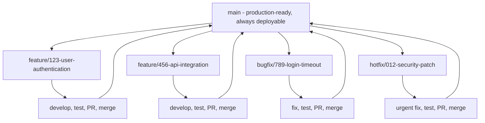
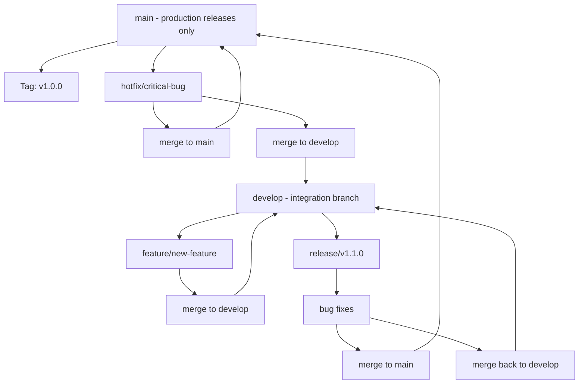
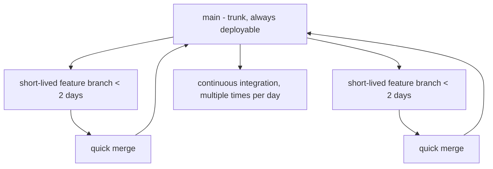

# Branching and Workflow

**Document Version:** 1.2
**Last Updated:** December 2025
**Status:** Draft for Review

---

## Table of Contents

1. [Introduction](#1-introduction)
2. [Branching Strategy](#2-branching-strategy)
3. [Branch Types](#3-branch-types)
4. [Workflow Processes](#4-workflow-processes)
5. [Commit Guidelines](#5-commit-guidelines)
6. [Merge Strategies](#6-merge-strategies)
7. [Release Management](#7-release-management)
8. [Best Practices](#8-best-practices)
9. [Common Scenarios](#9-common-scenarios)
10. [Troubleshooting](#10-troubleshooting)

---

## 1. Introduction

### 1.1 Purpose

This document establishes standardized Git branching strategies and workflows for the WEBUILD consortium. Consistent workflows ensure smooth collaboration, reduce conflicts, and maintain code quality across all repositories.

### 1.2 Scope

These guidelines apply to:

- All consortium repositories
- All contributors and maintainers
- All development activities
- All environments (DEV, TEST, PROD)

### 1.3 Workflow Goals

1. **Enable Parallel Development:** Multiple features developed simultaneously
2. **Maintain Stability:** Keep main branch always deployable
3. **Facilitate Collaboration:** Clear processes for team coordination
4. **Support Quality:** Built-in review and testing processes
5. **Enable Traceability:** Clear history of changes and decisions

### 1.4 Choosing a Strategy

**Standard Strategy:** Feature Branch Workflow

**Why Feature Branching?**

Feature Branch Workflow is the recommended standard approach for WEBUILD consortium repositories. It provides a simple, flexible model that maintains main branch stability while supporting parallel development and code review through pull requests.

**When to Consider Alternatives:**

| Scenario | Alternative Strategy | Reason |
|----------|---------------------|---------|
| Multiple production versions | GitFlow | Structured release management |
| Very large teams (20+ developers) | GitFlow | Formal release processes |
| Continuous deployment with very short cycles | Trunk-Based Development | Rapid iteration |
| Library with LTS versions | GitFlow | Multiple version support |

Most WEBUILD repositories should use Feature Branch Workflow. Alternative strategies are documented in [Appendix D](#appendix-d-alternative-branching-strategies) for specific use cases.

---

## 2. Branching Strategy

### 2.1 Feature Branch Workflow (Standard Approach)

**Overview:**

The Feature Branch Workflow is the standard branching strategy for all WEBUILD repositories. All development work happens in feature branches that are merged to main via pull requests.



### 2.2 Core Principles

**1. Single Main Branch**
- `main` branch is the single source of truth
- Always stable and deployable to production
- Protected with branch protection rules
- All releases tagged from `main`

**2. Feature Branches**
- Branch from latest `main`
- One feature/fix per branch
- Short-lived (typically < 2 weeks)
- Descriptive naming convention

**3. Pull Request Workflow**
- All changes merged via pull requests
- Code review required before merge
- Automated tests must pass
- Squash merge recommended for clean history

**4. Continuous Integration**
- Automated testing on every push
- CI/CD pipeline validates changes

### 2.3 Branch Types

#### 2.3.1 Main Branch
- **Purpose:** Production-ready code
- **Protection:** Fully protected, no direct commits
- **Merges:** Only via approved pull requests
- **Tags:** All releases tagged here

#### 2.3.2 Feature Branches
- **Naming:** `feature/[issue-number]-[description]`
- **Source:** Branch from `main`
- **Target:** Merge back to `main`
- **Lifetime:** Short-lived, deleted after merge
- **Example:** `feature/123-add-jwt-authentication`

#### 2.3.3 Bugfix Branches
- **Naming:** `bugfix/[issue-number]-[description]`
- **Source:** Branch from `main`
- **Target:** Merge back to `main`
- **Priority:** Higher than features
- **Example:** `bugfix/456-fix-login-timeout`

#### 2.3.4 Hotfix Branches
- **Naming:** `hotfix/[issue-number]-[description]`
- **Source:** Branch from `main`
- **Target:** Merge back to `main`
- **Priority:** Highest, urgent production fixes
- **Example:** `hotfix/789-patch-security-vulnerability`

### 2.4 Why Feature Branch Workflow?

**Advantages:**

- Simple to understand and adopt
- Flexible across team sizes and project types
- Main branch always deployable
- Supports parallel development
- Clear history with distinct feature units
- Natural code review workflow
- Scales from small to large teams

### 2.5 Alternative Strategies

For specific use cases that require different approaches, see [Appendix D: Alternative Branching Strategies](#appendix-d-alternative-branching-strategies) which covers:

- **GitFlow** - For projects with scheduled releases and multiple production versions
- **Trunk-Based Development** - For teams with mature CI/CD and very short development cycles

These alternatives should only be adopted after careful consideration and approval from the Technical Coordinator.

---

## 3. Branch Types

### 3.1 Main Branches

#### 3.1.1 main Branch

**Purpose:** Production-ready code

**Characteristics:**
- Always stable and deployable
- Protected branch
- Only accepts merges via PR
- Tagged for releases
- Never commit directly

**Protection Rules:**

```yaml
Branch: main
- Require pull request reviews: 1
- Require status checks to pass
- Require conversation resolution
- Require linear history (optional)
- Include administrators
- Restrict force pushes
- Restrict deletions
```

#### 3.1.2 develop Branch (GitFlow only)

**Purpose:** Integration branch for features

**Characteristics:**
- Latest development changes
- May be unstable
- Features merge here first
- Protected branch
- Tested before release

**Protection Rules:**

```yaml
Branch: develop
- Require pull request reviews: 1
- Require status checks to pass
- Allow force pushes (for maintainers only)
```

### 3.2 Supporting Branches

#### 3.2.1 Feature Branches

**Purpose:** Develop new features

**Naming Convention:**
```
feature/[issue-number]-[brief-description]
feature/123-user-authentication
feature/456-api-rate-limiting
```

**Lifecycle:**

```bash
# Create feature branch from main
git checkout main
git pull origin main
git checkout -b feature/123-user-authentication

# Work on feature
# ... make changes ...
git add .
git commit -m "feat: implement user authentication"

# Keep updated with main
git fetch origin
git rebase origin/main

# Push to remote
git push origin feature/123-user-authentication

# Create pull request
# ... via GitHub UI ...

# After merge, delete branch
git checkout main
git pull origin main
git branch -d feature/123-user-authentication
```

**Best Practices:**

- Branch from latest `main`
- Keep branches focused and small
- Update regularly from `main`
- Delete after merge
- Keep branch lifetime under 2 weeks

#### 3.2.2 Bugfix Branches

**Purpose:** Fix bugs in development

**Naming Convention:**
```
bugfix/[issue-number]-[brief-description]
bugfix/789-fix-login-timeout
bugfix/012-resolve-memory-leak
```

**Similar to feature branches but for bug fixes.**

#### 3.2.3 Hotfix Branches

**Purpose:** Emergency fixes for production

**Naming Convention:**
```
hotfix/[issue-number]-[brief-description]
hotfix/345-fix-critical-security-issue
hotfix/678-patch-data-corruption
```

**Lifecycle:**

```bash
# Create hotfix from main
git checkout main
git pull origin main
git checkout -b hotfix/345-fix-critical-security-issue

# Fix the issue
# ... make changes ...
git add .
git commit -m "fix: resolve critical security vulnerability"

# Push and create PR
git push origin hotfix/345-fix-critical-security-issue

# After merge to main:
# 1. Tag new version
git checkout main
git pull origin main
git tag -a v1.2.1 -m "Hotfix: Critical security patch"
git push origin v1.2.1

# 2. Delete hotfix branch
git branch -d hotfix/345-fix-critical-security-issue
```

If using GitFlow (see [Appendix D](#appendix-d-alternative-branching-strategies)), also merge to `develop` branch.

**Best Practices:**

- Keep changes minimal and focused
- Test thoroughly before merge
- Tag immediately after merge
- Document in CHANGELOG

#### 3.2.4 Documentation Branches (Optional)

**Purpose:** Major documentation updates

**Naming Convention:**
```
docs/[issue-number]-[description]
docs/123-update-api-documentation
docs/456-add-deployment-guide
```

**Usage:** Same workflow as feature branches, but for documentation-only changes.

For minor documentation updates, use feature branches or commit directly to documentation PRs.

### 3.3 Branch Naming Rules

**Format:**
```
<type>/<issue-number>-<description>
```

**Types:**
- `feature/` - New features
- `bugfix/` - Bug fixes
- `hotfix/` - Production hotfixes
- `release/` - Release preparation
- `docs/` - Documentation only
- `refactor/` - Code refactoring
- `test/` - Test additions/changes
- `chore/` - Maintenance tasks

**Description Rules:**

- Use lowercase with hyphens for spaces
- Be descriptive but concise (under 50 characters)
- Include issue number
- Use present tense
- Avoid vague descriptions or personal names

**Examples:**

**Good:**
```
feature/123-add-jwt-authentication
bugfix/456-fix-memory-leak-in-cache
hotfix/789-patch-sql-injection
docs/012-update-api-documentation
```

**Bad:**
```
my-feature
fix
john-work
feature_new_stuff
FEATURE-123-ADD-AUTHENTICATION
```

---

## 4. Workflow Processes

### 4.1 Feature Development Workflow

**Step-by-Step Process:**

#### Step 1: Plan the Feature

- [ ] Create issue describing feature
- [ ] Discuss approach with team
- [ ] Get approval from maintainer
- [ ] Assign issue to yourself

#### Step 2: Create Feature Branch

```bash
# Update local main
git checkout main
git pull origin main

# Create feature branch
git checkout -b feature/123-add-user-profile

# Verify branch
git branch
```

#### Step 3: Develop the Feature

```bash
# Make changes
# ... edit files ...

# Check status
git status

# Stage changes
git add src/profile.py tests/test_profile.py

# Commit with clear message
git commit -m "feat: add user profile management

- Implement profile CRUD operations
- Add profile validation
- Create profile API endpoints
- Add comprehensive tests

Closes #123"
```

#### Step 4: Keep Branch Updated

```bash
# Fetch latest changes
git fetch origin

# Rebase on main (preferred)
git rebase origin/main

# Or merge (if rebase causes issues)
git merge origin/main

# Resolve conflicts if any
# ... fix conflicts ...
git add .
git rebase --continue  # or git commit for merge
```

#### Step 5: Push and Create PR

```bash
# Push feature branch
git push origin feature/123-add-user-profile

# If rebased, may need force push
git push origin feature/123-add-user-profile --force-with-lease
```

**Create Pull Request:**

1. Go to GitHub repository
2. Click "Pull requests" → "New pull request"
3. Select your branch
4. Fill in PR template
5. Request reviewers
6. Link related issues

#### Step 6: Address Review Feedback

```bash
# Make requested changes
# ... edit files ...

# Commit changes
git add .
git commit -m "refactor: address review feedback

- Simplify profile validation logic
- Add error handling
- Update tests"

# Push updates
git push origin feature/123-add-user-profile
```

#### Step 7: Merge

**After approval:**

1. Ensure all checks pass
2. Resolve any conflicts
3. Squash commits if needed
4. Merge pull request
5. Delete feature branch

```bash
# After merge, update local main
git checkout main
git pull origin main

# Delete local feature branch
git branch -d feature/123-add-user-profile

# Delete remote branch (if not auto-deleted)
git push origin --delete feature/123-add-user-profile
```

### 4.2 Bug Fix Workflow

**Similar to feature workflow but:**

1. **Branch from:** `main`
2. **Branch name:** `bugfix/[issue]-[description]`
3. **Commit prefix:** `fix:`
4. **Priority:** Higher than features
5. **Testing:** Include regression tests

**Example:**

```bash
# Create bugfix branch
git checkout main
git pull origin main
git checkout -b bugfix/456-fix-login-timeout

# Fix the bug
# ... make changes ...

# Add regression test
# ... add test ...

# Commit
git commit -m "fix: resolve login timeout issue

- Increase session timeout to 30 minutes
- Add connection retry logic
- Add regression test

Fixes #456"

# Push and create PR
git push origin bugfix/456-fix-login-timeout
```

### 4.3 Hotfix Workflow

**For critical production issues:**

1. **Branch from:** main (production)
2. **Branch name:** `hotfix/[issue]-[description]`
3. **Priority:** Highest
4. **Testing:** Thorough testing required
5. **Deployment:** Immediate after merge

**Process:**

```bash
# Create hotfix from main
git checkout main
git pull origin main
git checkout -b hotfix/789-fix-security-vulnerability

# Fix the issue
# ... make critical fix ...

# Test thoroughly
# ... run all tests ...

# Commit
git commit -m "fix: patch critical security vulnerability

- Sanitize user input in authentication
- Add input validation
- Update security tests

SECURITY: Fixes CVE-2025-XXXX
Fixes #789"

# Push and create PR
git push origin hotfix/789-fix-security-vulnerability

# After merge and deployment:
# Tag new version
git checkout main
git pull origin main
git tag -a v1.2.1 -m "Hotfix: Security patch"
git push origin v1.2.1

```

In Feature Branch Workflow, hotfixes follow the same process as regular fixes but with highest priority.

### 4.4 Release Workflow

**For Feature Branch Workflow:**

Releases are created directly from the `main` branch since it's always in a deployable state.

```bash
# 1. Ensure main is up to date
git checkout main
git pull origin main

# 2. Update version and CHANGELOG
# Edit version files (package.json, setup.py, etc.)
# Update CHANGELOG.md with release notes

git add .
git commit -m "chore: prepare release v1.3.0"
git push origin main

# 3. Create and push tag
git tag -a v1.3.0 -m "Release version 1.3.0"
git push origin v1.3.0

# 4. Create GitHub Release
# - Go to Releases → Draft new release
# - Select tag v1.3.0
# - Add release notes from CHANGELOG
# - Publish release

# 5. Deploy to production (via CI/CD or manual process)
```

**For scheduled releases with preparation period:**

If you need a preparation period before release, create a release branch:

```bash
# 1. Create release branch
git checkout main
git pull origin main
git checkout -b release/v1.3.0

# 2. Prepare release (version updates, CHANGELOG, bug fixes only)
git add .
git commit -m "chore: prepare release v1.3.0"
git push origin release/v1.3.0

# 3. Create PR to merge back to main
# After approval and merge, tag the release on main

# 4. Delete release branch
git branch -d release/v1.3.0
```

For GitFlow release process, see [Appendix D](#appendix-d-alternative-branching-strategies).

---

## 5. Commit Guidelines

### 5.1 Commit Message Format

**Structure:**

```
<type>(<scope>): <subject>

<body>

<footer>
```

**Example:**

```
feat(auth): implement JWT authentication

- Add JWT token generation
- Implement token validation middleware
- Add refresh token support
- Update API documentation

Closes #123
```

### 5.2 Commit Types

| Type | Description | Example |
|------|-------------|---------|
| `feat` | New feature | `feat: add user registration` |
| `fix` | Bug fix | `fix: resolve login timeout` |
| `docs` | Documentation only | `docs: update API guide` |
| `style` | Code style changes | `style: format code with prettier` |
| `refactor` | Code refactoring | `refactor: simplify auth logic` |
| `test` | Test additions/changes | `test: add integration tests` |
| `chore` | Maintenance tasks | `chore: update dependencies` |
| `perf` | Performance improvements | `perf: optimize database queries` |
| `ci` | CI/CD changes | `ci: add deployment workflow` |
| `build` | Build system changes | `build: update webpack config` |
| `revert` | Revert previous commit | `revert: revert "feat: add feature"` |

### 5.3 Commit Best Practices

- Write clear, descriptive messages in imperative mood
- Keep subject line under 50 characters
- Separate subject from body with blank line
- Wrap body at 72 characters
- Explain what and why, not how
- Reference issues and PRs
- Make atomic commits (one logical change)
- Avoid vague messages or committing broken code

**Good Examples:**

```
feat: add email notification system

Implement email notifications for:
- User registration
- Password reset
- Account updates

Uses SendGrid API for delivery.

Closes #234
```

```
fix: resolve memory leak in cache manager

The cache was not properly releasing memory when
items expired. Added explicit cleanup in the
expiration handler.

Fixes #567
```

**Bad Examples:**

```
fixed stuff
```

```
WIP
```

```
Updated files
```

### 5.4 Commit Frequency

Commit logical units of work frequently throughout the day. Commit before switching tasks or branches, and before rebasing. Don't wait until a feature is complete to commit.

---

## 6. Merge Strategies

### 6.1 Merge Methods

#### 6.1.1 Merge Commit

**Creates a merge commit:**

```
main:     A---B---C---D---E
                   \       \
feature:            F---G---H
```

**When to use:**
- Preserving branch history important
- Multiple developers on feature
- Long-lived feature branches

**Command:**
```bash
git checkout main
git merge feature/123-new-feature
```

#### 6.1.2 Squash and Merge

**Combines all commits into one:**

```
main:     A---B---C---D
                       \
feature:                E (squashed F+G+H)
```

**When to use:**
- Clean, linear history desired
- Many small commits in feature
- Single logical change
- **Recommended for most PRs**

**Command:**
```bash
git checkout main
git merge --squash feature/123-new-feature
git commit -m "feat: add new feature"
```

#### 6.1.3 Rebase and Merge

**Replays commits on top of main:**

```
main:     A---B---C---D---F'---G'---H'
```

**When to use:**
- Linear history required
- Clean commit history in feature
- Each commit is meaningful

**Command:**
```bash
git checkout feature/123-new-feature
git rebase main
git checkout main
git merge feature/123-new-feature
```

### 6.2 Merge Strategy Selection

**Recommended:** Squash and Merge

**Decision Matrix:**

| Scenario | Strategy | Reason |
|----------|----------|--------|
| Most feature branches | Squash | Clean, linear history |
| Small feature, many commits | Squash | Single logical unit |
| Large feature, clean commits | Rebase | Preserve meaningful commits |
| Hotfix | Squash | Single logical fix |
| Documentation updates | Squash | Clean history |

For Feature Branch Workflow, squash and merge is recommended for most cases to maintain a clean, readable history on `main`.

### 6.3 Handling Merge Conflicts

**When conflicts occur:**

```bash
# 1. Update your branch
git fetch origin
git rebase origin/main

# 2. Git will pause at conflicts
# CONFLICT (content): Merge conflict in file.py

# 3. Open conflicted files
# Look for conflict markers:
<<<<<<< HEAD
current code
=======
incoming code
>>>>>>> branch-name

# 4. Resolve conflicts
# - Edit files to resolve
# - Remove conflict markers
# - Test the resolution

# 5. Stage resolved files
git add file.py

# 6. Continue rebase
git rebase --continue

# 7. Push (may need force push)
git push origin feature/123 --force-with-lease
```

**Conflict Resolution Tips:**

- Understand both changes before resolving
- Test after resolution
- Communicate with team if unsure
- Never leave conflict markers in code

---

## 7. Release Management

### 7.1 Versioning

**Use Semantic Versioning:**

```
MAJOR.MINOR.PATCH

Example: 1.2.3
```

**Version Increments:**

- **MAJOR (1.0.0 → 2.0.0):** Breaking changes
- **MINOR (1.0.0 → 1.1.0):** New features (backwards compatible)
- **PATCH (1.0.0 → 1.0.1):** Bug fixes (backwards compatible)

**Pre-release Versions:**

- `1.0.0-alpha.1` - Alpha release
- `1.0.0-beta.1` - Beta release
- `1.0.0-rc.1` - Release candidate

### 7.2 Release Process

**Steps:**

1. **Plan Release**
   - Review completed features
   - Check bug fixes
   - Update roadmap

2. **Prepare Release**
   - Create release branch (GitFlow)
   - Update version numbers
   - Update CHANGELOG
   - Update documentation

3. **Test Release**
   - Run all tests
   - Perform manual testing
   - Fix release-blocking bugs

4. **Create Release**
   - Merge to main
   - Tag version
   - Create GitHub release
   - Deploy to production

5. **Post-Release**
   - Merge back to develop
   - Announce release
   - Monitor for issues
   - Update project boards

### 7.3 CHANGELOG Management

**Format:**

```markdown
# Changelog

## [Unreleased]

### Added
- New features in development

### Changed
- Changes to existing features

### Fixed
- Bug fixes

## [1.2.0] - 2025-10-22

### Added
- User authentication with JWT
- API rate limiting
- Email notifications

### Changed
- Improved error handling
- Updated dependencies

### Fixed
- Fixed login timeout issue
- Resolved memory leak

### Security
- Patched SQL injection vulnerability
```

**Update CHANGELOG:**

- With every significant change
- Before each release
- Use clear, user-focused language
- Group by change type
- Link to issues/PRs

---

## 8. Best Practices

### 8.1 General Best Practices

- Keep branches short-lived (under 2 weeks)
- Update from main frequently
- Write clear commit messages
- Make atomic commits
- Test before pushing
- Review your own code first
- Delete merged branches
- Never commit directly to main
- Never force push to shared branches
- Never rewrite published history

### 8.2 Code Review Best Practices

**For Authors:**

- Keep PRs small and focused
- Provide clear description
- Self-review before requesting review
- Respond to feedback promptly

**For Reviewers:**

- Review within 2 days
- Be constructive and respectful
- Focus on important issues
- Explain reasoning

### 8.3 Branch Hygiene

**Regular Maintenance:**

```bash
# List all branches
git branch -a

# Delete merged local branches
git branch --merged main | grep -v "main" | xargs git branch -d

# Delete remote branches that no longer exist
git fetch --prune

# Clean up references
git remote prune origin
```

**Automated Cleanup:**

Enable "Automatically delete head branches" in repository settings.

---

## 9. Common Scenarios

### 9.1 Starting New Feature

```bash
git checkout main
git pull origin main
git checkout -b feature/123-new-feature
# ... work on feature ...
git add .
git commit -m "feat: implement new feature"
git push origin feature/123-new-feature
# Create PR on GitHub
```

### 9.2 Updating Feature Branch

```bash
git checkout feature/123-new-feature
git fetch origin
git rebase origin/main
# Resolve conflicts if any
git push origin feature/123-new-feature --force-with-lease
```

### 9.3 Fixing Merge Conflicts

```bash
# During rebase
git rebase origin/main
# Fix conflicts in files
git add .
git rebase --continue
git push origin feature/123 --force-with-lease
```

### 9.4 Undoing Last Commit

```bash
# Keep changes
git reset --soft HEAD~1

# Discard changes
git reset --hard HEAD~1
```

### 9.5 Cherry-Picking Commits

```bash
# Pick specific commit to another branch
git checkout target-branch
git cherry-pick <commit-hash>
git push origin target-branch
```

### 9.6 Stashing Changes

```bash
# Save work in progress
git stash save "WIP: feature implementation"

# List stashes
git stash list

# Apply stash
git stash pop

# Apply specific stash
git stash apply stash@{0}
```

---

## 10. Troubleshooting

### 10.1 Common Issues

#### Issue: Accidentally Committed to Main

```bash
# Move commit to new branch
git branch feature/accidental-commit
git reset --hard HEAD~1
git checkout feature/accidental-commit
```

#### Issue: Need to Change Last Commit Message

```bash
git commit --amend -m "New commit message"
git push origin branch-name --force-with-lease
```

#### Issue: Pushed Sensitive Data

```bash
# Remove from history
git filter-branch --force --index-filter \
  'git rm --cached --ignore-unmatch path/to/file' \
  --prune-empty --tag-name-filter cat -- --all

# Force push
git push origin --force --all

# Rotate exposed secrets immediately!
```

#### Issue: Merge Conflict During Rebase

```bash
# Fix conflicts in files
git add .
git rebase --continue

# Or abort rebase
git rebase --abort
```

#### Issue: Lost Commits

```bash
# Find lost commits
git reflog

# Recover commit
git checkout <commit-hash>
git checkout -b recovery-branch
```

### 10.2 Getting Help

**Resources:**

- [Git Documentation](https://git-scm.com/doc)
- [GitHub Guides](https://guides.github.com)
- Repository maintainers
- WP/Group leads
- Technical Coordinator

**When to Ask:**

- Unsure about workflow
- Complex merge conflicts
- Lost work
- Need to rewrite history
- Security concerns

---

## Appendices

### Appendix A: Quick Reference

**Common Commands:**

```bash
# Create branch
git checkout -b feature/123-name

# Update branch
git fetch origin
git rebase origin/main

# Commit
git add .
git commit -m "type: description"

# Push
git push origin feature/123-name

# Update from main
git checkout main
git pull origin main
git checkout feature/123-name
git rebase main

# Delete branch
git branch -d feature/123-name
```

### Appendix B: Git Aliases

**Useful aliases:**

```bash
git config --global alias.co checkout
git config --global alias.br branch
git config --global alias.ci commit
git config --global alias.st status
git config --global alias.unstage 'reset HEAD --'
git config --global alias.last 'log -1 HEAD'
git config --global alias.visual 'log --oneline --graph --all'
```

### Appendix C: Resources

**Learning Resources:**

- [Pro Git Book](https://git-scm.com/book)
- [GitHub Flow Guide](https://guides.github.com/introduction/flow/)
- [Feature Branch Workflow](https://www.atlassian.com/git/tutorials/comparing-workflows/feature-branch-workflow)
- [Conventional Commits](https://www.conventionalcommits.org/)

### Appendix D: Alternative Branching Strategies

**Note:** These strategies are alternatives to the standard Feature Branch Workflow. They should only be adopted for specific use cases and require approval from the Technical Coordinator.

---

#### D.1 GitFlow Workflow

**Overview:**

GitFlow is a more structured branching model suitable for projects with scheduled releases and multiple production versions.



**Key Principles:**

- `main` contains production releases only
- `develop` is the integration branch
- Features branch from and merge to `develop`
- Releases prepared in release branches
- Hotfixes branch from `main` and merge to both `main` and `develop`

**When to Use:**

- Projects with scheduled release cycles
- Multiple versions in production simultaneously
- Need for strict release management
- Large teams with formal processes
- Libraries or frameworks with LTS versions

**Branch Types:**

1. **Main Branch** - Production releases only
2. **Develop Branch** - Integration branch for features
3. **Feature Branches** - `feature/*` branch from `develop`
4. **Release Branches** - `release/*` branch from `develop`
5. **Hotfix Branches** - `hotfix/*` branch from `main`

**Release Process:**

```bash
# 1. Create release branch from develop
git checkout develop
git pull origin develop
git checkout -b release/v1.2.0

# 2. Prepare release (version updates, bug fixes only)
git add .
git commit -m "chore: prepare release v1.2.0"
git push origin release/v1.2.0

# 3. Merge to main
git checkout main
git merge release/v1.2.0
git tag -a v1.2.0 -m "Release version 1.2.0"
git push origin main --tags

# 4. Merge back to develop
git checkout develop
git merge release/v1.2.0
git push origin develop

# 5. Delete release branch
git branch -d release/v1.2.0
```

**Advantages:**

- Clear separation of development and production code
- Structured release process
- Supports multiple production versions

**Disadvantages:**

- More complex than Feature Branch Workflow
- Additional overhead with `develop` branch
- Can slow down deployment cycles

---

#### D.2 Trunk-Based Development

**Overview:**

Trunk-Based Development emphasizes very short-lived branches and frequent integration to a single trunk (main branch).



**Key Principles:**

- Single main branch (trunk)
- Very short-lived feature branches (< 2 days)
- Frequent integration (multiple times per day)
- Feature flags for incomplete features
- Strong CI/CD pipeline required
- High test automation coverage

**When to Use:**

- Mature CI/CD practices in place
- Experienced development teams
- Continuous deployment environment
- High degree of test automation
- Small, incremental changes preferred

**Requirements:**

- Robust CI/CD pipeline with automated testing and deployment
- Feature flags to hide incomplete features in production
- High test coverage with comprehensive automated tests
- Team discipline and commitment to frequent integration
- Strong production monitoring and rollback capabilities

**Workflow:**

```bash
# 1. Create short-lived branch
git checkout main
git pull origin main
git checkout -b feature/123-small-change

# 2. Make small, focused change
# ... implement change ...
git add .
git commit -m "feat: add small feature"

# 3. Push and create PR immediately
git push origin feature/123-small-change

# 4. Merge quickly (same day)
# After review and CI passes, merge to main

# 5. Delete branch
git branch -d feature/123-small-change
```

**Feature Flags Example:**

```python
# Use feature flags for incomplete features
if feature_flags.is_enabled('new-feature'):
    # New feature code
    new_implementation()
else:
    # Existing code
    old_implementation()
```

**Advantages:**

- Reduces merge conflicts
- Faster feedback loops
- Encourages small, incremental changes
- Simplifies branching model

**Disadvantages:**

- Requires mature engineering practices
- High initial setup cost
- Requires feature flag management
- Steep learning curve

---

#### D.3 Choosing the Right Strategy

**Decision Framework:**

| Factor | Feature Branch | GitFlow | Trunk-Based |
|--------|---------------|---------|-------------|
| **Team Size** | Any | Large (10+) | Small-Medium |
| **Release Cycle** | Continuous | Scheduled | Continuous |
| **Complexity** | Low | High | Medium |
| **CI/CD Maturity** | Medium | Medium | High |
| **Learning Curve** | Easy | Medium | Hard |
| **Flexibility** | High | Medium | Low |
| **Overhead** | Low | High | Medium |

**Recommendation:**

Use Feature Branch Workflow for most WEBUILD repositories. Consider GitFlow only for projects with strict release schedules and multiple production versions. Consider Trunk-Based only for teams with mature CI/CD and high automation.

If you need to switch strategies, consult with the Technical Coordinator and plan a gradual transition with team training.

---

**Document Control:**

| Version | Date | Author | Changes |
|---------|------|--------|---------|
| 1.0 | October 2025 | Technical Coordinator | Initial draft |
| 1.1 | November 2025 | Technical Coordinator | General improvements |
| 1.2 | December 2025 | Technical Coordinator | General improvements & cleanup |

**Next Review Date:** March 2026

---

*This document is maintained in the `webuild-policies` repository. For questions or suggestions, please open an issue or contact the Technical Coordinator.*
