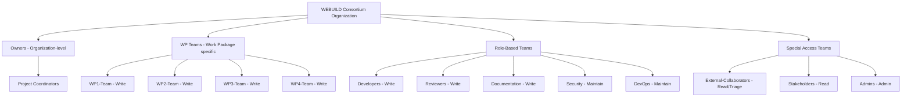
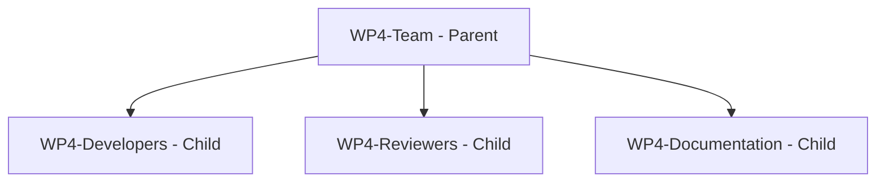

# Guide: Access Management

This guide provides comprehensive instructions for managing access to WEBUILD Consortium GitHub repositories.

## Table of Contents

- [Overview](#overview)
- [Access Levels](#access-levels)
- [Team Structure](#team-structure)
- [Granting Access](#granting-access)
- [Revoking Access](#revoking-access)
- [Managing Teams](#managing-teams)
- [Best Practices](#best-practices)
- [Security Considerations](#security-considerations)
- [Troubleshooting](#troubleshooting)

## Overview

### Purpose

Proper access management ensures:

- **Security**: Only authorized users can access repositories
- **Collaboration**: Team members have appropriate permissions
- **Accountability**: Clear audit trail of who has access
- **Compliance**: Meets EU project requirements
- **Efficiency**: Users can perform their roles effectively

### Principles

Access management follows these principles:

1. **Least Privilege**: Grant minimum necessary permissions
2. **Need-to-Know**: Access based on role requirements
3. **Regular Review**: Periodic access audits
4. **Timely Revocation**: Remove access when no longer needed
5. **Clear Documentation**: Maintain access records

## Access Levels

### Repository Permission Levels

GitHub provides five permission levels:

#### Read

**Capabilities**:
- View and clone repository
- Open and comment on issues
- Submit pull requests
- View project boards

**Use Cases**:
- External collaborators
- Observers and stakeholders
- Documentation reviewers
- Community contributors

**Limitations**:
- Cannot push commits
- Cannot merge pull requests
- Cannot modify settings

#### Triage

**Capabilities**:
- All Read permissions, plus:
- Manage issues and pull requests
- Apply labels
- Assign issues
- Close/reopen issues

**Use Cases**:
- Issue managers
- Community moderators
- Support team members
- Project coordinators

**Limitations**:
- Cannot push commits
- Cannot merge pull requests
- Cannot modify repository settings

#### Write

**Capabilities**:
- All Triage permissions, plus:
- Push to repository
- Create branches
- Merge pull requests
- Edit wiki (if enabled)

**Use Cases**:
- Core developers
- Active contributors
- Documentation writers
- Integration developers

**Limitations**:
- Cannot modify repository settings
- Cannot manage teams
- Cannot delete repository

#### Maintain

**Capabilities**:
- All Write permissions, plus:
- Manage repository settings (limited)
- Manage webhooks and deploy keys
- Manage branch protection rules
- Manage GitHub Actions

**Use Cases**:
- Technical leads
- DevOps engineers
- Repository maintainers
- Senior developers

**Limitations**:
- Cannot delete repository
- Cannot transfer repository
- Cannot manage team access

#### Admin

**Capabilities**:
- All Maintain permissions, plus:
- Full repository control
- Manage team access
- Delete repository
- Transfer repository
- Manage security settings

**Use Cases**:
- Repository owners
- Project administrators
- Work package leaders
- Organization owners

**Responsibilities**:
- Ensure proper access control
- Monitor security alerts
- Maintain repository health
- Coordinate with team

## Team Structure

### Recommended Team Organization



### Creating Teams

Teams should be organized by:

1. **Work Package**: WP1, WP2, WP3, WP4, etc.
2. **Role**: Developers, Reviewers, Documentation
3. **Function**: Security, DevOps, Testing
4. **Access Level**: Read-only, Contributors, Maintainers

## Granting Access

### Step 1: Determine Access Requirements

Before granting access, determine:

- [ ] **Who needs access**: User's identity and role
- [ ] **Why they need access**: Justification and purpose
- [ ] **What level of access**: Appropriate permission level
- [ ] **Which repositories**: Specific repos or team-wide
- [ ] **Duration**: Temporary or permanent access
- [ ] **Approval**: Required approvals obtained

### Step 2: Add Individual Collaborator

For individual repository access:

1. Navigate to repository on GitHub
2. Click **"Settings"** tab
3. Click **"Collaborators and teams"** in sidebar
4. Click **"Add people"**
5. Search for user by username or email
6. Select permission level:
   - Read
   - Triage
   - Write
   - Maintain
   - Admin
7. Click **"Add [username] to this repository"**

### Step 3: Add User to Team

For team-based access (recommended):

1. Navigate to organization page
2. Click **"Teams"** tab
3. Select appropriate team
4. Click **"Members"** tab
5. Click **"Add a member"**
6. Search for user
7. Click **"Add [username] to [team-name]"**

### Step 4: Verify Access

After granting access:

1. **Notify the user**:
   ```
   Subject: Access Granted to [REPOSITORY-NAME]

   Hello [Name],

   You have been granted [PERMISSION-LEVEL] access to:
   https://github.com/webuild-consortium/[REPOSITORY-NAME]

   Please:
   1. Accept the invitation (check your email)
   2. Review the README and CONTRIBUTING guidelines
   3. Familiarize yourself with the codebase
   4. Contact [CONTACT] if you have questions

   Best regards,
   [Your Name]
   ```

2. **Verify user can access**:
   - Ask user to confirm they can see the repository
   - Test that permissions work as expected
   - Ensure user has accepted invitation

3. **Document the access**:
   - Record in access log
   - Note reason for access
   - Set review date if temporary

### Access Request Template

Users should request access using this template:

```
Subject: Access Request for [REPOSITORY-NAME]

Repository: https://github.com/webuild-consortium/[REPOSITORY-NAME]
Requested by: [Your Name]
GitHub Username: [username]
Email: [email@example.com]

Access Level Requested:
[ ] Read
[ ] Triage
[ ] Write
[ ] Maintain
[ ] Admin

Justification:
[Explain why you need access and what you'll be working on]

Work Package: WP[X]
Duration: [Permanent / Until DATE]

Approved by:
- [ ] Work Package Leader: [Name]
- [ ] Technical Lead: [Name]
- [ ] Project Coordinator: [Name] (if Admin access)

Additional Notes:
[Any other relevant information]
```

## Revoking Access

### When to Revoke Access

Remove access when:

- User leaves the project or organization
- User changes roles and no longer needs access
- Temporary access period expires
- Security concerns arise
- User requests removal
- Inactivity for extended period (6+ months)

### Step 1: Prepare for Revocation

Before revoking access:

1. **Verify reason**: Confirm access should be removed
2. **Check dependencies**: Ensure no critical work is blocked
3. **Notify user**: Inform them in advance (if appropriate)
4. **Document reason**: Record why access is being revoked
5. **Transfer ownership**: Reassign any owned issues/PRs

### Step 2: Remove Individual Access

To remove a collaborator:

1. Navigate to repository
2. Go to **Settings** > **Collaborators and teams**
3. Find the user in the list
4. Click **"Remove"** next to their name
5. Confirm removal

### Step 3: Remove from Team

To remove from a team:

1. Navigate to organization
2. Click **"Teams"** tab
3. Select the team
4. Click **"Members"** tab
5. Find the user
6. Click **"Remove from team"**
7. Confirm removal

### Step 4: Verify Removal

After revoking access:

1. **Verify user cannot access**:
   - Check they're not listed in collaborators
   - Verify they're removed from teams
   - Confirm they cannot view private repos

2. **Notify relevant parties**:
   ```
   Subject: Access Revoked for [USERNAME]

   Access has been revoked for [USERNAME] from:
   - Repository: [REPOSITORY-NAME]
   - Team: [TEAM-NAME]

   Reason: [REASON]
   Date: [DATE]

   Any questions, contact [ADMIN-EMAIL]
   ```

3. **Update documentation**:
   - Remove from access logs
   - Update team rosters
   - Note in audit trail

### Emergency Access Revocation

For security incidents:

1. **Immediate action**:
   ```bash
   # Remove from all teams immediately
   # Revoke all repository access
   # Disable any personal access tokens
   # Review recent activity
   ```

2. **Notify security team**
3. **Audit recent changes**
4. **Document incident**
5. **Review and improve processes**

## Managing Teams

### Creating a New Team

1. Navigate to organization
2. Click **"Teams"** tab
3. Click **"New team"**
4. Configure team:
   - **Team name**: Descriptive name (e.g., "WP4-Developers")
   - **Description**: Team purpose and scope
   - **Team visibility**:
     - Visible: All members can see
     - Secret: Only team members can see
5. Click **"Create team"**

### Configuring Team Settings

After creating a team:

1. **Add repositories**:
   - Click **"Repositories"** tab
   - Click **"Add repository"**
   - Select repository
   - Choose permission level
   - Click **"Add repository to team"**

2. **Add members**:
   - Click **"Members"** tab
   - Click **"Add a member"**
   - Search for user
   - Click **"Add [username] to [team-name]"**

3. **Set team maintainers**:
   - Select member
   - Click **"Change role"**
   - Select **"Maintainer"**
   - Maintainers can manage team membership

### Team Hierarchy

Create parent-child team relationships:

1. Navigate to parent team
2. Click **"Settings"** tab
3. Under **"Parent team"**, select parent
4. Click **"Update"**

**Example hierarchy**:


**Benefits**:
- Inherited permissions
- Organized structure
- Easier management

### Team Synchronization

For organizations using SAML/SCIM:

1. Enable team synchronization
2. Map GitHub teams to identity provider groups
3. Automatic membership updates
4. Centralized access control

## Best Practices

### Access Management

1. **Use Teams, Not Individuals**
   - Easier to manage
   - Consistent permissions
   - Better scalability
   - Clear organization

2. **Regular Access Reviews**
   - Quarterly access audits
   - Remove inactive users
   - Verify permission levels
   - Update team memberships

3. **Document Everything**
   - Maintain access logs
   - Record approval chains
   - Note access changes
   - Track audit history

4. **Principle of Least Privilege**
   - Grant minimum necessary access
   - Start with Read, escalate as needed
   - Review and reduce over time
   - Justify higher permissions

5. **Timely Access Management**
   - Grant access promptly
   - Revoke access immediately when needed
   - Process requests within 24 hours
   - Respond to security concerns urgently

### Team Management

1. **Clear Team Structure**
   - Logical organization
   - Descriptive names
   - Clear purposes
   - Documented hierarchy

2. **Team Maintainers**
   - Assign responsible maintainers
   - Distribute management duties
   - Ensure availability
   - Document responsibilities

3. **Team Documentation**
   - Document team purpose
   - List team members
   - Define responsibilities
   - Maintain contact information

### Security

1. **Enable Two-Factor Authentication**
   - Require 2FA for all members
   - Enforce at organization level
   - Provide setup guidance
   - Monitor compliance

2. **Monitor Access Activity**
   - Review audit logs regularly
   - Track permission changes
   - Monitor unusual activity
   - Investigate anomalies

3. **Secure Credentials**
   - Never share accounts
   - Use personal access tokens properly
   - Rotate tokens regularly
   - Revoke unused tokens

4. **Incident Response**
   - Have revocation procedures ready
   - Know emergency contacts
   - Document incident response
   - Practice response scenarios

## Security Considerations

### Two-Factor Authentication

Enforce 2FA for all organization members:

1. Navigate to organization settings
2. Click **"Authentication security"**
3. Enable **"Require two-factor authentication"**
4. Set grace period for compliance
5. Monitor compliance status

### Personal Access Tokens

Manage personal access tokens:

- **Scope appropriately**: Minimum necessary scopes
- **Set expiration**: Use short-lived tokens
- **Rotate regularly**: Change tokens periodically
- **Revoke when done**: Delete unused tokens
- **Monitor usage**: Track token activity

### SSH Keys

Manage SSH keys:

- **Use strong keys**: RSA 4096 or Ed25519
- **Protect private keys**: Never share
- **Use passphrases**: Encrypt private keys
- **Rotate keys**: Change periodically
- **Remove old keys**: Delete unused keys

### Audit Logging

Monitor access through audit logs:

1. Navigate to organization settings
2. Click **"Audit log"**
3. Review recent activity:
   - Member additions/removals
   - Permission changes
   - Repository access
   - Settings modifications

4. Export logs for compliance:
   ```bash
   # Using GitHub CLI
   gh api /orgs/webuild-consortium/audit-log > audit-log.json
   ```

## Troubleshooting

### Issue: User Cannot Access Repository

**Symptoms**: User gets 404 error when accessing repository

**Solutions**:

1. **Verify user is added**:
   - Check collaborators list
   - Check team membership
   - Verify invitation was accepted

2. **Check repository visibility**:
   - Private repos require explicit access
   - Public repos are accessible to all

3. **Verify organization membership**:
   - User must be organization member
   - Check invitation status
   - Resend invitation if needed

4. **Clear cache**:
   - User should log out and back in
   - Clear browser cache
   - Try incognito mode

### Issue: User Has Wrong Permission Level

**Symptoms**: User cannot perform expected actions

**Solutions**:

1. **Verify permission level**:
   - Check individual access
   - Check team permissions
   - Higher team permission overrides individual

2. **Update permissions**:
   - Change individual access level
   - Move to different team
   - Adjust team permissions

3. **Check branch protection**:
   - Branch rules may restrict actions
   - Review protection settings
   - Adjust rules if appropriate

### Issue: Cannot Remove User

**Symptoms**: Remove button is disabled or fails

**Solutions**:

1. **Check your permissions**:
   - Must have Admin access
   - Organization owners can remove anyone

2. **Check user status**:
   - Verify user exists
   - Check if already removed
   - Refresh page

3. **Remove from teams first**:
   - Remove from all teams
   - Then remove individual access

### Issue: Team Permissions Not Working

**Symptoms**: Team members don't have expected access

**Solutions**:

1. **Verify team has repository access**:
   - Check team's repositories
   - Add repository if missing
   - Set correct permission level

2. **Check team membership**:
   - Verify user is team member
   - Check invitation status
   - Resend invitation if needed

3. **Review team hierarchy**:
   - Child teams inherit parent permissions
   - Check parent team settings
   - Verify inheritance is correct

## Access Management Checklist

### Granting Access
- [ ] Access request received and approved
- [ ] Appropriate permission level determined
- [ ] User added to repository or team
- [ ] User notified and confirmed access
- [ ] Access documented in logs
- [ ] Review date set (if temporary)

### Revoking Access
- [ ] Reason for revocation confirmed
- [ ] User notified (if appropriate)
- [ ] Access removed from repositories
- [ ] User removed from teams
- [ ] Removal verified
- [ ] Documentation updated
- [ ] Relevant parties notified

### Regular Reviews
- [ ] Quarterly access audit scheduled
- [ ] All users and permissions reviewed
- [ ] Inactive users identified
- [ ] Unnecessary access removed
- [ ] Team memberships updated
- [ ] Audit documented

## Related Documentation

- [GitHub Policies and Guidelines](../01-github-policies-and-guidelines.md)
- [Onboarding Procedures](../03-onboarding-procedures.md)
- [Repository Management](../04-repository-management.md)
- [Security and Compliance](../06-security-and-compliance.md)
- [Creating New Repository Guide](./creating-new-repository.md)

---

**WEBUILD Consortium Project**

This project is funded by the European Union under [GRANT NUMBER/PROGRAM]. Views and opinions expressed are however those of the author(s) only and do not necessarily reflect those of the European Union or [FUNDING AGENCY]. Neither the European Union nor the granting authority can be held responsible for them.